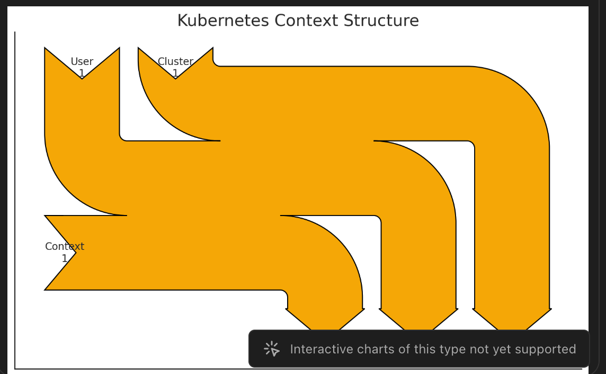

In Kubernetes, a "context" is a crucial part of the configuration that allows you to manage multiple Kubernetes clusters and user configurations easily. A context in Kubernetes combines three important pieces of information:

1. **Cluster**: The Kubernetes API server that the context is pointing to.
2. **User**: The credentials and configurations used to access the Kubernetes API server.
3. **Namespace**: The default namespace the context operates in when interacting with the cluster.

Each of these elements helps Kubernetes users to interact with different clusters or environments (e.g., development, staging, production) without having to reconfigure the command-line tool (`kubectl`) repeatedly.

### Components of a Kubernetes Context

#### 1. **Cluster**
   - **API Server URL**: The URL of the Kubernetes API server. 
    - This is where all `kubectl` commands are sent.
   - **CA Certificate**: The certificate authority (CA) certificate used to verify the server's SSL certificate.
   - **Cluster Name**: A name that you assign to the cluster in the configuration file for easy identification.

#### 2. **User**
   - **Credentials**: The user credentials, such as client certificates, tokens, or password, used to authenticate to the Kubernetes API server.
   - **User Name**: A name assigned to the user in the configuration file.

#### 3. **Namespace**
   - **Default Namespace**: The namespace that `kubectl` commands will operate within by default when using the context. 
   - This can be overridden by specifying a different namespace in a command.

### How Contexts are Managed

Kubernetes contexts are managed in the `kubeconfig` file, which is usually located at `~/.kube/config`.
-  This file can contain multiple contexts, clusters, and user configurations.

#### Example `kubeconfig` File Structure

```yaml
apiVersion: v1
kind: Config
clusters:
- cluster:
    server: https://my-cluster.example.com
    certificate-authority: /path/to/ca.crt
  name: my-cluster
- cluster:
    server: https://another-cluster.example.com
    insecure-skip-tls-verify: true
  name: another-cluster
contexts:
- context:
    cluster: my-cluster
    user: my-user
    namespace: default
  name: my-context
- context:
    cluster: another-cluster
    user: another-user
    namespace: production
  name: another-context
current-context: my-context
users:
- name: my-user
  user:
    client-certificate: /path/to/client.crt
    client-key: /path/to/client.key
- name: another-user
  user:
    token: my-secret-token
```

### Using Contexts

#### 1. **Listing Contexts**

You can list all available contexts using:

```bash
kubectl config get-contexts
```

This will show you all the contexts defined in your `kubeconfig` file along with the current context in use.

#### 2. **Switching Contexts**

To switch to a different context, use:

```bash
kubectl config use-context another-context
```

This command will change the current context to `another-context`, meaning all subsequent `kubectl` commands will interact with the cluster, user, and namespace defined in `another-context`.

#### 3. **Viewing the Current Context**

To see the currently active context:

```bash
kubectl config current-context
```

This will display the name of the context that is currently in use.

#### 4. **Modifying Contexts**

You can modify a context directly by specifying the cluster, user, or namespace. For example, to change the namespace of a context:

```bash
kubectl config set-context my-context --namespace=dev
```

This command will update the `my-context` context to use the `dev` namespace by default.

### Importance of Contexts in Kubernetes


- **Multiple Clusters**: You need to interact with multiple Kubernetes clusters from the same machine.
- **Multiple Users**: Different users with varying levels of access need to interact with the clusters.
- **Environment Separation**: Separate contexts for different environments (e.g., development, staging, production) allow for easy switching and management.

### Best Practices

- **Name Contexts Clearly**: Use clear, descriptive names for contexts, clusters, and users to avoid confusion.
- **Backup `kubeconfig`**: Always back up your `kubeconfig` file, especially if it contains multiple important contexts.
- **Environment-Specific `kubeconfig`**: Consider using different `kubeconfig` files for different environments or projects and use the `KUBECONFIG` environment variable to switch between them.

```bash
export KUBECONFIG=~/.kube/config-prod
```
