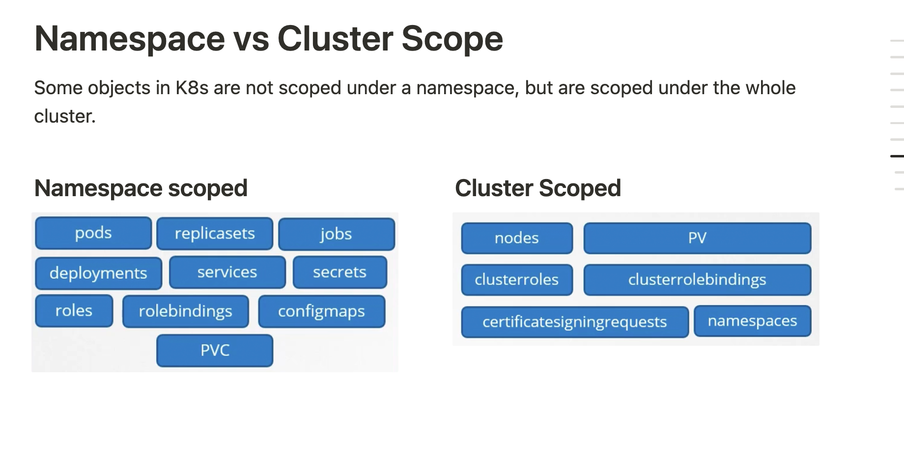

- Namespaces **isolate resources within a K8s cluster.**

### Automatic Namespaces:

- K8s creates a `default` namespace when the cluster is created.
	- **under the kube-system** if deployed by kube admin.
	- **Kube-public** created automatically for the users

### How to handle the resource management in namespaces:
- Resource limits can be placed at the namespace level.
    - we can place a resource limit on the `dev` namespace to prevent it from starving the `prod` namespace.

## DNS Resolution
- Resources within a namespace **can refer to each other by their names.**
- For cross namespace communication, a resource needs to specify the namespace as shown below.
# Creating a namespace
- Imperative command: `k create namespace <namespace>`
- Declarative manifest file
```yaml
**apiVersion: v1**
kind: Namespace
metadata:
	name: dev
```
# Creating resources in a namespace
- Command line: `k apply -f pod.yml --namespace=dev` (untracked)
- Config file (tracked): Use the namespace `property` under the metadata section.
```yaml
metadata:
	namespace: dev
```
# Set namespace permanently
`k config set-context $(kubectl config current-context) --namespace=dev` 
#

# Specify Resource Quota for a Namespace

Create a K8s `ResourceQuota` and specify the namespace in the `metadata` section.

```yaml
apiVersion: v1
kind: ResourceQuota
metadata:
	name: compute-quota
	namespace: dev
spec:
	hard:
	pods: "10"
	requests.cpu: "4"
	**requests.memory: 5Gi**
	limits.cpu: "10"
	**limits.memory: 10Gi**
```

# Namespace vs Cluster Scope

Some objects in K8s are not scoped under a namespace, but are scoped under the whole cluster. 
- Cluster Role Bindings
- Cluster Roles
- Persistent Volumes
- Nodes
- Certificates

