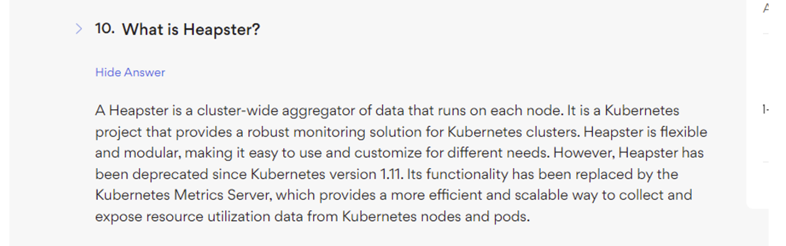

- If we want to monitor node level metrics or pod level metrics
- We need a solution to monitor the metrics to provide analytics
- Kubernetes does not come with logging mechanisms, we have different solutions like Dynatrace and data dog.
- Heapster is deprecated now


- We have a METRIC SERVER which retrieves the logs from the node and it is in memory solution.
- It does not store the logs on the disk so we need to go for the open source ones.
- **Kubernetes runs Kubelet on each node, kubelet contains sub component called as `C ADVISOR and then fetches the metrics` and exposes the data to the KUBE API SERVER.**


```bash
k top pod
# To show the information of the node
k top node

```

## Managing Application Logs

```bash
controlplane ~ ➜  **k get pods**
NAME       READY   STATUS    RESTARTS   AGE
webapp-1   1/1     Running   0          11s

controlplane ~ ➜  **k logs webapp-1** 
[2024-03-03 19:46:47,330] INFO in event-simulator: USER4 is viewing page1
[2024-03-03 19:46:48,331] INFO in event-simulator: USER4 is viewing page2
[2024-03-03 19:46:49,332] INFO in event-simulator: USER1 is viewing page2
[2024-03-03 19:46:50,333] INFO in event-simulator: USER3 logged out
[2024-03-03 19:46:51,334] INFO in event-simulator: USER1 is viewing page3
[2024-03-03 19:46:52,335] WARNING in event-simulator: USER5 Failed to Login as the account is locked due to MANY FAILED ATTEMPTS.
[2024-03-03 19:46:52,335] INFO in event-simulator: USER4 is viewing page3
[2024-03-03 19:46:53,336] INFO in event-simulator: USER4 is viewing page1
[2024-03-03 19:46:54,338] INFO in event-simulator: USER1 is viewing page1
[2024-03-03 19:46:55,339] WARNING in event-simulator: **USER7 Order failed as the item is OUT OF STOCK.**
[2024-03-03 19:46:55,339] INFO in event-simulator: USER2 logged in
[2024-03-03 19:46:56,340] INFO in event-simulator: USER3 is viewing page2
[2024-03-03 19:46:57,341] WARNING in event-simulator: USER5 Failed to Login as the account is locked due to MANY FAILED ATTEMPTS.
[2024-03-03 19:46:57,341] INFO in event-simulator: USER3 is viewing page3
```