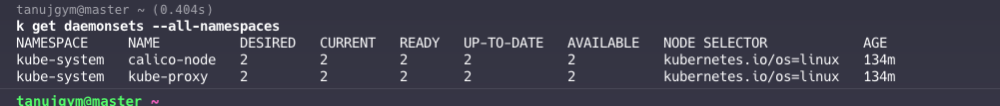

1. **What is a DaemonSet in Kubernetes?**
   - A DaemonSet ensures that a copy of a Pod runs on all (or some) nodes in a Kubernetes cluster. 
   - When nodes are added to the cluster, Pods are added to them. 
   - When nodes are removed from the cluster, those Pods are garbage collected.
   - Kube proxy is actually running as a daemon set.

2. **When would you use a DaemonSet?**
   - used for running background services on all nodes, such as:
     - Log collection (e.g., Fluentd, Logstash)
     - Node monitoring (e.g., Prometheus Node Exporter)
     - Cluster storage (e.g., glusterd, ceph).

4. **What are the update strategies available for DaemonSets?**
     - **RollingUpdate**: This is the default strategy. 
     - **OnDelete**: This strategy requires manual deletion of old Pods.

5. **How can you restrict a DaemonSet to run on specific nodes?**
     - **nodeSelector**: Specifies a label selector to match nodes.
     - **nodeAffinity**: Provides more expressive rules for node selection.
     - **Taints and Tolerations**: Allows Pods to be scheduled on nodes with specific taints.

6. **How do you perform a rolling update on a DaemonSet?**
   - you can update the DaemonSet's Pod template and apply the changes using `kubectl apply -f <updated-file>`.


7. **What are the differences between a DaemonSet and a Deployment?**
   - **DaemonSet**:  node-level operations like logging
   - **Deployment**: Manages stateless applications

8. **How does Kubernetes handle DaemonSet Pods on nodes marked as unschedulable?**
   - Kubernetes automatically adds a toleration for `node.kubernetes.io/unschedulable:NoSchedule` **to DaemonSet Pods, allowing them to run on nodes marked as unschedulable**

9. **What are some best practices for using DaemonSets?**
     - restart policy to `Always`.
     - Using namespaces
     - Using `preferredDuringSchedulingIgnoredDuringExecution` for node affinity to avoid scheduling issues.
     - Ensuring DaemonSet Pods have a high priority


### **Handling of DaemonSets by `kubectl drain`**

1. **Default Behavior:**
   - By default, `kubectl drain` does not evict DaemonSet-managed pods. 
   - This is because DaemonSet pods are designed to run on every node in the cluster, and the DaemonSet controller will immediately recreate any missing DaemonSet pods on the node being drained.

2. **Using `--ignore-daemonsets` Flag:**
   - To successfully drain a node that has DaemonSet-managed pods, you must use the `--ignore-daemonsets` flag. 
   - This tells `kubectl drain` to ignore DaemonSet pods and proceed with the eviction of other pods.
   - Command example:
     ```sh
     kubectl drain <node-name> --ignore-daemonsets
     ```

3. **DaemonSet Pods Are Not Evicted:**
   - Even when using the `--ignore-daemonsets` flag, DaemonSet pods are not actually evicted. Instead, they are ignored during the drain process. 

4. **DaemonSets Ignore Unschedulable Taints:**
   - DaemonSet pods are designed to ignore the `node.kubernetes.io/unschedulable` taint, which is applied to nodes being drained. 
   - Unschedulable taint they can tolerate.

### **Comparison with Other Workloads**

| Feature                       | DaemonSets                                   | Other Workloads (Deployments, StatefulSets, etc.) |
|-------------------------------|----------------------------------------------|---------------------------------------------------|
| **Eviction by Default**       | Not evicted by default                       | Evicted by default                                |
| **Flag Required for Drain**   | `--ignore-daemonsets`                        | No special flag required                          |
| **Pod Re-creation**           | Pods are recreated immediately by controller | Pods are rescheduled to other nodes               |
| **Respecting Unschedulable**  | Ignore unschedulable taints                  | Respect unschedulable taints                      |
| **PodDisruptionBudgets (PDBs)**| Not applicable                              | PDBs are respected                                |

## **Daemon Sets Vs Side Car Containers Monitoring**

### **1. Resource Efficiency**
- **Centralized Resource Usage**: DaemonSets deploy a single instance of the monitoring agent per node, which can monitor all the pods on that node. 
- This approach is more resource-efficient compared to deploying a sidecar container with each application pod

### **2. Simplified Management**
- **Easier Updates**: Updating the monitoring agent is simpler with DaemonSets. You only need to update the DaemonSet configuration, and Kubernetes will handle rolling out the changes to all nodes. 
   - In contrast, updating sidecar containers requires updating every deployment that includes the sidecar.


### **4. Scalability**
- **Node-Based Scaling**: DaemonSets scale with the number of nodes, not the number of pods. This makes them well-suited for monitoring tasks that need to run on every node, regardless of the number of pods running on each node


### **When to Use Sidecar Containers Instead**

1. Application-Specific Monitoring
2. **Different Logging Formats**: When applications produce logs in different formats or need to send logs to different destinations, sidecar containers can handle these requirements more flexibly than a single node-level agent.

## Daemon Sets And Pod Disruption Budgets:

### **Relationship Between DaemonSets and PDBs**

- **DaemonSets** ensure that critical system-level Pods are running on all nodes, providing essential services like logging, monitoring, and networking.
- **PDBs** ensure that application-level Pods maintain a minimum level of availability during voluntary disruptions, preventing excessive downtime.

### **Interaction**
While DaemonSets themselves do not directly interact with PDBs, they can benefit from the stability provided by PDBs in the cluster:
- **Maintenance Operations**: During node maintenance operations (e.g., draining a node), PDBs ensure that application Pods are not disrupted beyond the allowed limit. This helps maintain overall application stability, indirectly supporting the system-level services managed by DaemonSets.
- **Resource Management**: By ensuring that application Pods are not excessively disrupted, PDBs help maintain a stable environment for DaemonSet Pods to operate effectively.

### **Best Practices**
- **Use DaemonSets for Node-Level Services**: Deploy DaemonSets for services that need to run on every node, ensuring consistent and reliable operation across the cluster.
- **Implement PDBs for Critical Applications**: Define PDBs for critical applications to ensure they remain highly available during maintenance operations, minimizing the risk of downtime.
