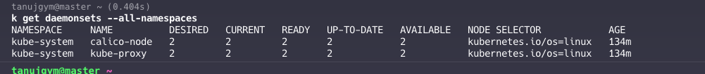

### INIT CONTAINERS
- Runs before the main containers and perform initialization
- They are sequential in nature 
- App do not start unless all are completed
- Contains Utilities or setup scripts
- Isolated and have own environment and file system
- If an init container fails, the pod’s restart policy determines the next steps. 
- For Always or OnFailure policies, the pod will restart from the first init container.
- The pod status will show Init:Error or Init:CrashLoopBackOff if there are repeated failures.

``` yaml
apiVersion: v1
kind: Pod
metadata:
  name: myapp-pod
spec:
  containers:
  - name: myapp-container
    image: busybox:1.28
    command: ['sh', '-c', 'echo The app is running! && sleep 3600']
  initContainers:
  - name: init-myservice
    image: busybox:1.28
    command: ['sh', '-c', "until nslookup myservice.$(cat /var/run/secrets/kubernetes.io/serviceaccount/namespace).svc.cluster.local; do echo waiting for myservice; sleep 2; done"]
  - name: init-mydb
    image: busybox:1.28
    command: ['sh', '-c', "until nslookup mydb.$(cat /var/run/secrets/kubernetes.io/serviceaccount/namespace).svc.cluster.local; do echo waiting for mydb; sleep 2; done"]

```
### CONS OF INIT CONTAINERS
- Resource Allocation and Scheduling
    - Resource Requests and Limits:
    - The highest resource request or limit specified across all init containers becomes the effective request/limit for the init phase. This means that init containers can reserve significant resources during initialization, which might not be used during the pod's runtime.
    - Since scheduling is based on the effective requests/limits, init containers can affect the scheduling of the pod. Pods with high resource requests for init containers might wait longer to be scheduled if the cluster is resource-constrained.
- Initialization Time
- Handling Failures: If an init container fails, the pod will restart according to its restart policy, which can lead to repeated initialization attempts and potential delays in application startup.

