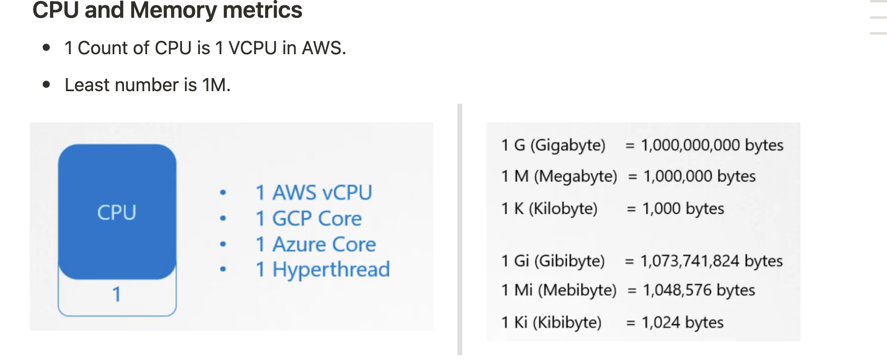
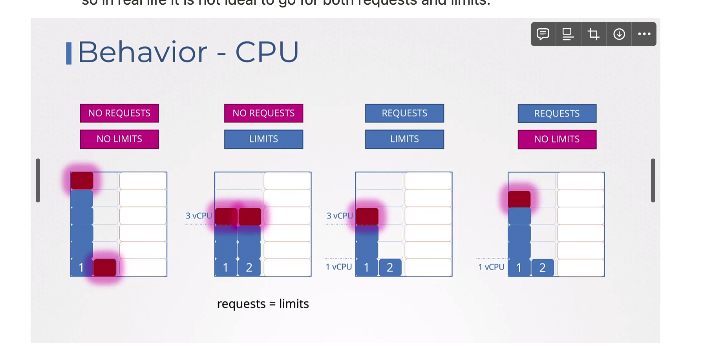
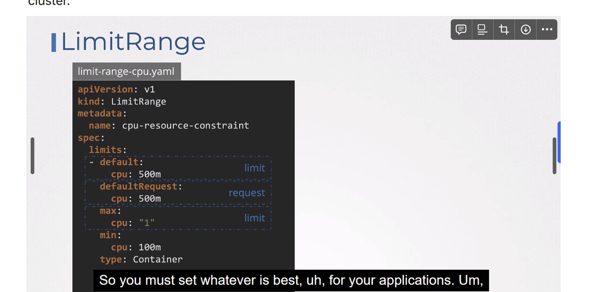

Every pod requires some resources (CPU, memory and disk space). Based on the pod’s resource requirements and the resource availability on each of the nodes, the scheduler decides which node to spawn the pod on.


### CPU and Memory metrics

- 1 Count of CPU is 1 VCPU in AWS.
- Least number is 1M.


### Resource Requests

We can specify the resource requirements for a container in the definition file. This will be used by the scheduler to find out which node has these resources available to spawn a new pod. If not specified explicitly, **the scheduler assumes that the pod will require 0.5 CPU and 256 Mi memory.**

### Resource Limits

A container has no limit on resources it can consume. **A container can use up all the resources and starve the native processes of the host.** 

- However, pods support resource limits.
- They can be specified for each container in the pod definition file. **If not specified explicitly, a container is given resource limits of 1 CPU and 512 Mi memory**.
- 3rd Scenario where limits and the resources are defined in that case this may happen one pod may need more CPU than the second one as second one is ideal, so in real life it is not ideal to go for both requests and limits.




- The container is not allowed to exceed the CPU limit. However, it can exceed the memory limit occasionally. If the container repeatedly exceeds its memory limit, k8s terminates the pod.  
- `A container can use more memory than the limit, then it will be terminated with the error Out of memory error, but it cannot go beyond the CPU Limit mentioned`

```yaml
apiVersion: v1
kind: Pod
metadata:
	name: web-pod
spec:
	containers:
		- name: nginx
			image: nginx
			resources:
				requests:
					memory: "1Gi"
					cpu: 1
				limits:
					memory: "2Gi"
					cpu: 3
```

---

We can use LIMIT RANGE Objects also at the Pod level, n**ewer pods will be affected after this is created, Not the existing ones.**

 This ensures that containers running in the namespace adhere to certain resource constraints, preventing resource contention and ensuring fair resource allocation across the cluster.



### Resource Quota

We can create QUOTAS at the namespace level, to set the hard limit at the namespace level, so we can define the maximum limit

```yaml
apiVersion: v1
kind: ResourceQuota
metadata:
  name: dev-namespace-quota
spec:
  hard:
    request.cpu: 4
    request.memory: 4Gi
    limits.cpu: 10
    limits.memory: 10Gi
```

Remember, you CANNOT edit specifications of an existing POD other than the below.

- spec.containers[*].image
- spec.initContainers[*].image
- spec.activeDeadlineSeconds
- spec.tolerations

LimitRange and ResourceQuota are both Kubernetes objects used for managing resource allocation within namespaces, but they serve different purposes and operate at different levels of granularity:

1. **LimitRange**:
    - **Scope**: LimitRange operates at the **Pod and Container level within a namespace.**
    - **Functionality**: It sets default resource requests and limits for containers within a namespace. 
        - ***If a container does not explicitly specify these values, the defaults defined in the LimitRange are applied.***
        - **Example**: You can use LimitRange to ensure that every container in a namespace has at least a certain amount of CPU and memory allocated to it by default.
2. **ResourceQuota**:
    - **Scope**: ResourceQuota operates at the namespace level.
    - **Functionality**: ***It sets limits on the total amount of compute resources (CPU and memory) and other Kubernetes objects (such as Pods, Services, and PersistentVolumeClaims)*** that can be created within a namespace.
    - **Example**: You can use ResourceQuota to restrict the total CPU and memory usage of all Pods in a namespace or limit the number of Pods that can be created.

In summary, LimitRange is focused on setting default resource requests and limits for individual containers within a namespace, ***while ResourceQuota is focused on setting constraints on the total resource usage and number of Kubernetes objects within a namespace.*** They can be used together to provide comprehensive resource management within Kubernetes namespaces.

For example you cannot edit the **environment variables, service accounts, resource limits (all of which we will discuss later) of a running pod.** But if you really want to, you have 2 options:

1. Run the `kubectl edit pod <pod name>` command.  This will open the pod specification in an editor (vi editor). Then edit the required properties. When you try to save it, you will be denied. This is because you are attempting to edit a field on the pod that is not editable.

```yaml
controlplane ~ ➜  k describe pod elephant
Name:             elephant
Namespace:        default
Priority:         0
Service Account:  default
Node:             controlplane/192.23.146.3
Start Time:       Sat, 02 Mar 2024 16:14:50 +0000
Labels:           <none>
Annotations:      <none>
Status:           Running
IP:               10.42.0.10
IPs:
  IP:  10.42.0.10
Containers:
  mem-stress:
    Container ID:  containerd://149438d5a6132b625da41dd58013f373e1cefca6986839f20d1e60cdf9b1ec7c
    Image:         polinux/stress
    Image ID:      docker.io/polinux/stress@sha256:b6144f84f9c15dac80deb48d3a646b55c7043ab1d83ea0a697c09097aaad21aa
    Port:          <none>
    Host Port:     <none>
    Command:
      stress
    Args:
      --vm
      1
      --vm-bytes
      15M
      --vm-hang
      1
    State:          Waiting
      Reason:       CrashLoopBackOff
    Last State:     Terminated
      Reason:       OOMKilled
      Exit Code:    1
      Started:      Sat, 02 Mar 2024 16:14:55 +0000
      Finished:     Sat, 02 Mar 2024 16:14:55 +0000
    Ready:          False
    Restart Count:  1
    Limits:
      memory:  10Mi
    Requests:
      memory:     5Mi
    Environment:  <none>
    Mounts:
      /var/run/secrets/kubernetes.io/serviceaccount from kube-api-access-9cmvd (ro)
Conditions:
  Type                        Status
  PodReadyToStartContainers   True 
  Initialized                 True 
  Ready                       False 
  ContainersReady             False 
  PodScheduled                True 
Volumes:
  kube-api-access-9cmvd:
    Type:                    Projected (a volume that contains injected data from multiple sources)
    TokenExpirationSeconds:  3607
    ConfigMapName:           kube-root-ca.crt
    ConfigMapOptional:       <nil>
    DownwardAPI:             true
QoS Class:                   Burstable
Node-Selectors:              <none>
Tolerations:                 node.kubernetes.io/not-ready:NoExecute op=Exists for 300s
                             node.kubernetes.io/unreachable:NoExecute op=Exists for 300s
Events:
  Type     Reason     Age               From               Message
  ----     ------     ----              ----               -------
  Normal   Scheduled  11s               default-scheduler  Successfully assigned default/elephant to controlplane
  Normal   Pulled     8s                kubelet            Successfully pulled image "polinux/stress" in 1.723s (1.723s including waiting)
  Normal   Pulling    7s (x2 over 10s)  kubelet            Pulling image "polinux/stress"
  Normal   Pulled     7s                kubelet            Successfully pulled image "polinux/stress" in 163ms (163ms including waiting)
  Normal   Created    6s (x2 over 8s)   kubelet            Created container mem-stress
  Normal   Started    6s (x2 over 8s)   kubelet            Started container mem-stress
  Warning  BackOff    4s (x2 over 5s)   kubelet            Back-off restarting failed container mem-stress in pod elephant_default(998badf8-4f55-45cb-92d9-001987f33be0)
```