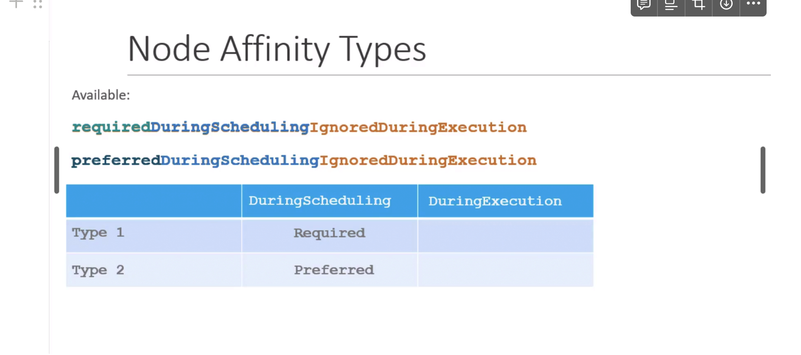
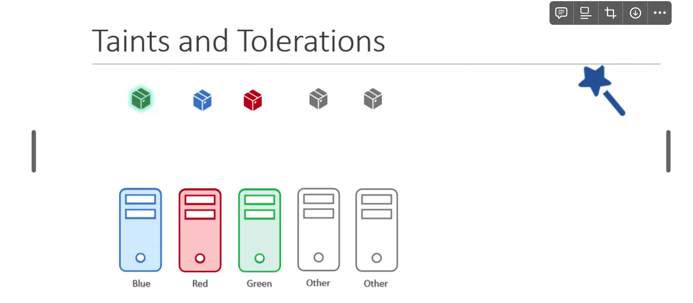
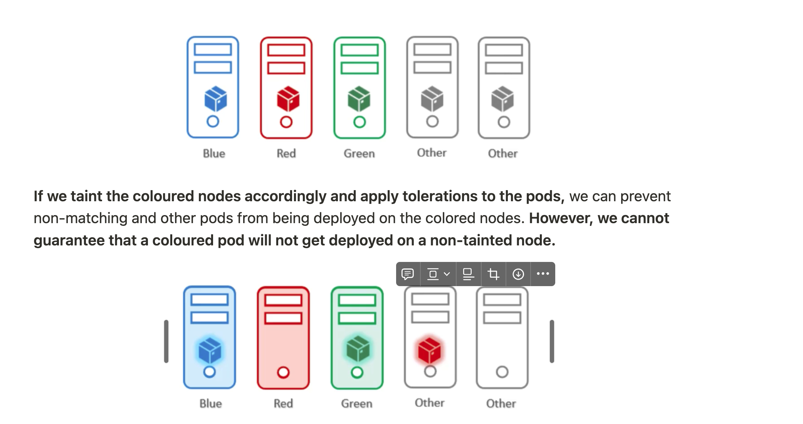

**It is used to ensure the pods are scheduled on the right nodes.** It allows us to use complex logic to decide which node the pod should be scheduled on. It uses the concept of labelling nodes as seen in Node Selector.

## Node Affinity Types

It defines the behavior of the node affinity when scheduling a new pod (`DuringScheduling`) and when a pod has been running (`DuringExecution`). 

These are of types:

- **`requiredDuringSchedulingIgnoredDuringExecution`**
    - During pod scheduling, the node **must satisfy** the node affinity requirements. If none of the nodes satisfy the requirements, the pod will not be scheduled.
    - `A pod already running should be allowed to keep running`.
- `preferredDuringSchedulingIgnoredDuringExecution`
    - During pod scheduling, the node **should ideally satisfy** the node affinity requirements. 
    - If none of the nodes satisfy the requirements, `the pod will still be scheduled on a node.`
    - A pod already running should be allowed to keep running.
- `requiredDuringSchedulingRequiredDuringExecution` (planned to be released)
    - During pod scheduling, the node **must satisfy** the node affinity requirements. If none of the nodes satisfy the requirements, the pod will not be scheduled.
    - A pod already running on a node that does not satisfy the node affinity requirements will be evicted from that node



### Schedule a pod on a node with `compute` label `high` or `medium`

```yaml
apiVersion: v1
kind: Pod
metadata:
	name: web-pod
spec:
	containers:
		- name: nginx
			image: nginx
	affinity:
		nodeAffinity:
			requiredDuringSchedulingIgnoredDuringExecution:
				nodeSelectorTerms:
					- matchExpressions:
						- key: compute
							operator: In
							values:
							- high
							- medium
```

### Schedule a pod on a node with `compute` label not `low`

```yaml
apiVersion: v1
kind: Pod
metadata:
	name: web-pod
spec:
	containers:
		- name: nginx
			image: nginx
	affinity:
		nodeAffinity:
			requiredDuringSchedulingIgnoredDuringExecution:
				nodeSelectorTerms:
					- matchExpressions:
						- key: compute
							operator: NotIn
							values:
							- low
```

### Schedule a pod on a node where `compute` label exists

```yaml
apiVersion: v1
kind: Pod
metadata:
	name: web-pod
spec:
	containers:
		- name: nginx
			image: nginx
	affinity:
		nodeAffinity:
			requiredDuringSchedulingIgnoredDuringExecution:
				nodeSelectorTerms:
					- matchExpressions:
						- key: compute
							operator: Exists
```

### Taints and Tolerations Vs Node Affinity



Even after the node tolerations and the taints it is not guarantee that pods will prefer the correct node for them

We want to deploy the colored pods on matching nodes and ensure that other pods don’t get deployed on colored nodes. 
- We also don’t want the colored pods to get deployed on other nodes.


**If we taint the coloured nodes accordingly and apply tolerations to the pods,** we can prevent non-matching and other pods from being deployed on the colored nodes. **However, we cannot guarantee that a coloured pod will not get deployed on a non-tainted node.**


If we label the nodes according to their color and use node affinity to make coloured pods schedule on the corresponding coloured nodes, the coloured pods will always be deployed on matching nodes. However, this does not guarantee that other pods will not be deployed on coloured nodes.

**We can combine both taints & tolerations and node affinity to achieve the desired result. Taints and tolerations ensure that other pods don’t get scheduled on colored nodes. Node affinity ensures that coloured pods get scheduled on the right nodes**.

### Why Go For Node Affinity

- If we go for node affinity then we label the nodes first with the color and then node selectors on the pods, the coloured pods will be 100% Scheduled on them
- **But it creates a new problem**
    - Now the non coloured nodes are also allowed on the same node itself because we are not using any taint here.
- To Solve this
    - Use combination of taints and tolerations + Node Affinity to prevent other pods to be placed on those nodes.