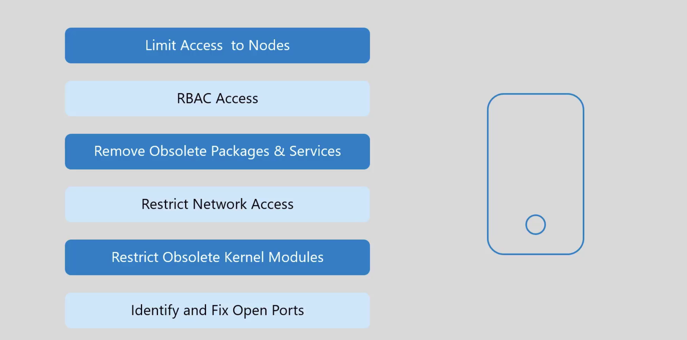
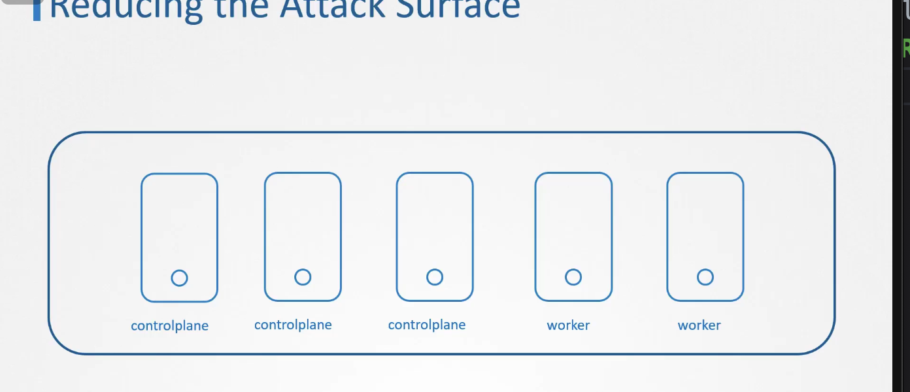
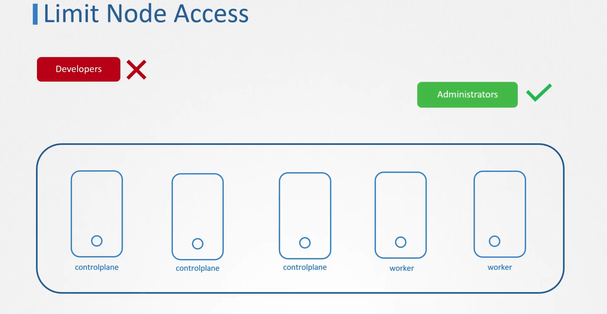
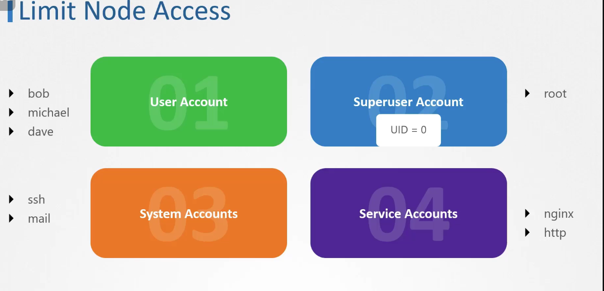
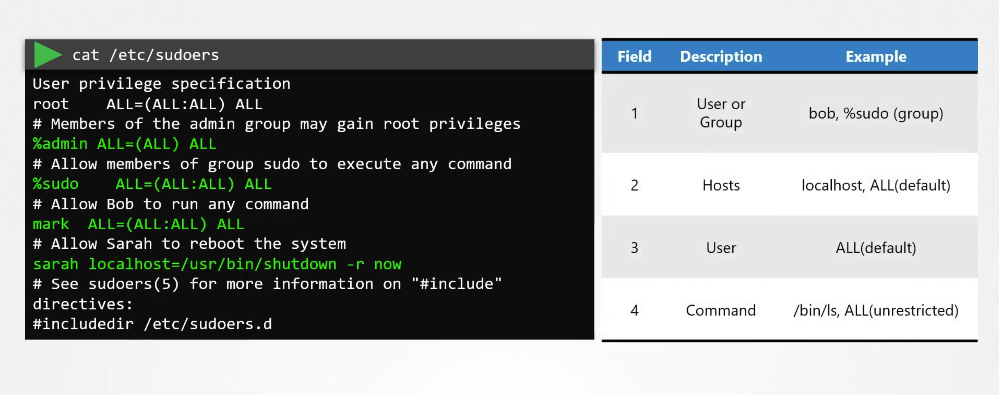
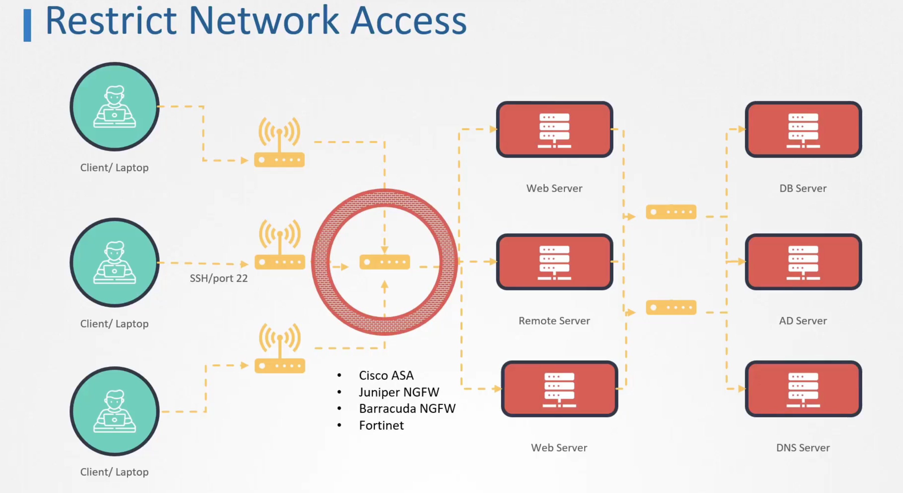

## Reducing the attack surface
- Use least privileged principle
- Limited Access
- Admission controllers.


## LIMITING THE ACCESS TO THE HOST.
- Install only required packages.
- Remove the packages which are not required.
    ```bash
    systemctl list-units --type service
    apt remove service
    ```
- ABAC and RBAC 
- We should limit the exposure of the master and the worker nodes to the internet.
- Self hosted clusters provisioning in a private network or a vpc.
- Enable Authorization Networks inside infrastructure firewall.

- User accounts, service accounts should be created with the LPP configuration.

- We can set a no login shell to the host.
```bash
usermod --shell /bin/nologin john
```
```bash
deluser micheal admin
```
## SSH HARDENING
- Disable root login
    - PermitRootLogin no in /etc/ssh/sshd_config.
- Change the default SSH Port
- Enable two factor authentication
- Configure idle timeout
- Disable Empty Passwords
    - Set PermitEmptyPasswords no in /etc/ssh/sshd_config.
- Use ssh keys instead of passwrod authentication.
- Set `Banner /etc/issue.net` in `/etc/ssh/sshd_config`.
Create and customize `/etc/issue.net` with the legal warning text.
- Install and configure `fail2ban` with an SSH-specific jail in `/etc/fail2ban/jail.local`.
- X11 Forwarding to be disabled on the server.
### X11 Forwarding

**X11 Forwarding** is a feature of SSH that allows a remote user to run graphical applications on a remote server and have the graphical interface displayed on their local machine. 

#### How X11 Forwarding Works:
- When you use X11 forwarding, SSH creates a secure channel between the client and the server.
- Graphical applications running on the server send their display output over this secure channel to be rendered on the client’s display.
- The user interacts with the application as if it were running locally, even though it's executing on the remote server.

#### Security Considerations:
- **Security Risks**: X11 forwarding can be a security risk because it allows for the potential of "X11 hijacking," where an attacker could capture keystrokes, screen contents, or inject commands into your graphical applications.
- **Usage**: X11 forwarding is disabled by default on many servers because it's not always necessary and can be a security risk if misused.

#### How to Use X11 Forwarding:
- To enable X11 forwarding, use the `-X` option in your SSH command:
  ```bash
  ssh -X user@remote-server
  ```
- On the server, ensure that X11 forwarding is enabled by setting `X11Forwarding yes` in the `/etc/ssh/sshd_config` file.

### SSH Protocol 2

**SSH Protocol 2** is the second version of the SSH (Secure Shell) protocol, which is used to securely connect to a remote computer or server over an insecure network. 

#### Key Features of SSH Protocol 2:
- **Security**: SSH Protocol 2 is much more secure than SSH Protocol 1. It uses strong cryptographic algorithms and provides better protection against man-in-the-middle attacks
- **Key Exchange**: SSH Protocol 2 supports secure key exchange methods, such as Diffie-Hellman, which allows for secure key generation even over insecure channels.
- **Encryption**: It supports strong encryption methods like AES (Advanced Encryption Standard), ensuring that data transmitted over the SSH session is well-protected.
- **Authentication**: SSH Protocol 2 supports various methods of authentication, including password-based authentication, public key authentication, and two-factor authentication.

#### Why Use SSH Protocol 2:
- **Default and Recommended**: SSH Protocol 2 is the default protocol in modern SSH implementations and is recommended for all SSH communications. 
- SSH Protocol 1 is deprecated due to its security vulnerabilities and should not be used.

## Priviledge Escalation
- Use Visudo to edit the /etc/sudoers
- setup no login shell for the root user.
- groups start with % symbol.
- Second argument is the host on which they are applicable.
- 3rd argument is the default which means ALL:ALL all groups and users can execute command on this machine.
- 4th Field is the command which can be executed by user

### VISUDO
```bash
On node01 host, open /etc/sudoers file using any editor like vi and edit entry for user jim and forcefully save the file.

To jim  ALL=(ALL) NOPASSWD:ALL
```

### CIS BENCHMARKS FOR SERVICES
- Remove unwanted packages
- Configure time synchronization of the server.
- Forward logs to a centralized syslog server for secure and consistent log management.
- Disable IPv6 if not in use or ensure it is securely configured.
```bash
sudo yum install chrony
sudo systemctl enable chronyd
sudo systemctl start chronyd
```
- Configure firewalls
- sshd config file changes
    - PermitRootLogin no
    - Use SSH Protocol 2 only: Protocol 2
    - Disable empty passwords: PermitEmptyPasswords no
    - Enable strong ciphers and MACs.
    - Configure idle timeout: ClientAliveInterval 300
### Restrict Kernel Modules

- Create or edit a file in the /etc/modprobe.d/ directory, such as /etc/modprobe.d/blacklist.conf.
```bash
    sudo nano /etc/modprobe.d/blacklist.conf
    controlplane /etc/modprobe.d ➜  ls -ltr
total 24
-rw-r--r-- 1 root root  347 Aug 17  2021 iwlwifi.conf
-rw-r--r-- 1 root root  583 Aug 17  2021 blacklist-rare-network.conf
-rw-r--r-- 1 root root  677 Aug 17  2021 blacklist-framebuffer.conf
-rw-r--r-- 1 root root  210 Aug 17  2021 blacklist-firewire.conf
-rw-r--r-- 1 root root  325 Aug 17  2021 blacklist-ath_pci.conf
-rw-r--r-- 1 root root 1519 Aug 16 14:30 blacklist.conf
controlplane /etc/modprobe.d ➜  vi blacklist.conf 
controlplane /etc/modprobe.d ➜  vi blacklist.conf 
controlplane /etc/modprobe.d ➜  
```
#### BLACKLIST CONF
```bash
# replaced by tulip
blacklist de4x5

# causes no end of confusion by creating unexpected network interfaces
blacklist eth1394

# snd_intel8x0m can interfere with snd_intel8x0, doesn't seem to support much
# hardware on its own (Ubuntu bug #2011, #6810)
blacklist snd_intel8x0m

# Conflicts with dvb driver (which is better for handling this device)
blacklist snd_aw2

# replaced by p54pci
blacklist prism54

# replaced by b43 and ssb.
blacklist bcm43xx

# most apps now use garmin usb driver directly (Ubuntu: #114565)
blacklist garmin_gps

# replaced by asus-laptop (Ubuntu: #184721)
blacklist asus_acpi

# low-quality, just noise when being used for sound playback, causes
# hangs at desktop session start (Ubuntu: #246969)
blacklist snd_pcsp

# ugly and loud noise, getting on everyone's nerves; this should be done by a
# nice pulseaudio bing (Ubuntu: #77010)
blacklist pcspkr
```

- Add Modules to the Blacklist: Add lines to the file to blacklist specific modules. For example, to blacklist the usb-storage and firewire-core modules:
    ```
    blacklist usb-storage
    blacklist firewire-core
    ```
- Update the Initramfs (if needed):
On some systems, you may need to update the initramfs to ensure the blacklist is applied during boot:
    ```bash
    sudo update-initramfs -u
    ```
- If we do not blacklist the modules then the pod can dynamically load kernel modules in the machine.
- Verify the config
```bash
blacklist sctp
blacklist dccp
#Verify the config
lsmod
```
## DISABLE HOST PORTS
```bash
netstat -tulpn | grep -i LISTEN
lsof -i :<port>
cat /etc/services| grep -w 6443
```

# Restrict Network Access
- External Firewals can be used:
    
- Individual Firewalls can be used at server level:
    - IP TABLES
    - UFW
