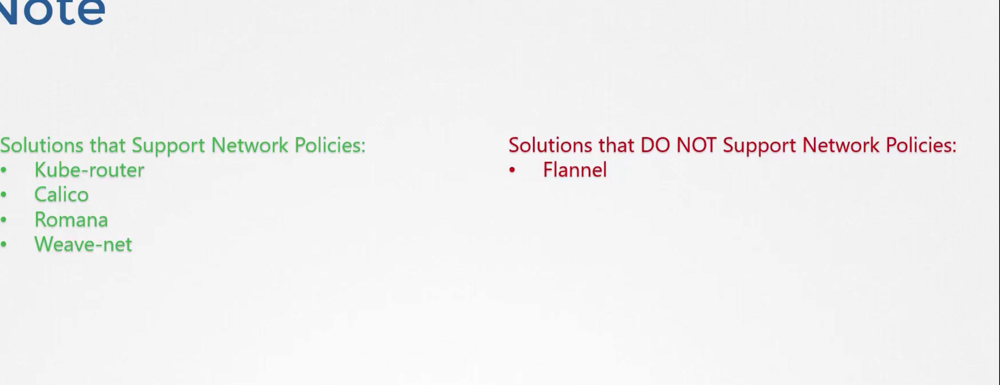
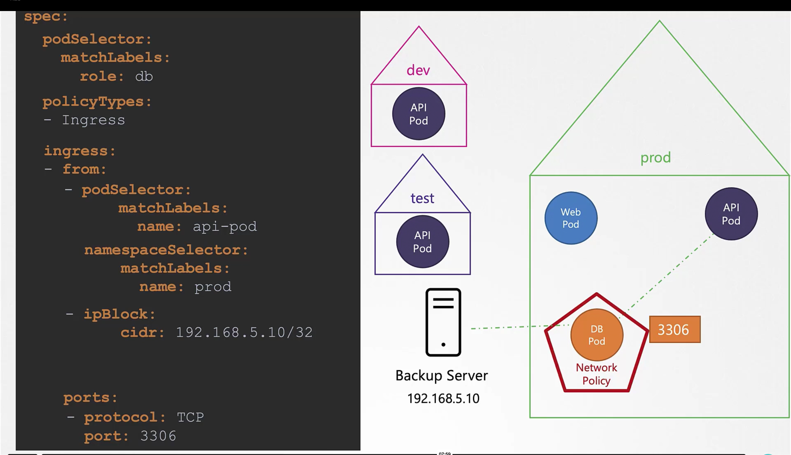

# NETWORK POLICY 

## PAUSE CONTAINERS

## ETHERNET BRIDGE NETWORK
## ARP TABLES
Here are notes on the topics you've requested:

### 1. **Network Policy**
- **Definition:** Network Policies in Kubernetes are a way to control traffic flow at the IP address or port level. They allow you to define rules that specify how pods communicate with each other and with other network endpoints.
  
- **Purpose:** Network Policies are used to enhance security by restricting access between pods. By default, all pods in a Kubernetes cluster can communicate with each other. Network Policies can limit this communication based on labels, namespaces, and IP blocks.

- **Components:**
  - **Pod Selector:** Defines which pods the policy applies to based on labels.
  - **Ingress Rules:** Define allowed inbound traffic to the selected pods.
  - **Egress Rules:** Define allowed outbound traffic from the selected pods.
  - **Policy Types:** Specify whether the policy is for ingress, egress, or both.

- **Example:**
  ```yaml
  apiVersion: networking.k8s.io/v1
  kind: NetworkPolicy
  metadata:
    name: deny-all
    namespace: default
  spec:
    podSelector: {}
    policyTypes:
    - Ingress
    - Egress
    ingress: []
    egress: []
  ```
  The above example denies all ingress and egress traffic to pods in the `default` namespace.

### 2. **Pause Containers**
- **Definition:** In Kubernetes, a pause container is a lightweight container that runs alongside application containers within a pod. It is responsible for holding the network namespace and other shared resources for the pod.
  
- **Purpose:** The pause container acts as the "parent" container in a pod, setting up the shared namespaces (like network, PID, etc.) that other containers in the pod use. This allows all containers in the pod to communicate with each other over localhost.

- **Functionality:**
  - **Network Namespace:** The pause container holds the network namespace, meaning all other containers in the pod share the same IP address and port space.
  - **Lifecycle Management:** Even if the application containers in a pod are stopped or restarted, the pause container remains running, preserving the pod's network configuration.

- **Key Point:** The pause container is crucial for Kubernetes' pod model but performs no real work itself. It simply runs a process that sleeps indefinitely.

### 3. **Ethernet Bridge Network**
- **Definition:** An Ethernet bridge is a device that connects multiple network segments at the data link layer (Layer 2) of the OSI model. In the context of container networking, it is used to connect different network interfaces or virtual machines (VMs) to form a single network.
  
- **Usage in Containers:** In a containerized environment like Kubernetes, a bridge network allows multiple containers to communicate with each other as if they were on the same physical network.

- **Linux Bridge:** The Linux kernel provides a software-based Ethernet bridge, which is commonly used in container networking setups like Docker and Kubernetes.

- **Functionality:**
  - **Packet Forwarding:** The bridge forwards packets between network interfaces based on MAC addresses.
  - **Isolation:** The bridge can be configured with VLANs or other mechanisms to isolate traffic between different network segments.

- **Example:** In Docker, the default bridge network is called `docker0`, and it is used to connect containers to each other and to the host machine.

### 4. **ARP Tables**
- **Definition:** ARP (Address Resolution Protocol) tables are used to map IP addresses to MAC addresses. This is necessary because network communication at the IP layer requires knowing the MAC address of the destination machine on a local network.
  
- **Functionality:**
  - **IP to MAC Mapping:** When a device on the network wants to communicate with another device, it uses ARP to find out the MAC address corresponding to the target IP address. The result is stored in the ARP table.
  - **Dynamic Entries:** ARP tables typically contain dynamic entries that are added or updated when a device sends an ARP request and receives a response.

- **Usage in Kubernetes/Containers:**
  - **Pod Networking:** In a Kubernetes cluster, ARP tables are used by the network plugin (like Calico, Flannel, etc.) to ensure correct routing of packets between pods.
  - **Network Troubleshooting:** Administrators can inspect ARP tables to troubleshoot networking issues, such as connectivity problems or IP conflicts.

- **Example Command:** On Linux, you can view the ARP table using the command:
  ```bash
  arp -n
  ```
  or
  ```bash
  ip neigh
  ```

