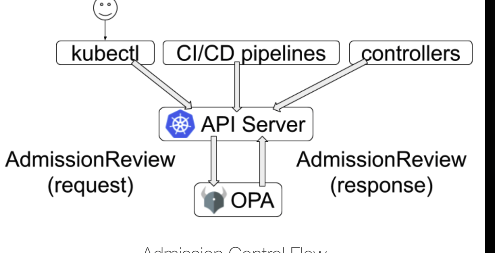

Pod Security Admission is a built-in admission controller in Kubernetes that enforces the Pod Security Standards (PSS) to control the security context of pods at the namespace level. This feature was introduced to provide a more streamlined and effective way to manage pod security compared to the deprecated Pod Security Policies.

### Key Features of Pod Security Admission

1. **Enforcement of Pod Security Standards**: Pod Security Admission applies predefined security contexts to pods based on three levels of security:
   - **Privileged**: Allows all permissions, suitable for trusted workloads.
   - **Baseline**: A minimally restrictive policy that prevents known privilege escalations.
   - **Restricted**: The most restrictive policy, following best practices for pod hardening.

2. **Namespace-Level Configuration**: Security policies can be applied at the namespace level by labeling namespaces with specific modes:
   - **Enforce**: Pods that violate the policy are rejected.
   - **Audit**: Violations are logged but allowed.
   - **Warn**: Users receive warnings for violations, but pods are still allowed.

3. **Exemptions**: Administrators can define exemptions for certain users, runtime classes, or namespaces 
    - allowing specific pods to bypass the defined security policies.

4. **Version Control**: Pod Security Admission allows pinning policies to specific Kubernetes versions, ensuring consistency in security enforcement across different environments.

5. **Integration with Kubernetes**: This admission controller is integrated into the Kubernetes API server and operates automatically, requiring minimal configuration to enforce security policies.

    - To use Pod Security Admission, you need to configure your Kubernetes cluster to enable it. This involves setting up the appropriate admission control configuration in the API server. 
    - Once enabled, you can label namespaces to define the desired security levels for pods.

# LEVELS OF SECURITY:

## 1. **Privileged**
- The least restrictive policy that allows for known privilege escalations
- Provides the widest possible level of permissions
- Typically aimed at system- and infrastructure-level workloads managed by privileged, trusted users

## 2. **Baseline** 
- A minimally restrictive policy that prevents known privilege escalations
- Allows the default (minimally specified) Pod configuration
- Targeted at application operators and developers of non-critical applications

## 3. **Restricted**
- The most restrictive policy, following current Pod hardening best practices
- Enforces strict security controls at the expense of some compatibility
- Targeted at operators and developers of security-critical applications, as well as lower-trust users

The Pod Security Admission controller validates the pod's security context against the assigned policy level for the namespace. Pods that do not comply with the policy are rejected from admission.

Pod Security Admission controllers do not directly check Roles and RoleBindings. Instead, they enforce pod security standards based on the security context of the pods themselves. 

1. **Pod Security Policies (PSPs)**: While PSPs were used to define security-sensitive aspects of pod specifications, they required associated Roles and RoleBindings to authorize users or service accounts to use those policies. 
- However, with the deprecation of PSPs in Kubernetes 1.21 and their removal in 1.25, the focus has shifted to Pod Security Admission controllers that enforce security standards without the need for PSPs or their associated RBAC configurations.

2. **Pod Security Admission**: This admission controller checks pods against the defined Pod Security Standards (Privileged, Baseline, Restricted) at the namespace level. 
- It does not validate or enforce Role and RoleBinding configurations. 
- Instead, it focuses solely on whether the pod specifications comply with the assigned security level for the namespace.

3. **Namespace-Level Enforcement**: The Pod Security Admission controller operates based on namespace labels that define the security level. 
- Pods that do not meet the requirements of the assigned security level will be denied admission, regardless of any Roles or RoleBindings that may exist.

When the Pod Security Admission controller is enabled in Kubernetes, it checks specific aspects of the pod manifest against the defined Pod Security Standards (PSS) before allowing the pod to be created. Here are the key checks performed:

### 1. **Security Context**
- **Privileged Mode**: Checks if the pod is running in privileged mode. 
- The Restricted and Baseline standards typically disallow privileged containers.
  
- **Host Namespace Access**: Verifies whether the pod requests access to host namespaces (PID, IPC, Network). 
- The Restricted standard generally prohibits this.

- **User and Group IDs**: Ensures that the container runs as a non-root user, as specified by the security context.

### 2. **Capabilities**
- **Linux Capabilities**: Checks if the pod requests additional capabilities beyond the default set.

### 3. **Volume Types**
- **Volume Mounts**: Validates the types of volumes being mounted. 

### 4. **Host Path Volumes**
- **Host Path Restrictions**: The use of host path volumes is generally restricted under the Baseline and Restricted standards to prevent potential security risks.

### 5. **Resource Requests and Limits**
- **Resource Management**: While not directly a part of the Pod Security Standards, ensuring that resource requests and limits.

### 6. **Container Security Context**
- **Security Context Settings**: Checks for configurations like `readOnlyRootFilesystem`, `runAsNonRoot`, and others to ensure compliance with the assigned security standard.

In Kubernetes, the Pod Security Admission controller operates in three different modes: **enforce**, **audit**, and **warn**. Each mode serves a distinct purpose in managing pod security within a cluster. Here’s a breakdown of the differences between these modes:

### 1. Enforce Mode
- **Function**: In this mode, the admission controller actively rejects any pod creation requests that do not comply with the assigned Pod Security Standard for the namespace.
- **Impact**: Pods that violate security policies are denied admission, meaning they cannot be created or updated in the namespace.
- **Use Case**: This mode is suitable for production environments where strict security compliance is necessary, ensuring that all pods adhere to the specified security standards.

### 2. Audit Mode
- **Function**: In audit mode, the admission controller allows pod creation requests but logs any violations of the Pod Security Standards.
- **Impact**: While pods that do not meet the security requirements are still created, the system generates audit logs that record the violations. This information can be useful for monitoring and compliance purposes.
- **Use Case**: This mode is beneficial for environments where you want to monitor compliance without enforcing strict rejections, allowing teams to gradually adapt to security standards.

### 3. Warn Mode
- **Function**: Similar to audit mode, warn mode allows pod creation but provides warnings to users about potential violations of the security standards.
- **Impact**: Users receive warnings when they create pods that do not comply with the security policies, but the pods are still allowed to run. This helps raise awareness without blocking the deployment.
- **Use Case**: This mode is useful for development environments or when transitioning to stricter security policies, as it informs users about security concerns without preventing their work.

### Summary of Modes

| Mode   | Action on Violations                       | Purpose                                           |
|--------|-------------------------------------------|---------------------------------------------------|
| Enforce| Rejects non-compliant pods                | Strict enforcement of security standards           |
| Audit  | Allows pods but logs violations           | Monitoring and compliance without blocking access  |
| Warn   | Allows pods and warns users               | Informing users of potential issues without blocking|

