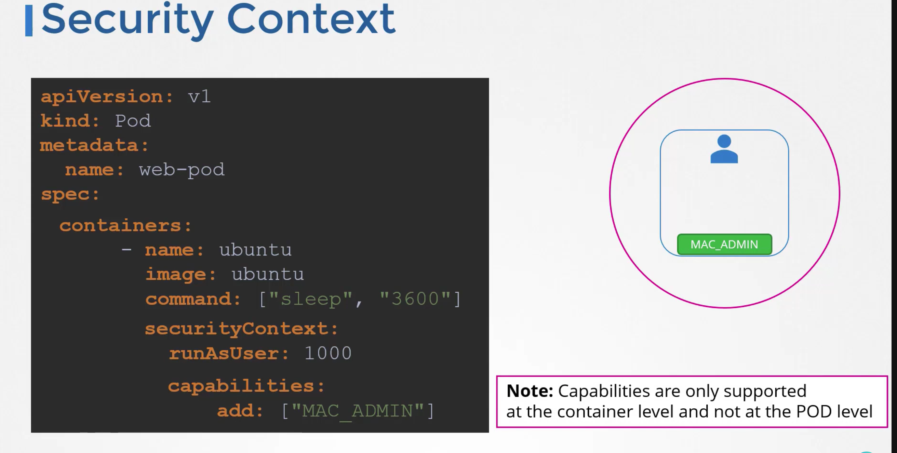

In Kubernetes, a Security Context defines privilege and access control settings for a Pod or a Container. 
- It allows you to specify what permissions the container has, what user it runs as, and other security-related settings that control how the container interacts with the system. Security contexts can be specified at both the Pod level and the Container level.

### 1. **Pod Security Context**
The Pod-level Security Context applies to all Containers within the Pod. If you set a Security Context at the Pod level, all Containers in the Pod inherit these settings unless they are overridden by a Container-level Security Context.

```yaml
apiVersion: v1
kind: Pod
metadata:
  name: mypod
spec:
  securityContext:
    runAsUser: 1000
    runAsGroup: 3000
    fsGroup: 2000
    seLinuxOptions:
      level: "s0:c123,c456"
  containers:
  - name: mycontainer
    image: nginx
```

### 2. **Container Security Context**
The Container-level Security Context overrides the Pod-level Security Context settings for the specific container. This allows you to fine-tune security settings on a per-container basis.

Here’s an example of a Container Security Context:

```yaml
apiVersion: v1
kind: Pod
metadata:
  name: mypod
spec:
  containers:
  - name: mycontainer
    image: nginx
    securityContext:
      runAsUser: 1000
      runAsGroup: 3000
      allowPrivilegeEscalation: false
      capabilities:
        drop:
        - ALL
      privileged: false
```

### 3. **Common Security Context Fields**

- **`runAsUser`:** Specifies the UID to run the container process. If not specified, the container runs as the root user (UID 0).

- **`runAsGroup`:** Specifies the GID to run the container process. If not specified, it defaults to the primary group of the `runAsUser`.

- **`fsGroup`:** Specifies the GID for files created by the container process. This ensures that files created by the container are accessible to members of the specified group.

- **`privileged`:** Determines whether a container runs in privileged mode. If `true`, the container has elevated privileges on the host system.

- **`allowPrivilegeEscalation`:** Controls whether the process can gain more privileges than its parent process. If set to `false`, it prevents privilege escalation (e.g., via `setuid` binaries).

- **`capabilities`:** Allows you to add or drop Linux capabilities from the container. 
- Capabilities are fine-grained permissions for processes running inside the container, like `NET_ADMIN` for network administration tasks.

  - **`add`:** Specifies additional capabilities to add.
  - **`drop`:** Specifies capabilities to drop (for enhanced security).

- **`readOnlyRootFilesystem`:** If `true`, the container’s root filesystem is mounted as read-only. 
- This improves security by preventing write operations to the root filesystem.

- **`seLinuxOptions`:** Specifies SELinux options for the container. SELinux is a security mechanism that enforces access controls based on security policies.

  - **`user`:** SELinux user label.
  - **`role`:** SELinux role label.
  - **`type`:** SELinux type label.
  - **`level`:** SELinux level label.

- **`seccompProfile`:** Specifies a seccomp (secure computing mode) profile to restrict system calls that the container can make.

  - **`type`:** Specifies the type of seccomp profile (`RuntimeDefault`, `Unconfined`, or `Localhost`).
  - **`localhostProfile`:** Path to the local seccomp profile (used only if `type` is `Localhost`).

### 4. **Example Use Cases**

- **Running as a Non-Root User:** To enhance security, it’s often recommended to run containers as a non-root user. This can be done by setting `runAsUser` to a non-root UID.

  ```yaml
  securityContext:
    runAsUser: 1000
  ```

- **Dropping Unnecessary Capabilities:** To reduce the potential attack surface, you can drop all capabilities except those explicitly required.

  ```yaml
  securityContext:
    capabilities:
      drop:
      - ALL
  ```

- **Using a Read-Only Root Filesystem:** This prevents the container from modifying its root filesystem, which can be beneficial for immutable or stateless containers.

  ```yaml
  securityContext:
    readOnlyRootFilesystem: true
  ```

### 5. **PodSecurityPolicy (Deprecated)**
While not strictly a Security Context, it’s important to note that Kubernetes used to provide PodSecurityPolicies (PSPs) to enforce security contexts across all pods in a namespace or cluster. However, PSPs have been deprecated and are removed in Kubernetes 1.25. They are being replaced by Pod Security Admission controls, which are simpler and more flexible.

The `runAsUser: 1000` field in a Kubernetes Security Context specifies the Unix user ID (UID) that the container's process should run as. Here's a detailed explanation of what this means and why it's used:

### 1. **Understanding the UID (`runAsUser`)**

- **Unix User ID (UID):** In Unix-like operating systems (including Linux, which is used by most Kubernetes nodes), every user is identified by a unique numeric identifier called a UID. The UID is used by the operating system to determine the permissions and access rights of processes running under that user.

- **`runAsUser: 1000`:** When you set `runAsUser: 1000` in a Kubernetes security context, you're instructing Kubernetes to run the container's main process as the user with UID 1000.

### 2. **Common UIDs in Linux Systems**

- **UID 0 (Root User):** UID 0 is the superuser or root user in Unix/Linux systems. Processes running as UID 0 have full administrative privileges and can perform any action on the system, which can be a security risk if compromised.

- **UID 1000:** On many Linux distributions, the first non-root user account created on the system is assigned UID 1000. This is typically the default user account created during the installation of the operating system. Unlike UID 0, this user has limited privileges, reducing the risk of security vulnerabilities.

### 3. **Why Use `runAsUser: 1000`?**

- **Security:** Running a container as a non-root user (like UID 1000) is a common security best practice. It limits the permissions of the container's processes, reducing the potential damage that could be caused if the container is compromised. For example, if a process running as UID 1000 is exploited, the attacker would only have the permissions of that user, not root privileges.

- **Compliance:** Many security policies and compliance frameworks require that applications do not run as the root user to minimize the risk of privilege escalation. Using a non-root user like UID 1000 helps meet these requirements.

- **Isolation:** Running as a specific user helps isolate the container's processes from other processes on the host system. Each container can be configured to run as a different user, further isolating them from each other and from the host system.

### 4. **Customizing the UID**

The specific UID used can be customized based on the needs of your application. For example:

- **Custom User:** You can create a custom user within your container image and assign it a specific UID. Then, you can configure Kubernetes to run the container as that user by setting `runAsUser` to the appropriate UID.

- **Multiple Users:** If your container image has multiple users defined with different UIDs, you can choose which user the container's process should run as by specifying the corresponding UID.

### Example

Here’s a simple example:

```yaml
apiVersion: v1
kind: Pod
metadata:
  name: non-root-pod
spec:
  containers:
  - name: myapp-container
    image: myapp:latest
    securityContext:
      runAsUser: 1000
```

In this example, the container `myapp-container` will run its processes as the user with UID 1000, instead of the root user.

### Summary

- **UID 1000** typically represents a non-root user in Linux systems, often the first user account created after the root user.
- **Using `runAsUser: 1000`** in Kubernetes helps improve security by running container processes as a non-root user, reducing the risk of privilege escalation and meeting compliance requirements.
- **Customizing UIDs** allows for flexibility in managing user permissions within containers, further enhancing security and isolation in your Kubernetes deployments.