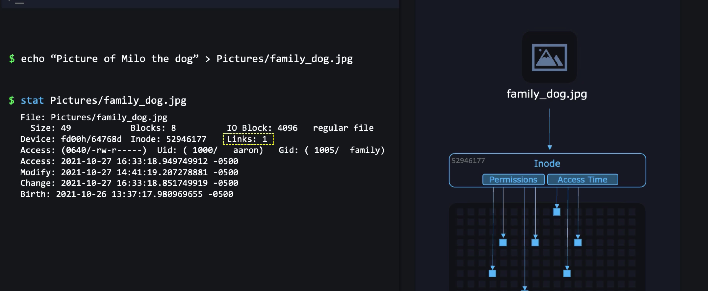

## HARD LINK
- Inode tracks the metadata, last modified, permissions etc.
- File Points to the INODE=> Data In File System.
- Points to same Inode as target file.
- `Hard link to directory is not possible if the whole directory is there then copy is the option`.
- We cannot hardlink to `files in different filesystems`.
    ```bash
    ln <target_file> <link>
    ```
    
## Create a soft link
- This is just a shortcut.
- Permissions does not matter for the soft links.
- If the directory is renamed then the symbolic link will break.
- We can Soft Link to directories also in a different file system also.
```bash
ln -s /path_to_file /path_to_link
```
### Check the path of the symbolic link
```bash
readlink <path_to_shortcut>
```

