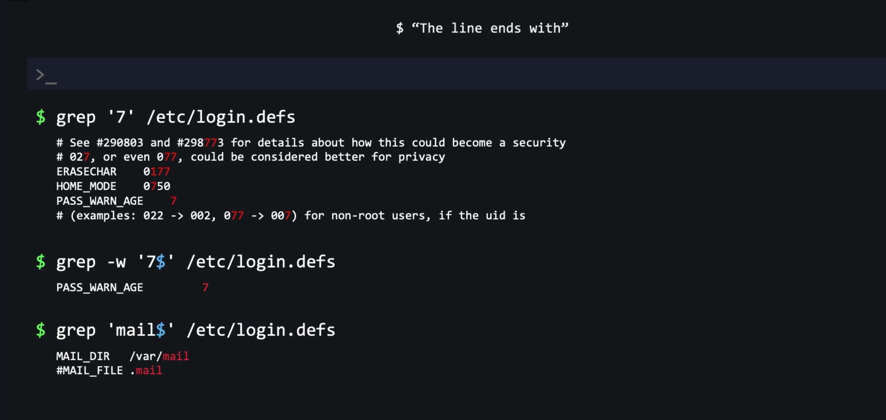
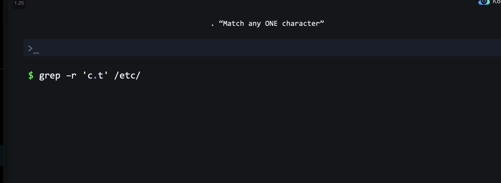
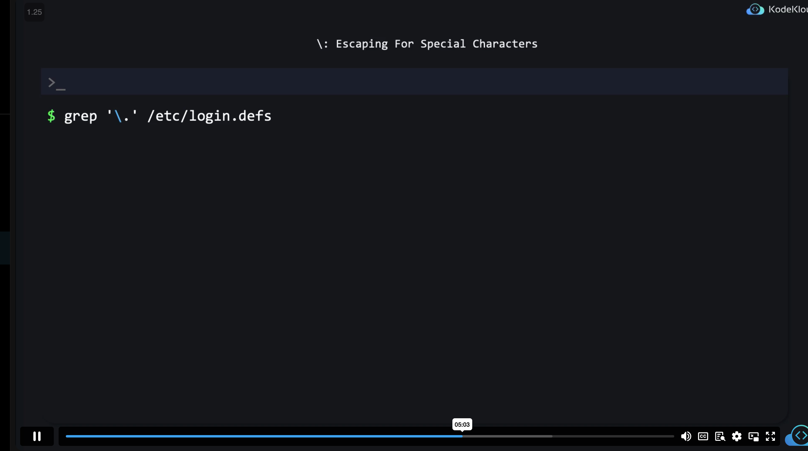

## Finding Files Modified in the Last 7 Days

```bash
find /path/to/directory -type f -mtime -7
```

## Finding Files Modified More Than 7 Days Ago
```bash
find /path/to/directory -type f -mtime +7
```

## Removing Files Modified More Than 7 Days Ago

To remove files that were modified more than 7 days ago, you can combine the `find` command with the `-exec` option or the `-delete` option:

### Using `-exec` Option

```bash
find /path/to/directory -type f -mtime +7 -exec rm {} \;
```

### Using `-delete` Option

```bash
find /path/to/directory -type f -mtime +7 -delete
```

## Finding Minimum and Maximum Modified Files

To find the minimum and maximum modified files, you can use the `ls` command in combination with `find` and `sort`:

### Finding the Most Recently Modified File (Minimum)

```bash
find /path/to/directory -type f -mtime -7 -exec ls -lrt {} + | head -n 1
```

### Finding the Oldest Modified File (Maximum)

```bash
find /path/to/directory -type f -mtime -7 -exec ls -lt {} + | tail -n 1
```

## Finding the Largest File

```bash
find / -type f -exec du -ah {} + | sort -rh | head -n 1
```

## Finding the Smallest File

```bash
find / -type f -exec du -ah {} + | sort -h | head -n 1
```


## Finding Files Modified in the Last 7 Days

```bash
find / -type f -mtime -7
```

## Finding Files Modified More Than 7 Days Ago

```bash
find / -type f -mtime +7
```

## Removing Files Modified More Than 7 Days Ago

```bash
find /path/to/directory -type f -mtime +7 -delete
```


## FINDING FILES WITH PERMISSIONS
```bash
bob@ubuntu-host ~ ➜  find /var/log -perm -g=w > /home/bob/data.txt
```
## GREP FOR LAST WORD
```sh
grep '7$' /home/bob/data.txt
```

## MATCH ANY CHARACTER IN BETWEEN

## ESCAPING SPECIAL CHARATCERS


## GREP FOR STARTING WORD
```bash
grep -i '^PS' <file_path>
# ^ Called Carrot Character
```
## Grep for Uncommented Lines
```bash
# -v is to invert the output or take not of output
grep -v '^#' <file_path>
```
## Case Insensitive Sed Command
```bash
# add i at the end
bob@ubuntu-host ~ ➜  sed -i s/disabled/enabled/gi values.conf 

```
## Stream Edit Within Specific Lines
```bash
sed -i '500,2000s/enabled/disabled/g' values.conf
```
