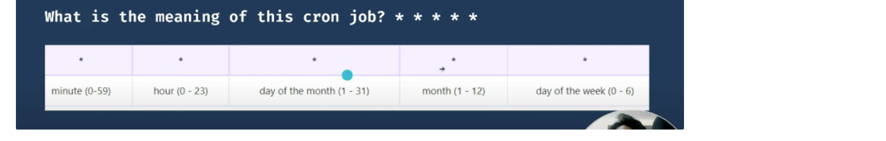

High Disk Usage Issue

- If root volume then check logs and clear some mount points
- If EBS volume take a snapshot and increase the disk space for EC2 Instance.
1. EC2 ASG is Going Down- `top` Command or `ps aux --sort=-%cpu | head -n 11`
2. **How does Anacron manage scheduling?**
    - Anacron maintains a timestamp file for each job in the system's spool directory (**`/var/spool/anacron`**). 
    - It compares the last execution time stored in the timestamp file with the current time to determine if a job needs to be executed.
3. **What happens if a scheduled Anacron job is missed?**
    - Anacron detects missed executions by comparing the current time with the expected time of the last execution. 
    - If a job is missed, Anacron executes it when the system is next booted or when Anacron is run manually.
4. **How do you configure Anacron jobs?**
    - Anacron jobs are defined in configuration files located in the **`/etc/anacrontab`** file or in individual files in the **`/etc/cron.{daily,weekly,monthly}`** directories.
5. **How does Anacron differ from Cron?**
    - Unlike Cron, Anacron is designed to handle jobs that should be executed periodically, even if the system is powered off during the scheduled time.
6. **How do you troubleshoot cron job failures?**
    - Check the system logs (**`/var/log/syslog`** or **`/var/log/cron`**) for any error messages.
    - Verify the permissions of the files and directories accessed by the cron job.
7. **Explain the format of a crontab entry.**
    - Crontab entries consist of six fields separated by spaces:
        ```bash
        minute hour day month day_of_week command
        ```
8. How to see the partition sizes :
    1. `fdisk -l`
    2. check linux version - `uname -a` or `'cat /etc/*release`
9. Limit the memory usage of the process - `ulimit -Sv 1000`
10. Check the full path of file `readlink -f file.txt`
11. **What is Zombie Process?**
- Process Creation: When a parent process creates a child process using the fork() system call, both processes start running concurrently.
- Child Process Completes: The child process finishes its execution and exits. Normally, when a process exits, it releases all its resources (like memory and file descriptors).
- Exit Status: Even though the child process has finished, it leaves behind an exit status. This status needs to be read by the parent process to know how the child terminated (whether it was successful or if there was an error).
- Parent Process Responsibility: The parent process reads the exit status of the child process using the wait() system call. This action is known as "reaping" the child process.
- Zombie State: If the parent process does not call wait(), the child process remains in the process table as a "zombie". 
    - It is essentially a "dead" process that has not been fully cleaned up.
    
12. System calls in Linux:
    - **fork():** Used to create a new process.
    - **exec():** Execute new process.
    - **wait():** wait until process execution.
    - **exit():** exit from the process.
    System calls to get the Process id :
    - **getpid():** to find the unique process id.
    - **getppid():** to find the unique parent process id.
13. A user cannot telnet or ssh to the server:
    1. server might be down
    2. Server sshd service is not running
    3. firewall can be blocking it.

14. Difference in tar and .gz
    1. tar puts multiple files in a tar file
    2. gzip compress that archive file
    3. To get a compressed archive we need to use the tar and gzip together
15. List directory only inside a directory
    1. `find . -type d`
16. Difference in TCP and UDP
17. check disk space - `df -h` 
18. Check Swap Memory `free -gh` 
19. hostname check - `hostname` 
20. check ip of the machine - `ip addr show or hostname -i`
21. check current user - `whoami`
22. Create file - `touch`, `vim,nano`
23. grep and egrep - egrep can search multiple words at one time also.
24. read file without cat command - `less` , `head` , `more`,  `nano or vim`
25. advantage of less command: forward and backward search is easy, navigation is easier.
26. check file permission:  `ls -l` or `getfacl filename`
27. inode: `ls -li` to check the inode
    1. Serves as unique identifier for a specific piece of metadata
    2. This is a type of data-structure which stores the metadata.
28. finding files on linux - `find` or `locate` command
29. counting words or lines - `wc` or `wc -l` for lines.
30. shred command: permanently delete a file which cannot be recovered - `shred -u abc.txt`
31. check architecture of the system - `lsblk` and `lscpu`
    1. `dmidecode is also used to check`
32. check the type of file - `file abc.txt or stat command`
33. How to sort the data of file - `sort` or `cat abc.txt|sort`
34. how to sort in reverse - `sort -r`
35. how to sort and remove duplicates - `sort -u`
36. how to sort by months - `sort -M`
37. How to redirect the error also - `2>` 
38. How to redirect the error and output- `2>&1`
39. how to check crontab - `crontab -l`
40. `* * * * *` what does this mean- run every minute, every hour, every day of the month, every month, every day of the week
    
    
41. How to check crontab did not work
    1. `check system time`
    2. `crontab -e`
    3. check `/var/log/messages`
42. Check cpu usage for a process - `ps aux` or `top`
43. check if process is running - `ps -ef | grep -i httpd`
44. How to kill a process - `kill -9 pid`
45. What is Kernel: Kernel is the core component between hardware and the process, it is like a `middleware which is responsible for communication.`
46. Search a word in file and replace it in entire file: 
    1. `sed` command is used to replace the word in entire file
    2. `sed -i.bak 's/MAINTAINCE_ENABLED/MAINTAINCE_DISABLED/g' config.cfg`
47. FTP Command is used for: To exchange the file to and from a remote computer.
48. How to setup alias : `vim .bashrc` file and set the alias
49. Default Ports:
    1. SSH -22
    2. DNS -53
    3. SMTP -25
    4. HTTP-80
    5. HTTPS-443
    6. FTP-21
50. How to check if a package is installed or not: `rpm -qa | grep -i net-tools`
    

51. Difference in Upgrade and Update Command:
    1. update: install new packages
    2. upgrade: perform same as update but removes older packages.
52. What is Swap Space: Swap space is used in linux if the system needs more memory and RAM is full, then linux uses this swap space.
    1. check swap space - `free -h`
53. Difference in kill and kill -9 - kill -9 forcefully terminates the process.
54. Which command has the value of exit status of previously executed command - `$?`
55. Check the usb devices - `lsusb`
56. How to check IP Server is accessible or not - `ping` or `telnet`
57. How to check the info of the ports - `netstat -tulpn`
58. How to check route table of the Machine- `netstat -route`
59. How to check network interfaces - `netstat -i` 
60. Difference in SSH and telnet: Telnet is not secured.
61. How to set a username and password that never expires `chage -M -1 Tanuj`
62. Why etc/passwd and etc/shadow file cannot be merged : existence of two files as passwd file is a text file and the shadow file is the hashed file
- shadow file is accessible by root only
63. List files opened by a specific process - `lsof -p PID`
64. Taking alot of time after reboot: filesystem can be corrupted or ext2 does not have journaling feature.
65. File is unable to be created on a mount point
    1. check space - `df -h`
    2. check inode usage - `df -i`
66. How to set a sticky bit and difference in small s and capital S
    1. Sticky bit is a special permissions for file and directory and superuser can delete or rename the file only even if other users have the write permission to the directory
    2. For executable files, the sticky bit has no effect on modern systems. However, on directories, it is primarily used to prevent users from deleting or renaming each other's files in a shared directory like /tmp. This ensures that users can create and modify their own files within the directory, but cannot delete or modify files owned by other users.
    3. Others with the full permission cannot rename or move a file or delete it only owner can or superuser.
67. Difference in -S and -s in setuidBit
    1. The setuid (set user ID) bit is a special permission in Unix-like operating systems that allows users to execute a program with the permissions of the program's owner rather than the permissions of the user who runs the program. When the setuid bit is set on an executable file, the program is executed with the privileges of the file's owner, typically root (the superuser).
    2. When the setuid bit is set on an executable file, it's represented by the letter **`s`** or **`S`** in the owner's execute permission position.
    - **`s`**: If the file has both the setuid bit and execute permission for the owner set.
    - **`S`**: If the file has the setuid bit set but does not have execute permission for the owner.

    - **`rwsr-xr-x`** : The setuid bit is set (**`s`**), and execute permission is also set for the owner (**`rwx`**).
    - **`rws--x--x`** : The setuid bit is set (**`S`**), but execute permission for the owner is not set (**`--`**).
68. Explain Booting Process of Linux.
    1. **BIOS/UEFI Initialisation:**
        - BIOS or UEFI firmware initialises hardware components like CPU, RAM, and storage devices.
        - Executes Power-On Self-Test (POST) to check hardware integrity.
    2. **Boot Loader Stage:**
        - BIOS/UEFI loads the boot loader from the Master Boot Record (MBR) or EFI System Partition (ESP).
        - Common boot loaders include GRUB (Grand Unified Bootloader) for BIOS systems and GRUB2 for UEFI systems.
    3. **GRUB Stage:**
        - GRUB loads its configuration file from **`/boot/grub/grub.cfg`**.
        - Presents boot options if multiple kernels are installed.
        - Loads the selected kernel and initial RAM disk (initrd).
    4. **Kernel Initialization:**
        - Kernel starts executing and initializes essential hardware components.
        - Mounts the root filesystem specified in the boot parameters.
        - Executes user-space init program (**`/sbin/init`** or its alternatives).
    5. **Init Process:**
        - Init process becomes the parent process (PID 1) and spawns other system processes.
        - Depending on the distribution, init can be traditional SysV init, Upstart, or systemd.
    6. **User Space Initialisation:**
        - System initialisation scripts and services start running.
        - System daemons like networking, logging, and device management are initialised.
    7. **User Login:**
        - Once initialisation is complete, the system presents a login prompt or graphical login screen.
        - Users can log in and start using the system