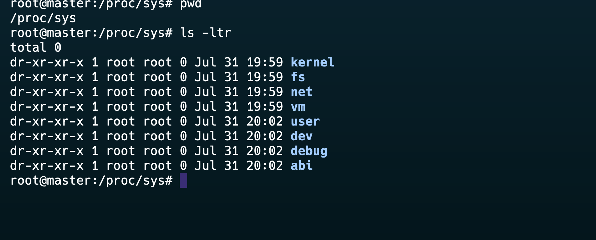

- `/proc` is a virtual file system.
- Proc files are created by the kernel itself.
- `/proc/PID/cmdline`: Command line arguments used to start the process.
- `/proc/PID/status`: Human-readable status of the process.
- `/proc/PID/stat`: Detailed statistics about the process.
- `/proc/cpuinfo`: Information about the CPU(s).
- `/proc/meminfo`: Memory usage statistics.
- `/proc/filesystems`: A list of file systems supported by the kernel.

## Virtual Files and Their Characteristics

- Zero KB Size files and created in realtime by kernel.
- Most of these files appear to have a size of zero bytes, but when accessed, they return significant amounts of information. For example, using the command `cat /proc/cpuinfo` displays detailed CPU information, while `cat /proc/meminfo` provides memory statistics[

The `/proc` file system also allows users to interact with kernel parameters. 
- Some files within `/proc/sys` can be modified to change kernel settings on-the-fly

## Key Files and Directories

- **`/proc/filesystems`**: 
- **`/proc/loadavg`**: 
- **`/proc/uptime`**: 
- **`/proc/stat`**:
- `/proc/cpuinfo`
- `/proc/meminfo`

