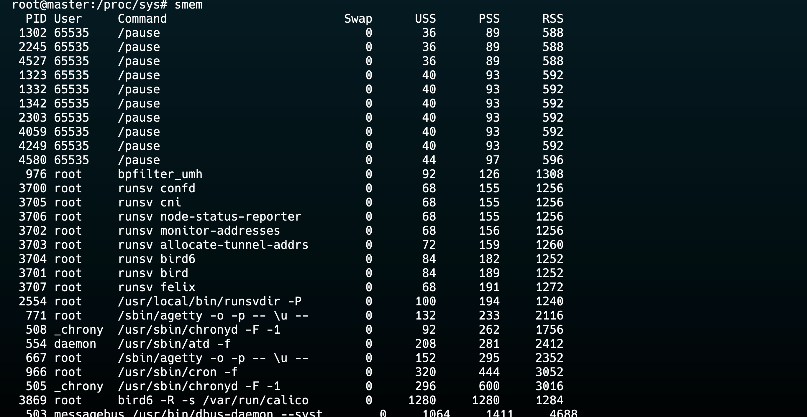
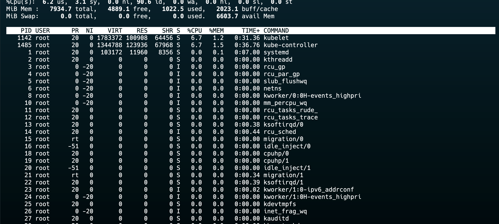

## VIRTUAL MEMORY 
- Memory management technique where the computer uses disk space as extension of RAM.
## Key Concepts of Virtual Memory
- **Illusion of Large Memory**: 
- **Swapping Mechanism**: When the system runs low on RAM, (OS) temporarily transfers inactive data from RAM to a designated space on the hard drive known as the swap space. 
- **This process, called swapping or paging, frees up RAM for active processes**.

- **Memory Management Unit (MMU)**: Main hardware component which actually makes sure that the correct memory address is being used by the process when using the virutal memory management.

## Benefits of Virtual Memory
1. **Multitasking**:
2. **Cost-Effectiveness**:

## Limitations of Virtual Memory
1. **Performance Overhead**: Accessing data in virtual memory is slower.
2. **Thrashing**: Excessive swapping can lead to thrashing, where the system spends more time swapping pages than executing processes.
4. **Complexity**: Managing virtual memory adds complexity to the operating system, requiring sophisticated algorithms for memory allocation and page replacement.

## Swap space

Swap space is an area on your hard drive used as virtual memory when your system runs out of physical RAM. 
```
free -h
```

## Monitor RAM usage
`free -h`
## RESIDENT SET SIZE AND VIRTUAL SET SIZE
The resident set size (RSS) and virtual set size (VSZ) are two important metrics for understanding memory usage

## Resident Set Size (RSS)
- Represents the total ram occupied by the process.
- Does not include the swap space or any virtual memory or shared libraries.
- RSS can be obtained using commands like `ps`, `top`, `pidstat`.

## Virtual Set Size (VSZ) 
- Represents the total virtual memory occupied by the process.
- Includes RSS,SWAP SPACE , Allocated Space but still unused, shared libraries.
- VSZ will always be greater than or equal to RSS.

The key differences are:

- RSS only counts memory in RAM, while VSZ includes all allocated virtual memory.
- VSZ includes memory from shared libraries even if not currently in use, while RSS only counts shared libraries if the pages are currently in memory.

Some important points to note:

- The sum of RSS values for all processes can exceed total RAM, as shared libraries are counted multiple times.
- VSZ values can be misleading, as they include memory that is allocated but not used.
- To get a more accurate picture of memory usage, tools like `smem`.


### Identifying Top Memory-Consuming Processes

```bash
ps -e -o pid,vsz,comm= | sort -n -k 2 -r | head 10
```

### Finding RAM Usage of a Specific Process

```bash
ps -o %mem,rss,vsize,cmd -C nginx
```
