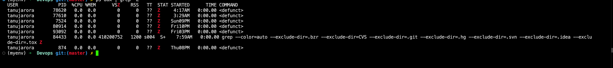

A zombie process is a process that has completed execution but still has an entry in the process table. 
- This entry remains because the process's parent has not yet read its exit status.

### How a Zombie Process is Created

1. **Process Termination:**
   - When a child process finishes execution, it exits and sends a `SIGCHLD` signal to its parent process and with this signal it' sends it's exit status.
   - Child is using the `wait` call for the process termination but the parent is not reading the status for the child process, so it keeps on waiting for the process termination.

2. **Parent Process Responsibilities:**
   - This reading of the exit status is known as `"reaping" the child `process. 

3. **Zombie State:**
   - If the parent process does not call `wait()` to read the child's exit status, the child remains in the process table as a zombie.
   - This means the process has released its resources but retains an entry in the process table to hold its exit status and PID for the parent to read.

- **Orphaned Child Processes:** When a parent process terminates, its children become orphans without reaping it.
    - These orphaned processes are adopted by the `init` process, which automatically reaps them.
    - Hence, orphaned processes typically do not remain zombies for long.

### Identifying Zombie Processes

You can identify zombie processes using commands like `ps` or `top`:

- **Using `ps`:**
  ```sh
  ps aux | grep 'Z'
  ```

- **Using `top`:**
  ```sh
  top
  ```
### Handling Zombie Processes

1. **Parent Process Modification:**
   - Ensure the parent process correctly handles the `SIGCHLD` signal and calls `wait()` to reap child processes.
2. **Manual Reaping:**
3. **Terminating the Parent Process:**
   - If modifying the parent process is not possible, terminating the parent process can sometimes resolve zombie processes, as the `init` process will adopt and reap them.
   ```sh
   kill -SIGTERM <parent_process_pid>
   ```