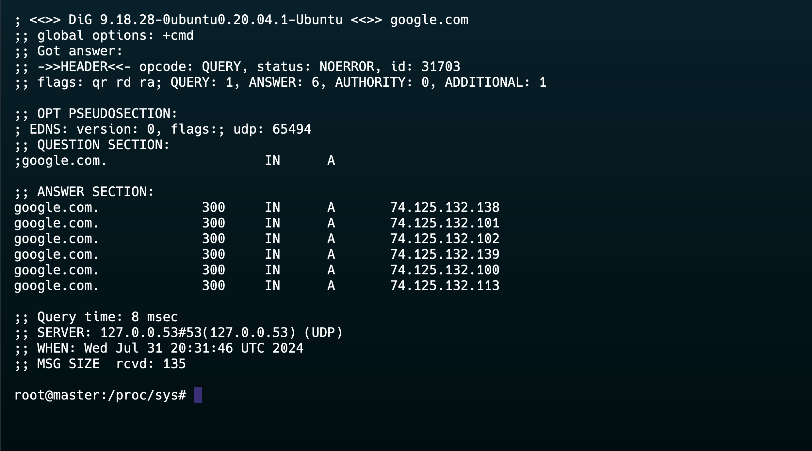
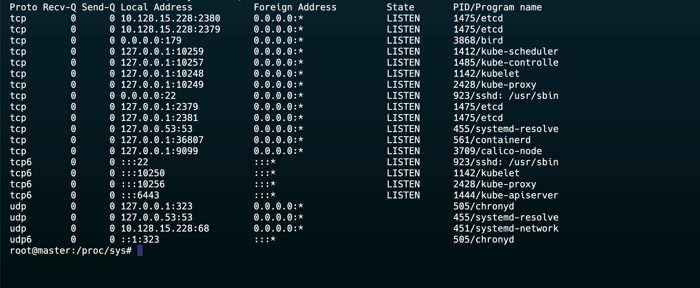
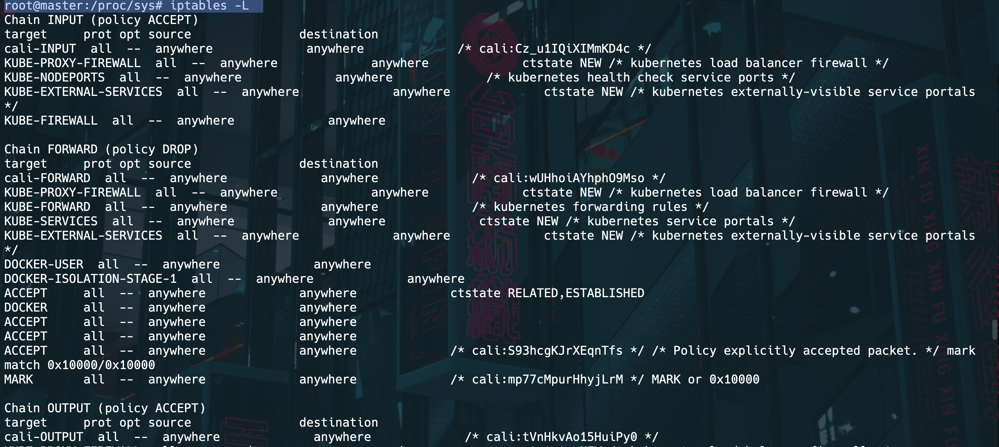

## **1. Check Network Configuration**

### **View IP Address Configuration**
- **Command**: `ip addr`
- **Purpose**: Displays the current IP address configuration.
```bash
ip addr
```
### Check the DNS and IP Address of a website
```bash
dig google.com
```


### **Check Routing Table**
```bash
ip route
```

### **Check Network Interfaces**
- **Command**: `ip link`
```bash
ip link
```

## **2. Test Basic Connectivity**

### **Ping Command**
```
ping -c 4 8.8.8.8  # Pings Google's public DNS server
```

### **Traceroute Command**
- **Command**: `traceroute`
- **Purpose**: Traces the path packets take to a destination.
```bash
traceroute google.com
```

## **4. Check Active Connections and Listening Ports**

### **SS Command**
```bash
ss -tulpn
netstat -tulpn
```


## **5. Analyze Network Traffic**
### **Tcpdump Command**
- **Command**: `tcpdump`
```bash
sudo tcpdump -i eth0 
sudo wireshark
```

## **6. Check Firewall Rules**

### **UFW (Uncomplicated Firewall)**
```bash
sudo ufw status
```

### **Iptables**
```
sudo iptables -L
```


### **Systemctl**
```bash
sudo systemctl status NetworkManager 
```

### **Curl Command**
```bash
curl -I http://google.com  
```

### **Wget Command**
```bash
wget -q --spider http://google.com && echo "Online" || echo "Offline"
```


## **SS VS NETSTAT**

### **netstat**
- Uses `/proc/net/tcp` and other `/proc` files 
- slower and older than ss

### **ss**
- Reads the kernel directly for traffic
- Faster
- More organized format

#### **netstat**
- **List all connections**:
  ```bash
  netstat -a
  ```
- **Show listening ports**:
  ```bash
  netstat -tuln
  ```
- **Display routing table**:
  ```bash
  netstat -r
  ```
