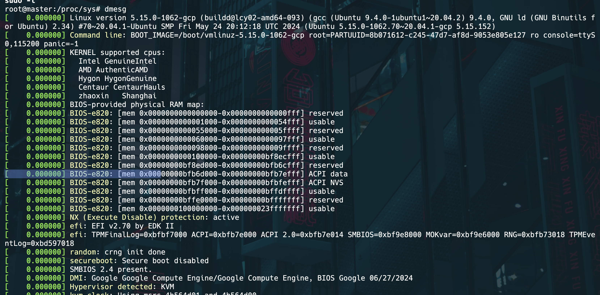

## Parallel Ports in Linux

- Used for legacy devices
- **Device Files**: In Linux, parallel ports are typically accessed via device files like `/dev/lp0`, `/dev/lp1`.
-  The `parport` subsystem supports it

### Detecting and Configuring Parallel Ports

#### Detecting Parallel Ports
1. **Check Loaded Modules**:
   ```bash
   lsmod | grep parport
   ```

2. **Check PCI Devices**:
   ```bash
   lspci -v | grep -i parallel
   ```

3. **Check Kernel Messages**:
   ```bash
   dmesg | grep parport
   ```

#### Configuring Parallel Ports

1. **Load Kernel Modules**:
   ```bash
   sudo modprobe parport_pc
   sudo modprobe ppdev
   sudo modprobe lp
   ```

2. **Set Permissions**:
   By default, parallel ports may only be accessible by users in the `lp` group. To allow normal users to access the parallel port, add them to the `lp` group:
   ```bash
   sudo usermod -aG lp username
   ```


