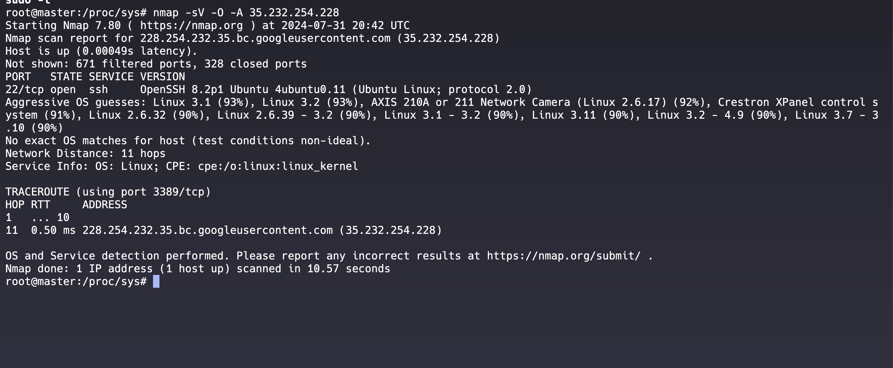

## Port Infection in Linux

- Unauthorized use of ports.
- `chrootkit` is a common tool.


#### Using `netstat`


1. **List Open Ports**:
   ```bash
   sudo netstat -ntulp
   ```
### Diagnosing Infected Ports

#### Identify Running Processes
1. **List Processes Using Specific Ports**:
   ```bash
   sudo lsof -i :1524
   sudo lsof -i :6667
   sudo lsof -i :31337
   ```

### Mitigating Port Infections
1. **Detect Infected Ports**:
   ```bash
   sudo chkrootkit
   ```

2. **Identify Processes Using Infected Ports**:
   ```bash
   sudo netstat -ntulp | grep -e '1524\|6667\|31337'
   sudo lsof -i :1524
   sudo lsof -i :6667
   sudo lsof -i :31337
   ```

3. **Stop and Disable Malicious Processes**:
   ```bash
   sudo kill -9 <PID>
   sudo systemctl stop <service_name>
   sudo systemctl disable <service_name>
   sudo systemctl mask <service_name>
   ```

4. **Secure the System**:
   ```bash
   sudo apt-get update
   sudo apt-get upgrade
   sudo ufw enable
   sudo ufw allow ssh
   sudo ufw deny 1524
   sudo ufw deny 6667
   sudo ufw deny 31337
   sudo nmap -sT -sU -p- localhost
   ```
   