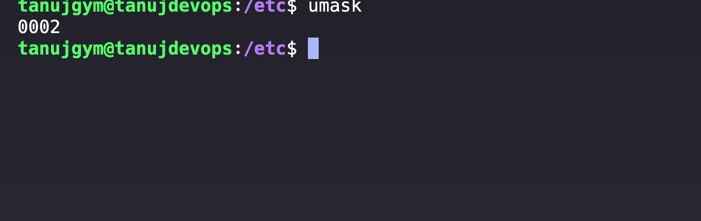

## What is Umask?
- Default permissions for directories and files
- In Octal format.


### Default Permissions

- **Files**: typically `666` 
- **Directories**:`777` 

### How Umask Works
- If the umask is set to `022`, the permissions for a new file would be calculated as follows:
  - Default file permissions: `666`
  - Umask: `022`
  - Resulting permissions: `666 - 022 = 644` (read and write for the owner, read for group and others).

- For a new directory:
  - Default directory permissions: `777`
  - Resulting permissions: `777 - 022 = 755` (read, write, and execute for the owner; read and execute for group and others).

## Setting and Viewing Umask

### Viewing Current Umask

To view the current umask value, simply run:

```bash
umask
```
- **Octal Mode**: For example, to set the umask to `027`, use:
  ```bash
  umask 027
  ```

- **Symbolic Mode**: You can also use symbolic notation, such as:
  ```bash
  umask u=rwx,g=rx,o=rx
  ```

### Permanent Changes

To make umask changes permanent, you can add the umask command to user-specific shell configuration files (like `~/.bashrc` or `~/.profile`).

## Examples of Umask Values

| Umask Value | Description                                                  |
|-------------|--------------------------------------------------------------|
| `000`       | No restrictions; all users have read, write, and execute permissions. (Potential security risk) |
| `022`       | Owner has full permissions; group and others have read permissions. |
| `077`       | Only the owner has read, write, and execute permissions; group and others have no permissions. |
| `027`       | Owner has full permissions; group has read and execute; others have no permissions. |


Special permissions in Linux, known as SUID (Set User ID), SGID (Set Group ID), and the sticky bit.

## SUID (Set User ID)

- When the SUID bit is set on an executable file, it allows users to run the program with the permissions of the file's owner, rather than their own.
- This is useful for programs that require elevated privileges, such as the `passwd` command, which allows users to change their passwords even if they don't have write access to the `/etc/shadow` file.
- To set the SUID bit, use `chmod u+s file` or `chmod 4755 file`.

## SGID (Set Group ID)

- For executable files, SGID works similarly to SUID, but it grants the permissions of the file's group owner instead of the user owner.
- To set the SGID bit on a file, use `chmod g+s file` or `chmod 2755 file`. 
- For a directory, use `chmod g+s dir` or `chmod 2755 dir`.

## Sticky Bit
- Sticky bit is not for individual files but only for directories.
- Restrict the naming and deletion of fles within those directories.
- When the sticky bit is set, only the file owner, directory owner, or root user can delete or rename a file, even if other users have write permissions on the directory.
- This is commonly used on directories like `/tmp` to prevent users from deleting each other's temporary files.
- To set the sticky bit, use `chmod +t dir` or `chmod 1755 dir`.
