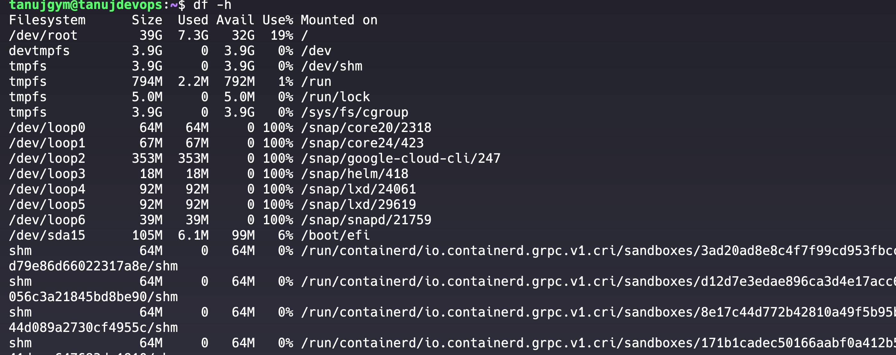

## Disk Usage Management

#### Check Mount Points
```bash
df -h 
```

## Diving into the du command

```bash
du -m / | sort -nr | head -10
```


## Cleaning Up Disk Space
1. **Remove Unnecessary Packages and Dependencies**:  you can use `apt-get autoremove`

2. **Clear Package Manager Cache**: `yum clean`

3. **Find and Remove Large Files**: You can use the `find` command to locate file.

4. **Use a Disk Cleanup Utility**: Tools like `bleachbit` 

### Bash Script Example for Disk Usage Monitoring

```bash
#!/bin/bash


# Set the path for the log file
DATE= $(date)
LOG_FILE="/var/log/disk_usage_report_$DATE.log"

# Get disk usage with df
echo "Disk Usage Report - $(date)" >> "$LOG_FILE"
echo "---------------------------------" >> "$LOG_FILE"
df -h >> "$LOG_FILE"

# Get top 10 directories consuming space
echo "" >> "$LOG_FILE"
echo "Top 10 Directories by Size:" >> "$LOG_FILE"
du -x / | sort -nr | head -10 >> "$LOG_FILE"

# # Send the log via email
# MAIL_RECIPIENT="recipient@example.com"
# MAIL_SUBJECT="Disk Usage Report"
# mail -s "$MAIL_SUBJECT" "$MAIL_RECIPIENT" < "$LOG_FILE"

# End of script
```