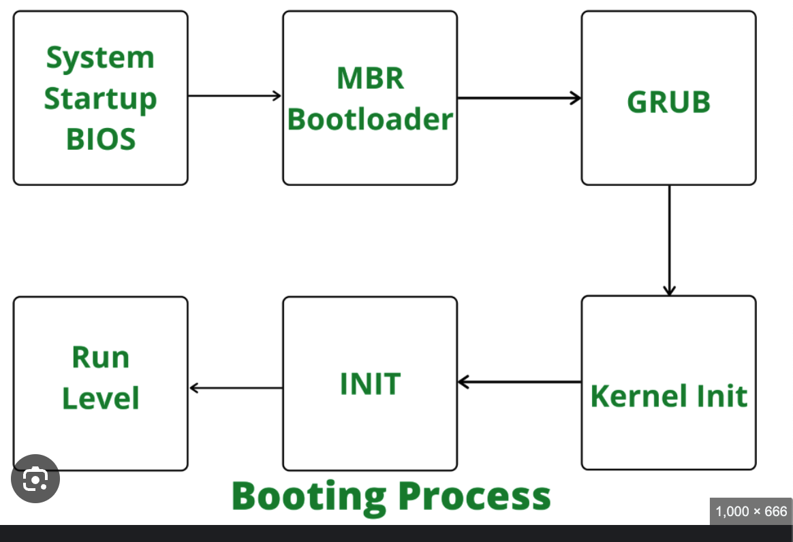

## Stages of the Linux Boot Process

### 1. **System Startup**
- Bios perform a hardware test called POST Test for RAM, CPU
- Bios Loads the OS from the bootable device.

### 2. **Bootloader Stage**
- Bootloader is the main process which loads the Operating system kernel which will be the middleman to talk to the operating system loaded in the system startup process.
- GRUB OR LILO are examples of bootloaders.
- Kernel is sotred as a compressed image file eg: vmlinuz
- Kernel is loaded into memory by bootloader and then it decompress itself in memory from a compressed image
- Menu is provided and once selected then kernel loaded into the memory.
- **BIOS Systems**: The bootloader is located in the Master Boot Record (MBR) of the bootable disk.
- **UEFI Systems**: The bootloader is located in a specific EFI system partition.

### 3. **Kernel Stage**
#### Initial Hardware Setup:
- The kernel performs basic hardware initialization.
- Mounting the Root Filesystem: This can be the final root system or the temporary root file system which is called Initial Ram DISK or initrd.
- Fires the init process. 

### 4. **System Services and Daemons**
- Init Process now runs the daemons and various processes that are required for the initialization process
### 6. **User Interaction**
Finally, once all services are running, the system presents a login prompt or graphical user interface.
