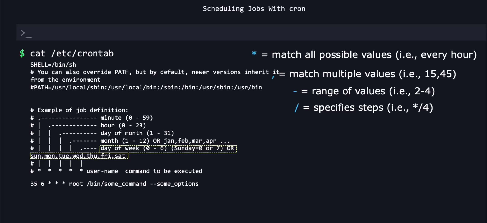
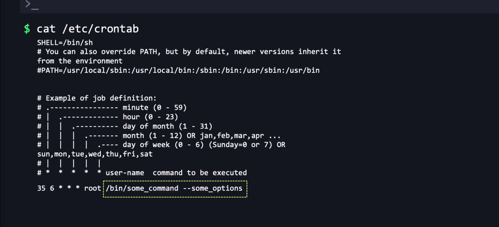
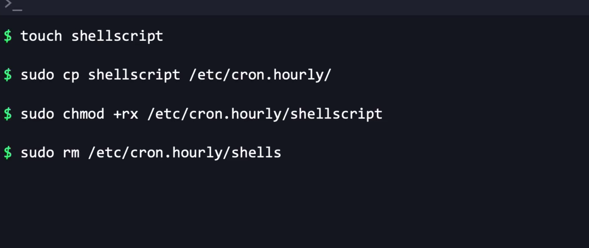

### Utilities 
- Anacron - Execute when the system gets powered on.
 - Day
 - Week
 - Month
 - Year
- Cron- Miss Jobs when power is off.
  - Minutes
  - Hour
  - Day 
  - For specific dates
- At utility: Focus on tasks which runs once only.
```bash
# Check the syntax
cat /etc/crontab
# This file will be overwritten when the system is updated.
# First it will check the /etc/crontab file 
# Then it checks for the root user
# Then for the specific user.

```


- **Cron**:
  -  accessible via the `crontab -e` command.
- **Anacron**:
  - Configuration is typically found in `/etc/anacrontab`

### FAQ
1. **Infrequently Used Systems**: 
2. **Guaranteed Execution of Periodic Tasks**:
5. **Backup and Maintenance Tasks**:
2. **How does Anacron manage scheduling?**
    - Anacron maintains a timestamp file (**`/var/spool/anacron`**). .

7. **Explain the format of a crontab entry.**
        ```
        minute hour day month day_of_week command
        ```
8. Remove Cronjob - crontab -r -u jane
9. ShellScript should not have any extension if we need to use it with a crontab entry.

10. Logs for both anacron and cron are stored in `/var/log/syslog`

```bash

bob@ubuntu-host ~ ➜  cat /etc/anacrontab 
# /etc/anacrontab: configuration file for anacron

# See anacron(8) and anacrontab(5) for details.

SHELL=/bin/sh
HOME=/root
LOGNAME=root

# These replace cron's entries
1       5       cron.daily      run-parts --report /etc/cron.daily
7       10      cron.weekly     run-parts --report /etc/cron.weekly
@monthly        15      cron.monthly    run-parts --report /etc/cron.monthly
10   5 db_cleanup /usr/bin/touch /root/anacron_created_this

bob@ubuntu-host ~ ➜  
```


