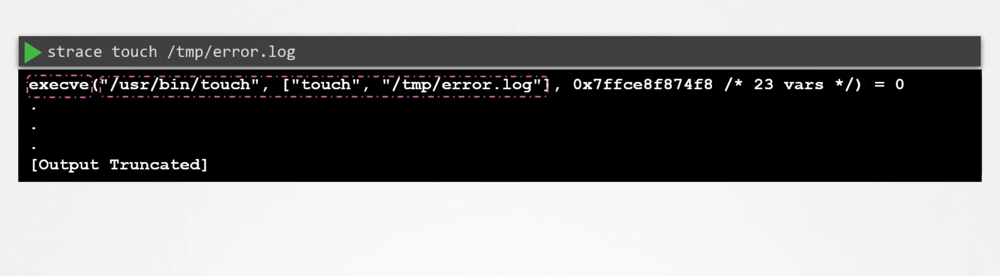
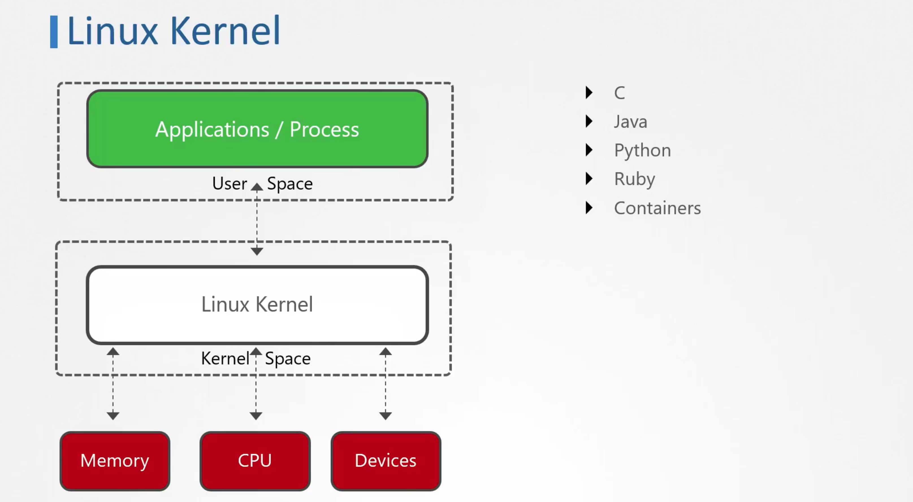
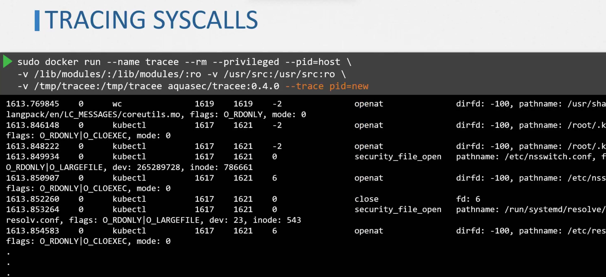
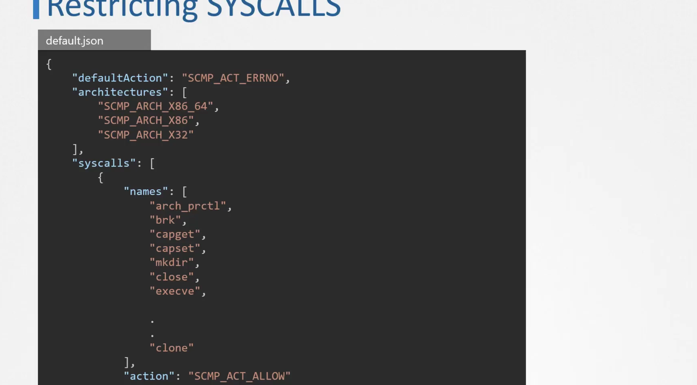
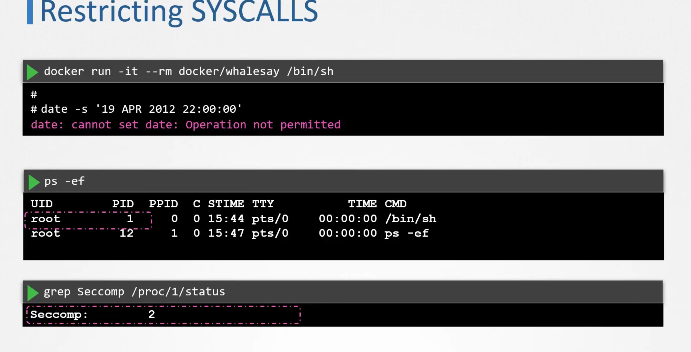

## Types of System Calls
1. **Process Management System Calls**:
   - **`fork()`**: Creates a new process by duplicating the calling process.
   - **`exec()`**: Replaces the current process image with a new process image. This is used to run a different program.
   - **`wait()`**: Makes the parent process wait until one of its child processes terminates.
   - **`exit()`**: 
## Kernel Space and User Space
- Application running in user space makes system calls to the kernel to do something on unix.
```bash
/usr/bin strace
strace touch /tmp/error.log
```

- First Argument is the absolute path to the file 
- Second Argument is the array of arguments.
- 23 vars is the number of environment variables present at the time of system calls.
### Check the Systemcalls of a process
```bash
# use -p Flag
pidof <process>
strace -p <pid>
```


2. **File Management System Calls**:
   - **`open()`**: 
   - **`read()`**: 
   - **`write()`**
   - **`close()`**:

3. **Device Management System Calls**:
   - **`ioctl()`**: Performs device-specific input/output operations that are not covered by standard system calls.

4. **Network Management System Calls**:
   - System calls related to networking, such as `socket()`, `bind()`, and `connect()`, allow for communication over networks.

5. **System Information System Calls**:
   - **`getpid()`**: Returns the process ID of the calling process.
   - **`alarm()`**: Sets a timer to send a signal after a specified number of seconds.
   - **`sleep()`**: Suspends the execution of the calling process for a specified duration.

## Common Commands Related to System Calls
  ``` bash
  strace <command>
  ```
  ``` bash
  lsof
  ```
#### List open file
```
lsof
```
#### Find who opens this file at the moment
```
lsof -u user_name
```
#### Which process is listening on what port
```
lsof -i :port_name
```
#### Which process is listening to tcp protocol
```
lsof -i tcp
```
## EXEC VS START SYSTEM CALL 
- Fork: 
   - Creates a new process
   - parent and child processes with same configuration
   - Returns a exit code which is pid of the child process to the parent process and zero out the child process
- Exec:
   - Executes and replaces the older process with the new process.
   - Parent and child processes with same configuration are not there as it is replaced. 
   - returns -1 in case of failure otherwise returns nothing.

## Kernel Modules

- **Dynamic Loading**: Kernel modules can be loaded and unloaded as needed.
- **File Format**: `.ko`

## Common Commands for Managing Kernel Modules
1. **Loading a Module**: 
   - `modprobe <module_name>`
2. **Unloading a Module**:
   - `rmmod <module_name>`

3. **Listing Loaded Modules**:
   - `lsmod`

4. **Viewing Module Information**:
   - `modinfo <module_name>`

5. **Checking Kernel Messages**:
   - `dmesg`: This command displays kernel-related messages.

## Tracing System Calls
- Can use Aquasecurity Tracee.
- Can Load the programs in the kernel space without modification of the kernel environment.
- Uses EBPF internally to work.
- Run it as binary or docker container.
- We need to bound the `/usr/src` and `/lib/modules` in read only mode bind them .
- Run the docker container in privileged mode.


### SECCOMP IN KERNEL
- Introduced in 2005 and part of kernel since then.
- Check the boot config for name 
- Docker has an inbuilt filter for mode 2 of seccomp

```bash
grep -i seccomp /boot/config-$(uname -r)
```

### Modes
- Mode 0: Disabled
- Mode 1: Strict mode only fork calls are allowed
- Mode 2: Selective strictness and filteration of the system calls can be done.