# Elastic Search
- It is designed to scale horizontally.
- New Nodes can be added without downtime.
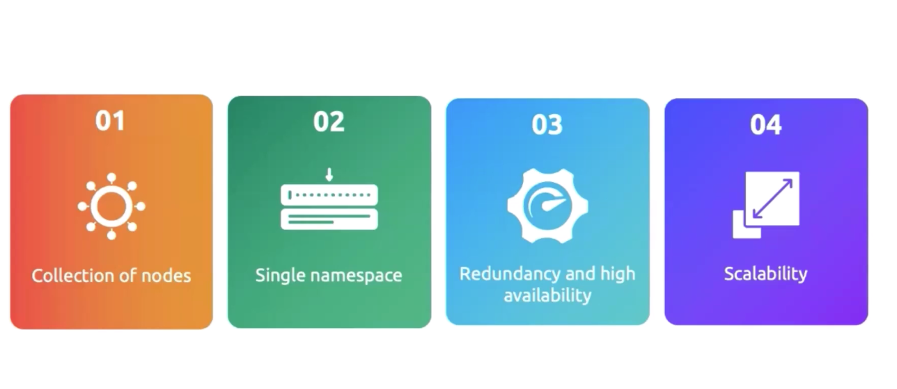
### Key Concepts in Elasticsearch

1. **Index:** 
   - An index is a collection of documents which shares similiar characteristics.
   - As documents are schemaless so indexes are also schemaless in nature even if the format of the logs change we can still put these logs on the same index.
   - Documents are the basic unit of the index and these documents have some fields which actually categorize them and then we put them on the correct index.
   - Each application will have their own indexes and then they have the common space where we can find the logs for them.
   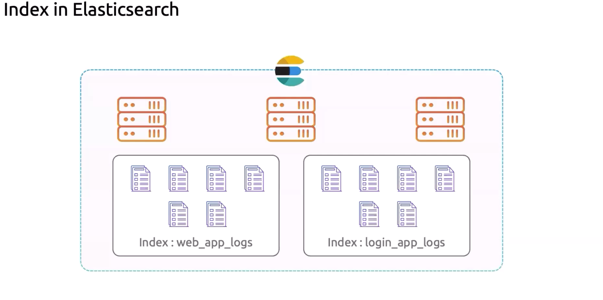
   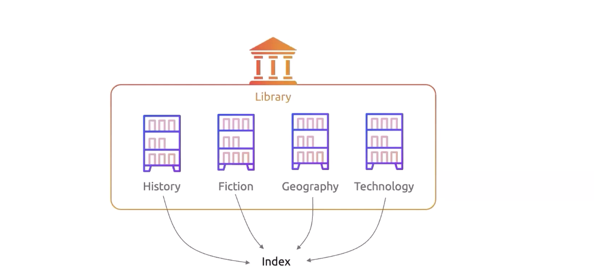
   - It stores documents in inverted index format.
   - Inverted Index format is like a book index, where each term that is there in log file will be at one side and the page numbers or the logs where it was appeared will be written on the right side. 
     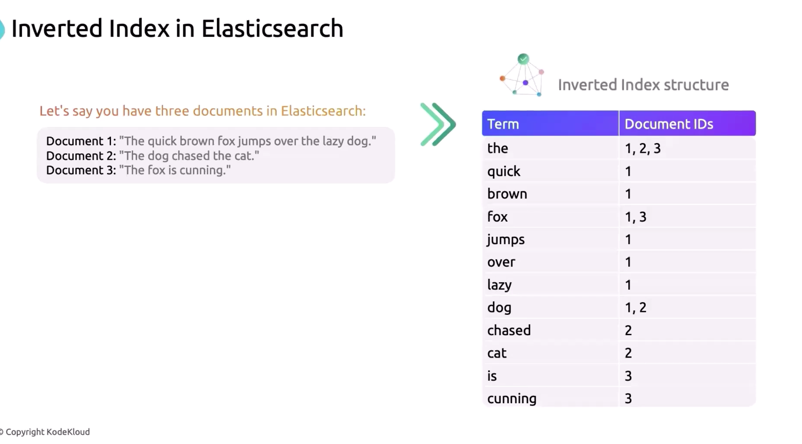
   - It makes the searching very easy just like book pages.
    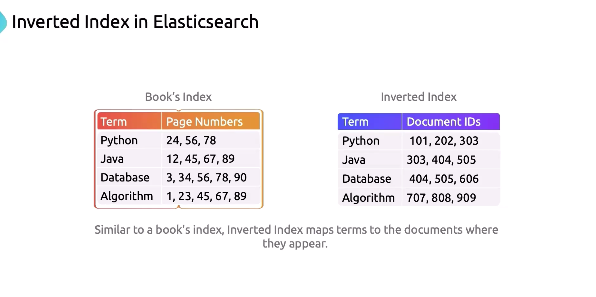
   
    
2. **Document:**
   - These are JSON based
   - Fundamental unit of data. 
   - Each has Unique ID.
   - When a document is indexed, elastic search converts it into an inverted index.
   - Schemaless documents.
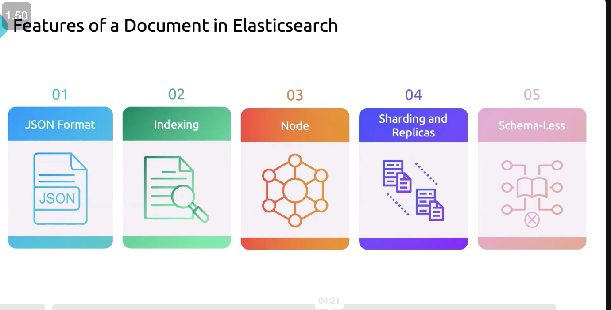
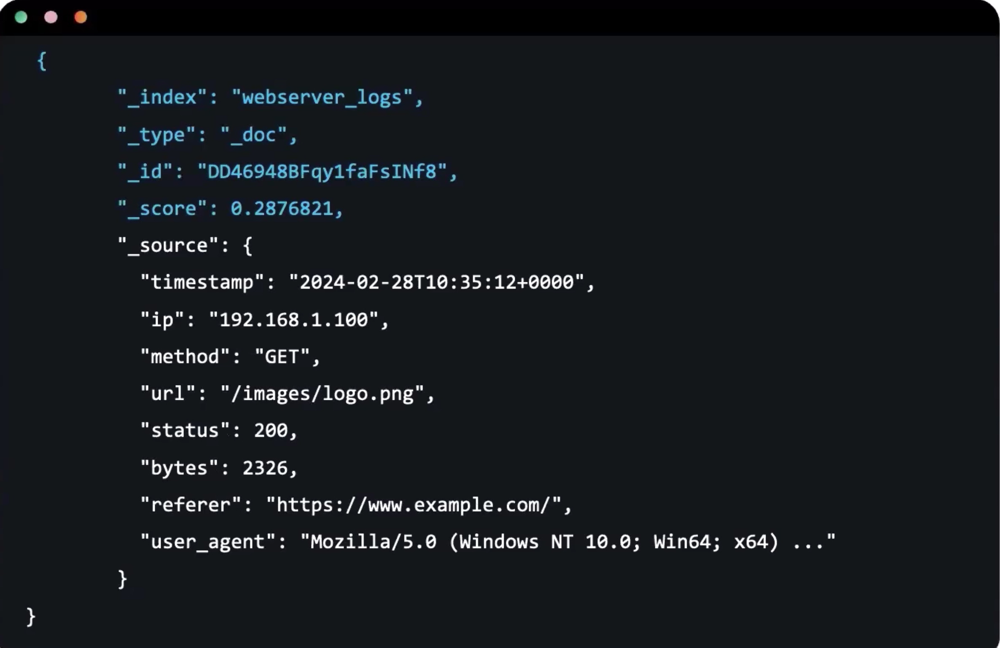
3. **Field:**
   - Fields are the key-value pairs that make up a document. For example, if a document represents a blog post, fields might include `title`, `author`, and `content`.
   - Fields have mappings information which is essentially the same as the schema in SQL databases.

4. **Node:**
   - A node is a single instance of Elasticsearch. 
   - It stores data and does indexing and search capabilities.
   - Every node does not do the same type of work. 
   - Each node has a single namespace even though the shards are on multiple nodes but they all will be integrated under the same namespace.
        - It makes the searching very easy.
    - Replica shards are created and this brings high availability in the cluster.
    - ES can automatically detect node failures.
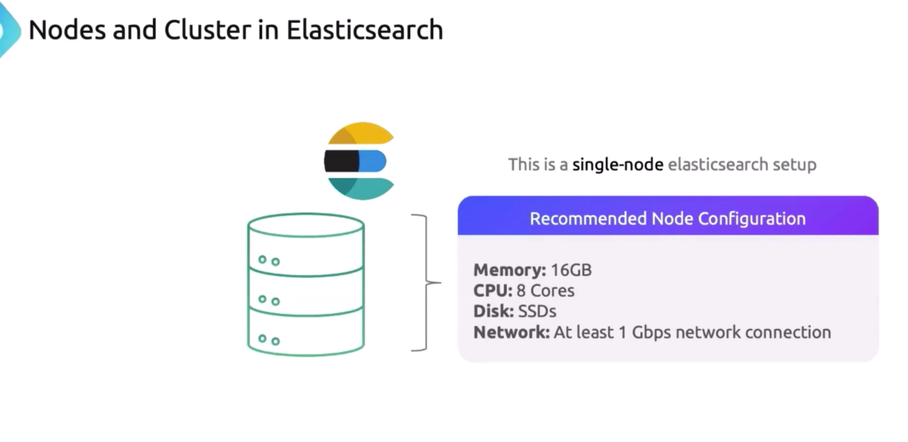
5. **Cluster:**
   - Collection of nodes become a cluster
   - Each node can server multiple roles and have a unique name.
6. **Shards**: 
    - Each shard is a piece of index.
    - We can divide the index into multiple shards like based on location logs, geoproximity logs, server logs etc.
    - Data redudancy is always present on the ES.
    - Elastic search automatically moves shards across nodes so that one node is not pressurized.
    - Only labelled nodes with the same type of labels participate in data rebalancing. EG: Data Storage nodes only work with each other, Data Cold Storage Nodes work with each other etc.
    - Replicas are there for shards.
    - Each shard is itself a index.
    - Can be on any node in cluster.
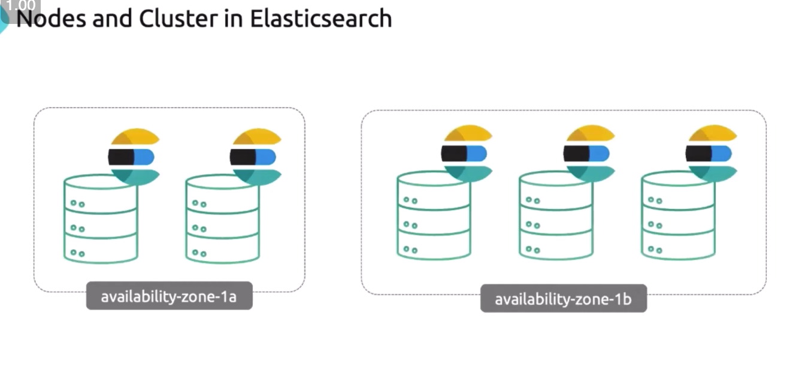

### Tokenization In Elasticsearch
- ES divides each document into multiple tokens or words.
- Second Phase is Normalization: Each Word is then converted to lowercase for consistency.
- Stop Words Remove: Like `the`, `but`
- Indexes are created which are called Inverted indexes.
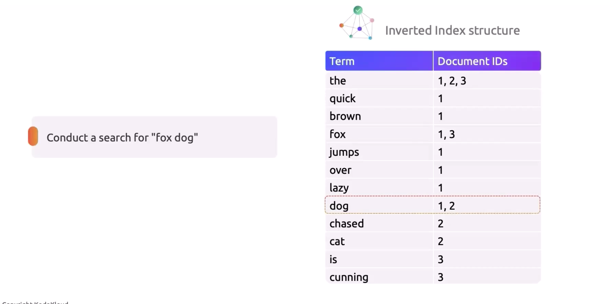


### Do all the nodes have the same type of work or roles?
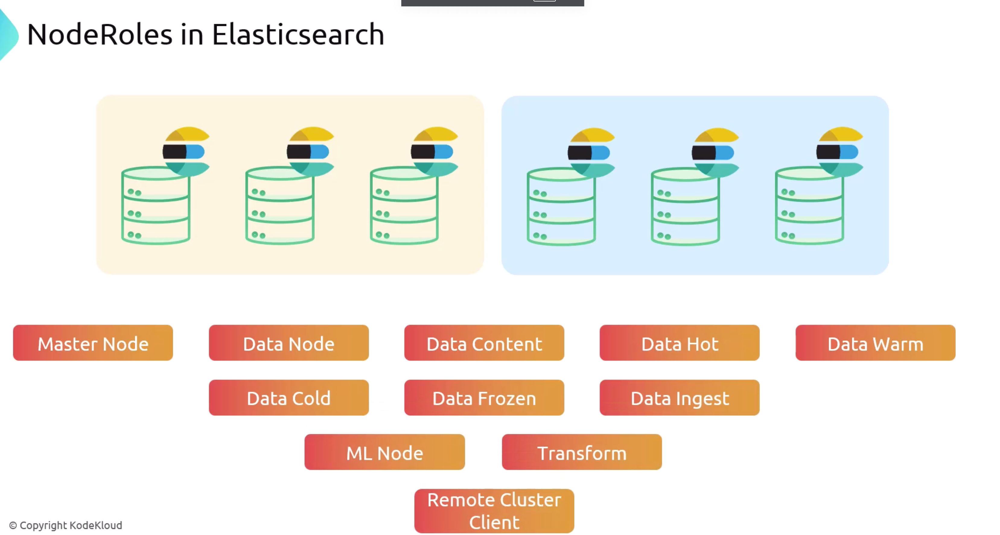
- There are multiple roles for the servers.
- Master Node: Controller of the cluster.
- Data Node: Stores the data and indexing the data.
    - WorkHorses of the cluster.
- Data Ingest Node: Pre Process data through ETL Pipelines or similiar process but before Indexing is doen on data node.
- ML Node: Handle the machine learning tasks like anomaly detection.
- Transform Node: Execute Data Transformation like pivoting, aggregating, removing null values etc.
- Remote Cluster Client: This is the main brain when we want to search against multiple clusters, even geo distributed clusters.
- Data Cold: Infrequent data optimized for cost, regulatory compliance is the main use case.
- Data Frozen: Rarely Accessed data, similiar to data cold but even older data is stored here.
- Data Hot: Frequent access data, optimized for high performance
- Data Warm: Prefered access data
balance both cost and performance.Eg: Non-Prod

### Shards in Elasticsearch

#### What are Shards?


- When you create an index, you can specify the number of shards it should be divided into. 
- Each shard is essentially a fully functional and independent index that can be hosted on any node in the cluster.

#### Shards enable Elasticsearch to:

- **Scale Horizontally:** By distributing the data across multiple shards
- **Improve Performance:** Parallelism in query execution
- **Provide High Availability:** Elasticsearch can replicate shards  
- also be used to provide read access.

#### Types of Shards:

1. **Primary Shards:**
   - The original shards that are created when you create an index. 
   - Every document you index in Elasticsearch belongs to one of the primary shards.

2. **Replica Shards:**
   - Copies of the primary shards that are used to provide redundancy and fault tolerance.

#### How Sharding Works
- You cannot change the primary shards once index is created
- So we need to plan the number of shards for an index at the beginning only.
- Replica shards can be changed after index is created but not primary shards.
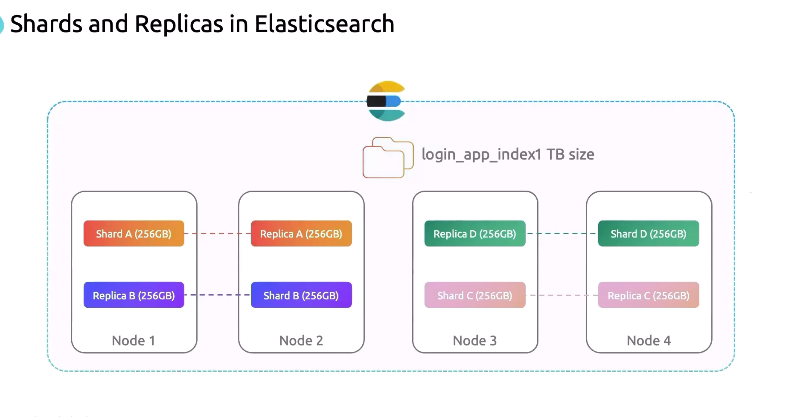
When you create an index, you define the number of primary shards (e.g., 5) and the number of replicas (e.g., 1 replica per shard). Elasticsearch automatically distributes these shards across the nodes in the cluster.

- **Example:**
  - Suppose you create an index with 5 primary shards and 1 replica.
  - If you have 3 nodes in your cluster, Elasticsearch might distribute the shards like this:
    - Node 1: Shard 1 (primary), Shard 2 (replica)
    - Node 2: Shard 2 (primary), Shard 3 (replica)
    - Node 3: Shard 3 (primary), Shard 1 (replica)

  In this setup, the index has 5 primary shards, and each primary shard has 1 replica, resulting in a total of 10 shards distributed across the cluster.

### Sharding Strategy
- **Too Few Shards:** May lead to bottlenecks, as each shard can handle only so much data.
- **Too Many Shards:** Can lead to excessive overhead and resource consumption, as each shard requires CPU, memory, and disk space.

## Indexes In Elasticsearch
In Elasticsearch, an **index** is a collection of documents that are logically grouped together. It is similar to a database in a relational database management system (RDBMS). 
- Each index is identified by a unique name, which is used to refer to it when performing operations such as indexing, searching, and managing data.

4. **Mapping:** 
   - Similar to a schema (e.g., `text`, `keyword`, `integer`, `date`), index options, analyzers.
   - Dynamic Mapping and Explicit Mapping are supported.
   - Explicit mapping gives precision.
   - Dynamic Mapping gives more flexibility.
     - Types are automatically generated by elasticsearch.
     - Dynamic Mapping is schemaless in nature and can work without predefined schemas.
     - Automatic infer of data types and schema.
    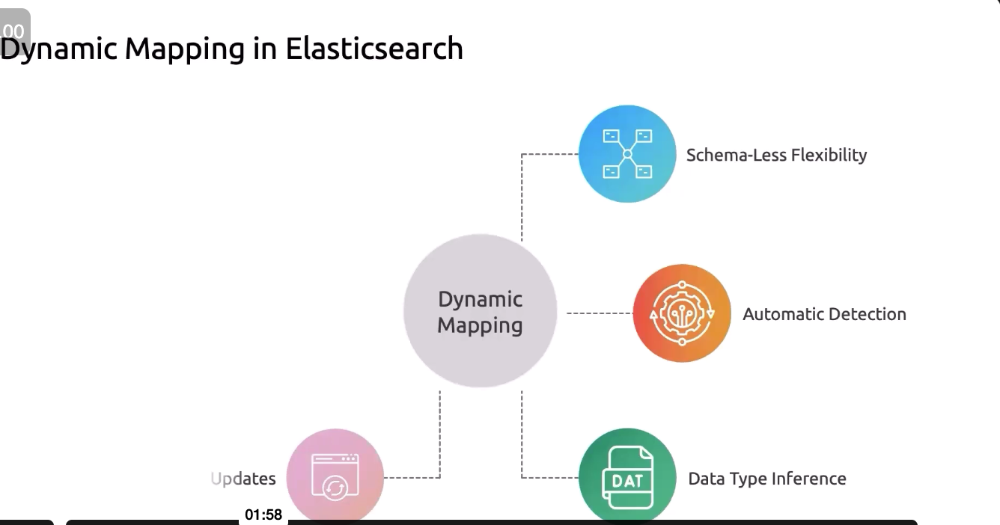
     - Faster iteration and support agile development.
  - Explicit Mapping:
    - More precision and data is consistent.
    - Analyzer Customization to customize how the searching will work.
    - Schema evolution challenge is a concer with this type of mapping.


### Creating an Index

You can create an index using the Elasticsearch REST API. Here’s a basic example:

```bash
PUT /my-index
```

This command creates an index named `my-index` with the default settings.

#### Creating an Index with Specific Settings and Mappings
```bash
PUT /my-index
{
  "settings": {
    "number_of_shards": 3,
    "number_of_replicas": 2
  },
  "mappings": {
    "properties": {
      "title": {
        "type": "text"
      },
      "author": {
        "type": "keyword"
      },
      "content": {
        "type": "text"
      },
      "date": {
        "type": "date"
      }
    }
  }
}
```


### Indexing Documents

Once an index is created, you can start adding documents to it:

```json
POST /my-index/_doc/1
{
  "title": "Introduction to Elasticsearch",
  "author": "John Doe",
  "content": "Elasticsearch is a powerful search engine...",
  "date": "2024-08-16"
}
```

### Searching in an Index


```json
GET /my-index/_search
{
  "query": {
    "match": {
      "content": "Elasticsearch"
    }
  }
}
```

### Managing Indexes

- **List Indexes:**
  ```bash
  GET /_cat/indices?v
  ```

- **Delete an Index:**
  ```bash
  DELETE /my-index
  ```

- **Close an Index:** (Makes it inaccessible without deleting it)
  ```bash
  POST /my-index/_close
  ```

- **Open a Closed Index:**
  ```bash
  POST /my-index/_open
  ```

### Index Lifecycle Management (ILM)

Elasticsearch also provides Index Lifecycle Management (ILM), which helps automate the management of index lifecycles, including tasks like rolling over indexes based on size or age, deleting old indexes, and more. This is particularly useful in scenarios like log management, where indexes can grow very large over time.

Elasticsearch uses several search strategies and algorithms to efficiently retrieve data. The primary strategies include:

### 1. **Inverted Indexing**
   - **Core Search Strategy:** Elasticsearch, like many search engines, relies on an inverted index to quickly find matching documents for a given search query. The inverted index maps each unique term (word) in the document to the list of documents that contain that term. This allows Elasticsearch to quickly retrieve documents that match the search criteria.
   - **How It Works:** Instead of scanning every document in the index, Elasticsearch uses the inverted index to find all occurrences of a search term and retrieves the documents containing those terms. This is particularly efficient for full-text searches.

### 2. **Boolean Query**
   - **Logical Combination:** Elasticsearch supports Boolean queries, which combine multiple queries using logical operators like `must`, `should`, `must_not`, and `filter`.
     - `must`: The document must satisfy this condition.
     - `should`: The document should satisfy this condition (increases relevance if matched).
     - `must_not`: The document must not satisfy this condition.
     - `filter`: Similar to `must`, but the result is not scored, making it more efficient for large datasets.
   - **Usage:** Boolean queries are used for complex search scenarios where you want to include or exclude certain conditions.

### 3. **Term-Based Queries**
   - **Exact Matching:** These queries search for exact matches of a term within a field. Common term-based queries include:
     - `term`: Matches documents that have the exact term.
     - `terms`: Matches documents that have any of the specified terms.
     - `range`: Matches documents where the field’s value falls within a specified range.
   - **Usage:** These queries are used for structured fields, like numbers, dates, keywords, and identifiers.

### 4. **Full-Text Queries**
   - **Text Analysis and Relevance:** Full-text queries analyze the text to break it into tokens (words), apply text analysis (like stemming, removing stopwords, etc.), and then perform the search.
     - `match`: The most common full-text query, which analyzes the input and searches for matching documents.
     - `match_phrase`: Searches for the exact phrase after analysis.
     - `multi_match`: Searches across multiple fields.
   - **Usage:** These queries are used for free-text fields, like descriptions, titles, or content.

### 5. **Relevance Scoring**
   - **Ranking Search Results:** Elasticsearch assigns a relevance score to each document that matches a search query. This score is based on algorithms like Term Frequency-Inverse Document Frequency (TF-IDF) and Boolean similarity (BM25).
     - **TF-IDF:** Weighs the importance of a term in a document relative to its frequency across all documents.
     - **BM25:** A modern variant of TF-IDF that adjusts for document length and term saturation.
   - **Usage:** Relevance scores determine how closely a document matches the query, and the results are ranked accordingly.

### 6. **Distributed Search Across Shards**
   - **Parallel Processing:** When you perform a search in Elasticsearch, the search request is distributed across all the shards (both primary and replica) of the index. Each shard processes the search independently, and the results are then aggregated by the coordinating node.
     - **Query Phase:** Each shard returns the top `N` results based on relevance scoring.
     - **Fetch Phase:** The coordinating node merges these results and fetches the actual documents for the final result set.
   - **Usage:** This strategy allows Elasticsearch to scale horizontally, handling large volumes of data and complex queries across distributed systems.

### 7. **Pagination and Result Windowing**
   - **Handling Large Result Sets:** Elasticsearch supports pagination through the `from` and `size` parameters, which allow users to retrieve subsets of search results. However, deep pagination (retrieving very large offsets) can be resource-intensive.
   - **Search After:** For efficient pagination in large datasets, Elasticsearch supports the `search_after` parameter, which allows for efficient, cursor-based pagination.

### 8. **Fuzzy Search**
   - **Tolerance for Typos:** Fuzzy search in Elasticsearch allows for approximate matching, which is useful for handling typos or variations in spelling.
     - **Usage:** Fuzzy queries find terms that are within a specified edit distance (Levenshtein distance) of the search term.

### 9. **Proximity Searches**
   - **Nearness in Text:** Elasticsearch supports proximity searches, where you can search for terms that are within a certain distance from each other in the text.
     - **match_phrase:** Supports slop (distance) parameter to allow for word rearrangement.
   - **Usage:** Useful for finding phrases or words that are close to each other but not necessarily in the exact order.

### 10. **Wildcard and Regular Expression Queries**
   - **Pattern Matching:** Elasticsearch supports wildcard and regex queries for pattern-based matching.
     - `wildcard`: Allows for partial term matching using `*` (any characters) and `?` (single character).
     - `regexp`: Allows for complex pattern matching using regular expressions.
   - **Usage:** Useful for searching terms with unknown or variable components.

### 11. **Aggregations**
   - **Faceted and Analytical Queries:** Elasticsearch allows for aggregations that enable analytical queries, such as calculating statistics, counting occurrences, and grouping data.
     - **Buckets:** Grouping documents based on field values.
     - **Metrics:** Calculating statistics (like average, sum, min, max) on grouped data.
   - **Usage:** Aggregations are often used for data analysis, reporting, and dashboards.

