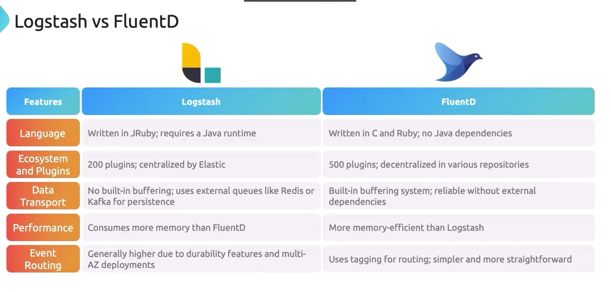
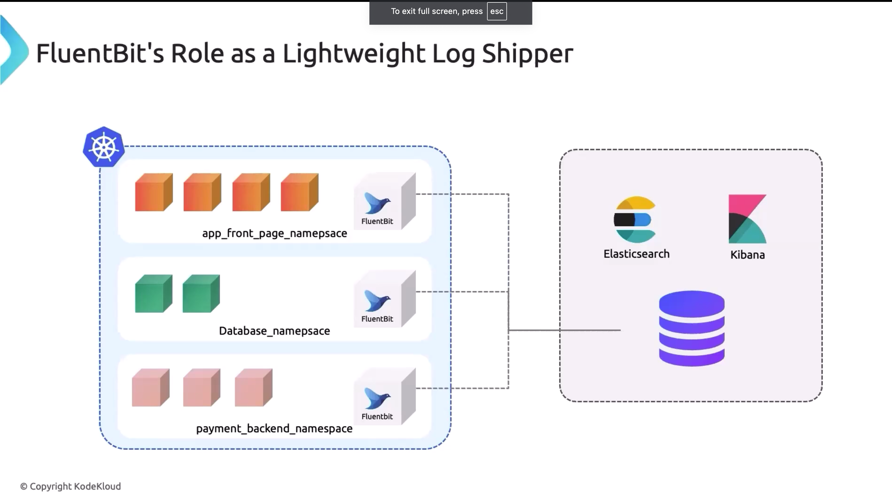

## LOG STASH VS FLUENTD:
   - **Logstash:**
     - J Ruby takes alot of memory and cpu.
     - Requires java dependencies
     - Centralized in nature
     - Need message queues to support log messages.
     - More advanced routing features
   - **Fluentd:**
     - Written in `C with a Ruby core`, making it lighter and generally faster.
     - No `Java dependencies required`.
     - `JSON` like syntax and easier
     - Decentralized in nature and plugins has more customization.
     - Inbuilt buffer system no queue required.
     - Simple routing features, use tagging system.
     - Backed by `CNCF`.
  

## FLUENT-D VS FLUENT BIT
### FLUENT-BIT
- Lightweight log processor and forwarder.
- Focuses primarily on log forwarding and minimal processing.
- Low memory and CPU footprint.
- Written in C, which provides higher performance and lower resource consumption.
- Uses a .conf file format with a clear and concise structure.

### FLUENTD
- Built on Ruby, with a plugin system that supports both Ruby and C plugins
- Uses Json file
- More configuration can be done and advanced routing features like retry logic, buffering etc.

# PLUGINS
### 1. **Input Plugins:**
   - **Common Examples in Fluentd and Fluent Bit:**
     - **`tail`:** 
     - `systemd` - service logs.
     - **`forward`:** Receives logs from other Fluentd or Fluent Bit instances. Useful in distributed logging setups.
     - **`http`:** Accepts logs via HTTP POST requests.
     - **`syslog`:** Collects logs from Syslog servers.
     - **`tcp` and `udp`:** Receive logs over TCP or UDP protocols.

### 2. **Filter Plugins:**

   - **Common Examples in Fluentd and Fluent Bit:**
     - **`grep`:** 
     - **`record_transformer`:** Modifies the log records by adding, removing, or modifying fields. Useful for adding metadata to logs.
     - **`parser`:** Parses the log message into structured data, often used to parse unstructured logs (e.g., JSON, regex).
     - **`geoip`:** Adds geographical location information to logs based on IP addresses.
     - **`rewrite_tag`:** Changes the tag of the log entry based on specified conditions, which helps in routing logs to different outputs.

### 3. **Output Plugins:**
   - **Common Examples in Fluentd and Fluent Bit:**
     - **`elasticsearch`:** 
     - **`s3`:** 
     - **`kafka`:** 
     - **`stdout`:** 
     - **`gcs`:** 
     - **`http`:** Sends logs to an HTTP endpoint, allowing integration with web services that accept logs over HTTP.
