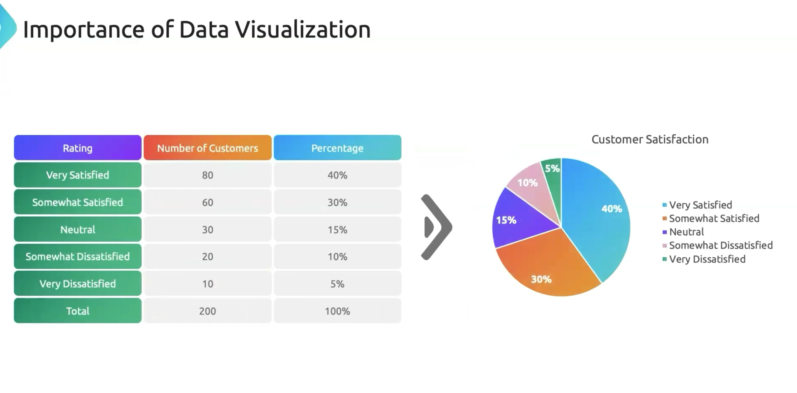
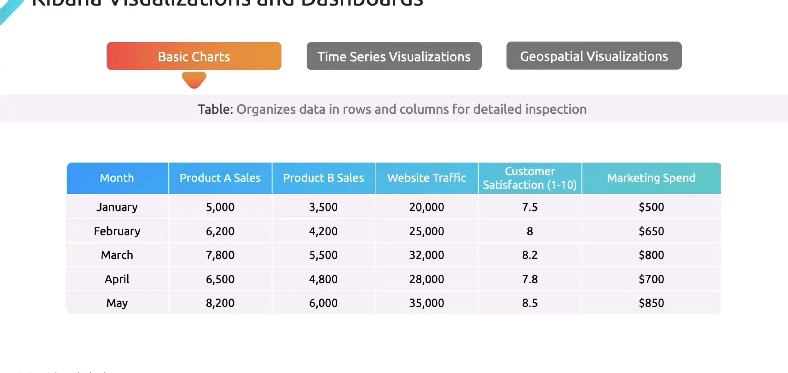
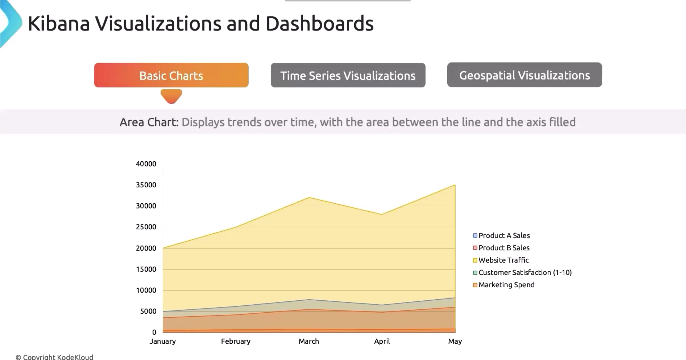
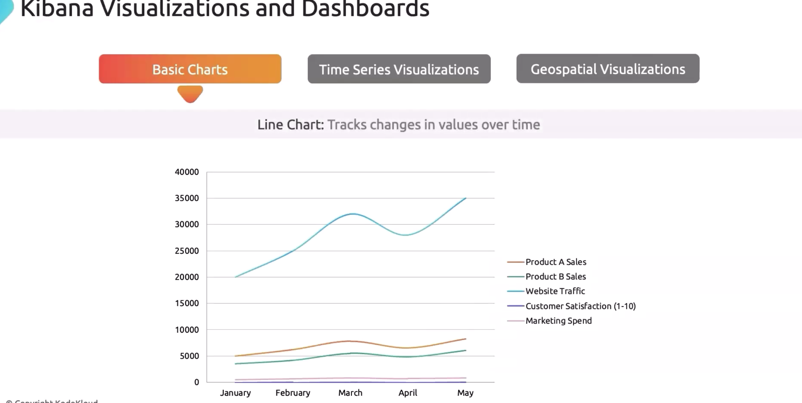
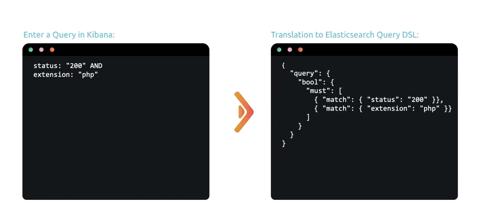

# KIBANA
 - Powerful visualization tool works with Elasticsearch.
 - Enable Customers to create dashboards on top of the elasticsearch.
 
## Importance
 - Improved Understanding.
 - Faster Decision Making.
 - Communication with the stakeholders.
## Charts In Kibana
### Basic Charts 
 - Tables
    
 - Area Charts: For Over time progress.
    
 - Bar Charts: Error Rate across multiple microservices.
 - Line Charts: More for latency and performance and high load time.
    
 - Pie Charts: Distribution of resource usage across different microservices.
### Time Series Visualization
- Creates sophisticated visualizations for time series and complex aggregation.
- Gauge Charts: More for latency and performance and high load time.
    
### Geospatial Visualization
- User Distribution and Server Locations in the world.
### KQL
- KQL is similiar to SQL.
- Integrated with ElasticSearch.
- KQL query are case sensitive in nature.
- KQL are translated into 
Elasticsearch DSL Query Language

#### Queries
- Field Query
 ```kql
 field_name:"value"
 ```
- Wildcard query
 ```kql
 field_name:"val*"
 ```
- Regular expression
```kql
bytes > 1000
```