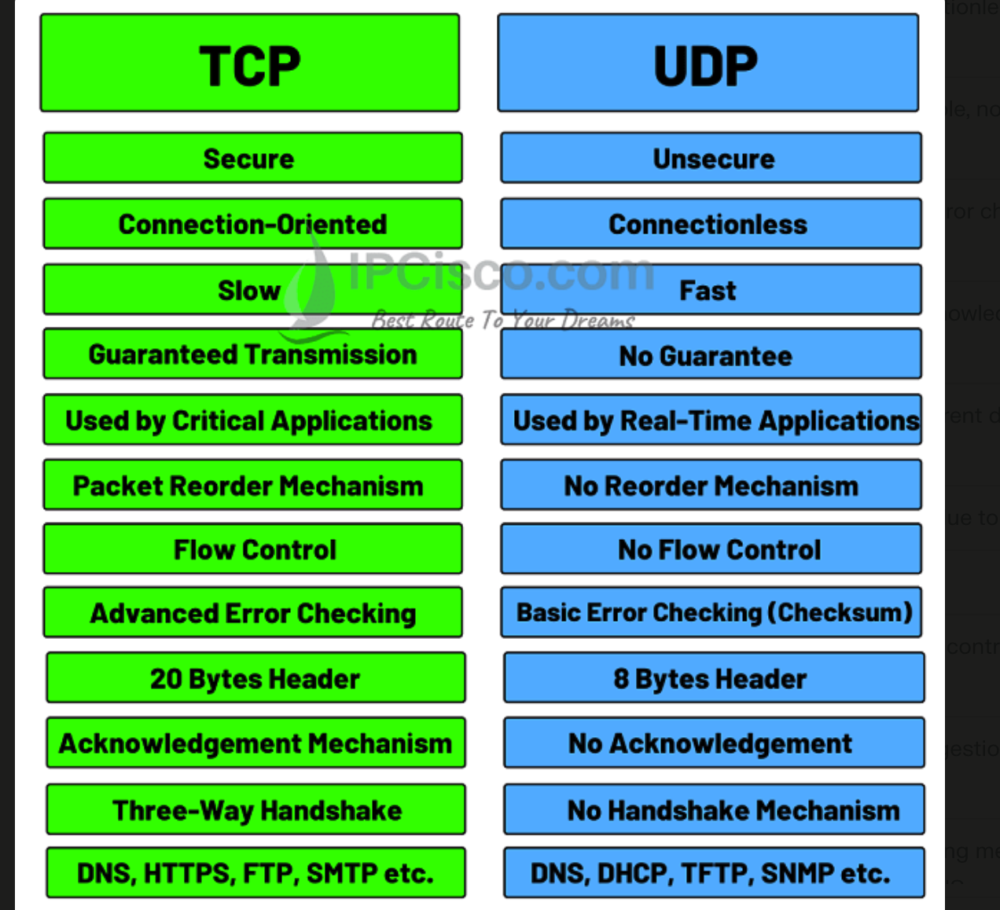

## **OSI Model**

1. **Physical Layer**: 
2. **Data Link Layer**: 
3. **Network Layer**: Determines how data is sent to the receiving device, including routing through different routers.
4. **Transport Layer**: Ensures complete data transfer with error recovery and flow control.
5. **Session Layer**: 
6. **Presentation Layer**: 
7. **Application Layer**: 

## **TCP/IP Model**

The **Transmission Control Protocol/Internet Protocol (TCP/IP) model** is a more practical framework for network communications, consisting of four layers:

1. **Link Layer**: Corresponds to the OSI's Physical and Data Link layers, handling the physical transmission of data.
2. **Internet Layer**: Similar to the OSI's Network layer, it manages the routing of data packets.
3. **Transport Layer**: Ensures reliable data transmission between devices, akin to the OSI's Transport layer.
4. **Application Layer**: Combines the OSI's Session, Presentation, and Application layers, providing protocols for specific data communication services[1][4].

The TCP/IP model is more streamlined and widely used in real-world networking due to its simplicity and effectiveness in practical applications[1][4].

## **IP Addressing**

### **IPv4**

- **Structure**: IPv4 addresses are 32-bit integers, represented in decimal notation as four numbers separated by dots (e.g., 192.168.1.1).
- **Address Space**: IPv4 can generate approximately 4.29 billion unique addresses.
- **Configuration**: Supports manual and DHCP address configuration.
- **Security**: Security features depend on the application layer.
- **Transmission**: Uses a broadcast message transmission scheme[2][5].

### **IPv6**

- **Structure**: IPv6 addresses are 128-bit integers, represented in hexadecimal notation as eight groups of four hexadecimal digits separated by colons (e.g., 2001:0db8:85a3:0000:0000:8a2e:0370:7334).
- **Address Space**: IPv6 provides a vastly larger address space, capable of generating 3.4×10^38 unique addresses.
- **Configuration**: Supports auto-configuration and renumbering.
- **Security**: Includes built-in security features like IPsec for data authentication and encryption.
- **Transmission**: Uses multicast and anycast message transmission schemes[2][5].

### **Key Differences**

| **Feature** | **IPv4** | **IPv6** |
|-------------|----------|----------|
| **Address Length** | 32 bits | 128 bits |
| **Address Configuration** | Manual, DHCP | Auto, renumbering |
| **Security** | Application-dependent | Built-in IPsec |
| **Transmission** | Broadcast | Multicast, anycast |
| **Fragmentation** | By sender and routers | Only by sender |
| **Checksum** | Available | Not available |
| **Header Size** | 20-60 bytes | Fixed 40 bytes[2][5] |

## **TCP vs UDP Traffic: Comparison Table**

| **Feature**                  | **TCP (Transmission Control Protocol)** | **UDP (User Datagram Protocol)**            |
|------------------------------|-----------------------------------------|---------------------------------------------|
| **Connection Type**          | Connection-oriented                     | Connectionless                              |
| **Reliability**              | Reliable, ensures delivery and order    | Unreliable, no guarantee of delivery or order |
| **Error Checking**           | Extensive error checking and recovery   | Basic error checking, no recovery           |
| **Acknowledgment**           | Acknowledgment segments present         | No acknowledgment segments                  |
| **Data Sequencing**          | Ensures data packets arrive in order    | No inherent data sequencing                 |
| **Speed**                    | Slower due to error checking and recovery | Faster due to minimal overhead              |
| **Header Size**              | 20-60 bytes                             | 8 bytes                                     |
| **Flow Control**             | Yes, manages data flow between sender and receiver | No flow control                             |
| **Congestion Control**       | Yes, adjusts data flow based on network congestion | No congestion control                       |
| **Use Cases**                | Web browsing, email, file transfers, SSH | Streaming media, online gaming, VoIP, DNS   |
| **Packet Format**            | Segments                                | Datagrams                                   |
| **Broadcasting**             | Not supported                           | Supported                                   |
| **Handshake Protocol**       | Three-way handshake (SYN, SYN-ACK, ACK) | No handshake protocol                       |
| **Retransmission**           | Retransmits lost packets                | Does not retransmit lost packets            |
| **Overhead**                 | Higher due to connection management     | Lower due to lack of connection management  |
| **Optimal Usage**            | Applications requiring reliability and data integrity | Applications requiring speed and efficiency |

## **Scenarios Where UDP is Preferred Over TCP**

UDP (User Datagram Protocol) is often chosen over TCP (Transmission Control Protocol) in scenarios where speed and efficiency are more critical than reliability. Here are the main scenarios where UDP is preferred:

### **1. Real-Time Applications**

- **Video Conferencing**: Applications like Skype, Google Meet, and Zoom use UDP because they require minimal latency and can tolerate some packet loss without significant degradation in quality[2][6].
- **Online Gaming**: Real-time games prioritize low latency and fast data transmission to ensure a smooth gaming experience. UDP's lack of overhead makes it ideal for this purpose[5][7].
- **Voice over IP (VoIP)**: VoIP applications like WhatsApp and Skype calls use UDP to minimize delays and provide real-time communication[2][6].

### **2. Streaming Media**

- **Live Streaming**: Services that stream live video or audio, such as live sports broadcasts or live news, use UDP to ensure that the stream is as close to real-time as possible[5][6].
- **Multimedia Streaming**: Applications like IPTV and certain streaming services use UDP to deliver continuous streams of data without the delays caused by error correction and retransmission[6].

### **3. Broadcast and Multicast Communications**

- **Broadcasting**: UDP supports broadcasting, where data is sent to all devices on a network segment. This is useful for applications like network discovery protocols and certain types of network management[6].
- **Multicasting**: UDP is used in multicast applications where data is sent to multiple specific recipients, such as in live video conferencing with multiple participants[6].

### **4. Simple Query-Response Protocols**

- **Domain Name System (DNS)**: DNS queries are typically sent over UDP because they are simple, single-packet requests and responses that need to be fast[6].
- **Simple Network Management Protocol (SNMP)**: SNMP uses UDP for quick, lightweight communication to manage network devices[6].
- **Dynamic Host Configuration Protocol (DHCP)**: DHCP uses UDP to quickly assign IP addresses to devices on a network[6].

### **5. Situations Requiring Low Overhead**

- **Lightweight Communication**: UDP is used in scenarios where the communication overhead needs to be minimized, such as in sensor networks or certain IoT applications[3][5].

### **6. Applications Tolerant of Packet Loss**

- **Real-Time Data Transfer**: Applications that can tolerate some level of packet loss without significant impact on performance, such as certain types of telemetry data or real-time analytics, may use UDP[3][5].
