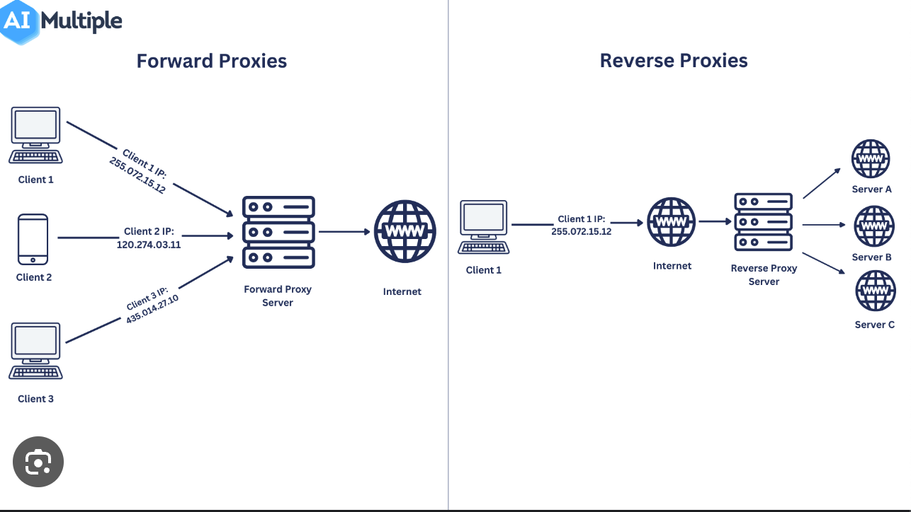
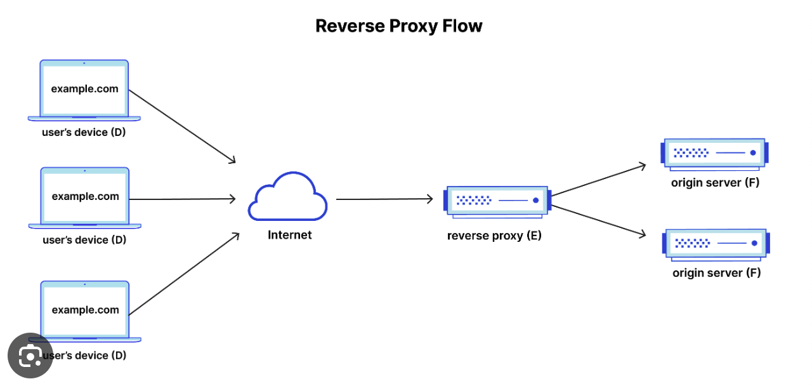
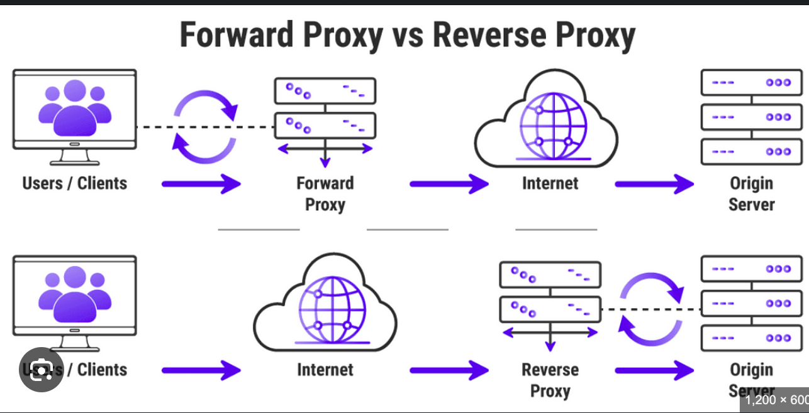

## **Proxies and Reverse Proxies**

### **Proxy Servers**

A **proxy server** acts as an intermediary between a client and the internet.

1. **Forward Proxy**:
   - **Function**: Sits in front of client machines and forwards their requests to the internet.
   - Client is aware of the proxy server but not in case of the reverse proxy.
   - **Use Cases**: 
     - **Masking Client IP**
     - **Blocks Certain Websites in Secured Environment**
     - **Caching**:
   - **Examples**: Squid, Proxy, Tor.

### **Reverse Proxy**

A **reverse proxy** sits in front of web servers and forwards client requests to those servers. 
- Used to increase web security and performance.
- Example: Nginx, HAProxy.

#### **Key Functions of Reverse Proxies**:

1. **Load Balancing**:
   - **Description**: Distributes incoming client requests across multiple servers.

2. **Caching**:

3. **Security**: WAF, SSL Termination.

4. **Anonymity and Privacy**

5. **Advanced Traffic Routing on URL, Location**:

#### **Common Use Cases of Reverse Proxies**:

- **Content Delivery Networks (CDNs)**:
- **Web Application Security**: Implement reverse proxies to inspect and filter traffic.
- **SSL Termination**

### **Comparison: Forward Proxy vs. Reverse Proxy**

| **Feature**         | **Forward Proxy**                                    | **Reverse Proxy**                                    |
|---------------------|------------------------------------------------------|------------------------------------------------------|
| **Purpose**         | Provides anonymity and caching to clients            | Improves server performance, load balancing, and security |
| **Location**        | Between the client and the internet                  | Between the internet and server                      |
| **Visibility**      | The client is aware of the proxy                     | The server is not aware of the proxy                 |
| **Configuration**   | The client must be configured to use the proxy       | The server must be configured to use the proxy       |
| **Use Cases**       | Bypassing content filters, accessing restricted content | Load balancing, caching, SSL/TLS offloading, web application firewall |
| **Examples**        | Squid, Proxy, Tor                                    | Nginx, Apache, HAProxy                               |

