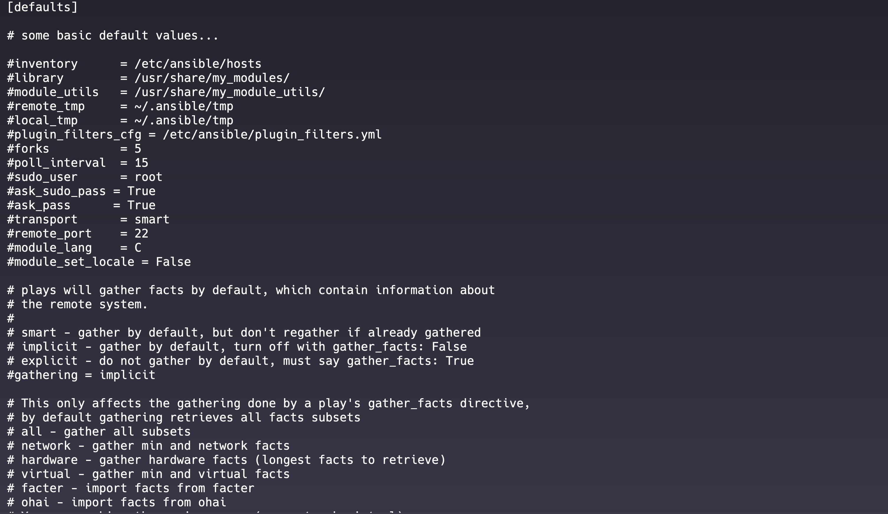

## ANSIBLE CONFIG FILE

## ANSIBLE HOST_VARS AND GROUP_VARS:

### `group_vars`

- **Definition**: `group_vars` allows you to define variables that apply to all hosts in a specific group. This is useful for setting configurations that are common across multiple hosts.

- **Location**: You can define `group_vars` in a directory named `group_vars` within your Ansible project structure. Each group can have its own YAML file named after the group.

- **Example Structure**:
  ```
  inventory/
  ├── group_vars/
  │   ├── webservers.yml
  │   └── dbservers.yml
  └── hosts
  ```

- **Example Content of `webservers.yml`**:
  ```yaml
  http_port: 80
  max_clients: 200
  server_name: example.com
  ```

- **Usage in Playbooks**: You can reference these variables in your playbooks like so:
  ```yaml
  - name: Configure web servers
    hosts: webservers
    tasks:
      - name: Ensure Apache is running
        ansible.builtin.service:
          name: apache2
          state: started
      - name: Configure Apache
        ansible.builtin.template:
          src: /path/to/template.j2
          dest: /etc/apache2/sites-available/{{ server_name }}.conf
  ```

## `host_vars`

- **Definition**: `host_vars` allows you to define variables that apply to individual hosts. This is useful for settings that are unique to a specific machine.

- **Location**: Similar to `group_vars`, you can define `host_vars` in a directory named `host_vars` within your Ansible project structure. Each host can have its own YAML file named after the host.

- **Example Structure**:
  ```
  inventory/
  ├── host_vars/
  │   ├── host1.yml
  │   └── host2.yml
  └── hosts
  ```

- **Example Content of `host1.yml`**:
  ```yaml
  ansible_host: 192.168.1.10
  ansible_user: ubuntu
  db_password: secret_password
  ```

- **Usage in Playbooks**: You can reference these variables in your playbooks like so:
  ```yaml
  - name: Configure database
    hosts: dbservers
    tasks:
      - name: Create database user
        ansible.builtin.command: >
          mysql -u root -p{{ db_password }} -e "CREATE USER 'myuser'@'localhost' IDENTIFIED BY 'mypassword';"
  ```

## Summary

- **`group_vars`**: Used for defining variables that apply to all hosts within a specific group. Useful for common configurations across multiple hosts.

- **`host_vars`**: Used for defining variables that apply to individual hosts. Useful for unique configurations specific to a single machine.
To gather facts from all hosts in your inventory file using Ansible, you can utilize the `ansible` command with the `setup` module. This command will retrieve various system information and configuration details from each host. Here’s how to do it: