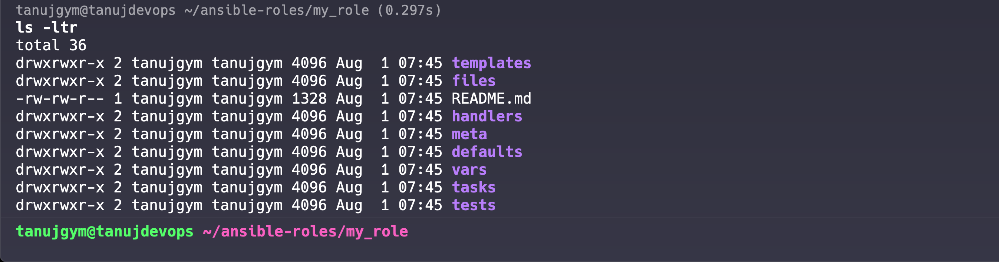

#### Create a role
```bash
ansible-galaxy init my_role
```

#### Explanation of the Directory Structure
- README.md: A markdown file where you can document your role.
- tasks/: Contains the main list of tasks to be executed by the role. The main.yml file is where you define your tasks.
- handlers/: Contains handlers, which are special tasks that run when notified by other tasks.
- defaults/:default variables that can be overridden by users of the role.
    - Can be overridden at the runtime.
- vars/: This directory is for variables that are specific to the role and should not be overridden.
    - Strict than default variables and should not be overridden
- files/: A place to store files that need to be transferred to the managed hosts.
- templates/: Contains Jinja2 templates that can be used to dynamically generate configuration files.
- meta/: Contains metadata about the role, such as dependencies on other roles.
- tests/: A directory for testing the role, which includes an inventory file and a test playbook.
