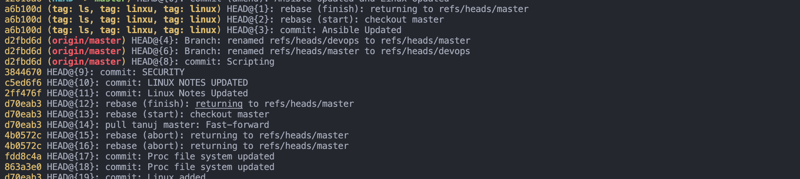

#### What is git and what are the most useful commands ?
- Git is a distributed version control system
#### How to rename the origin
```bash
git origin rename origin <new_name>
```
### GIT VS SVN 

#### GIT COMMANDS
- `git init`
- `git clone `
- `git add `
- `git commit -m “”`: 
- `git status`: Displays the current state of the repository, including modified, staged, and untracked files.
- `git pull` 
- `git push` 
- `git branch` 
- `git checkout `
- `git merge `
- `git log`
- `git diff`

### Why git is most popular ?

- Distributed architecture
- Speed and efficiency
- Branching and merging
- Collaboration and teamwork
- Stability and maturity
- Security

### Explain the difference between ‘git pull’ and ‘git fetch’ ?

- The `git pull` command combines two operations into one: fetching the latest changes from the remote repository and merging them into the current branch.
`git fetch`:
  - The `git fetch` command retrieves the latest commits and updates the remote-tracking branches in your local repository.

### What command is used in git to change your working branch ?
- git checkout "other-branch"

### What is the difference between git and GitHub ?
`Git`:
- Git is a distributed version control system 
`GitHub`:
 - GitHub is a web-based hosting service that provides a centralized platform for Git repositories.
- It adds additional features on top of Git, such as a web interface, collaboration tools.


### How do you rename a branch in Git ?

```bash
➜  Tools git:(india) ✗ git branch -m nepal Australia
➜  Tools git:(india) ✗ git branch
```

### What is the purpose of the ‘git stash’ command ?

 - The purpose of the `git stash` command is to provide a way to save your work without committing it.
    — `git stash save`: Creates a new stash with the changes in your working directory.
    — `git stash list`: Lists all the stashes you have created.
    — `git stash apply`: Applies the most recent stash to your working directory.
    — `git stash pop`: Applies the most recent stash and removes it from the stash list.
    — `git stash drop`: Removes a specific stash from the stash list.
    — `git stash branch`: Creates a new branch and applies a stash to that branch.

### How do you revert a commit that has already been pushed and made public?
- Use `git revert <commit-hash>` to create a new commit that undoes the changes introduced by the specified commit. 

### **How do you squash the last N commits into a single commit?**
- Use `git rebase -i' 

### Explain the Gitflow workflow and its components.**
- **Gitflow** is a branching model that uses two main branches: `master` and `develop`. 
- The `master` branch is always production-ready, while `develop` is used for integrating features.
  - **Feature branches**: Created from `develop` for new features.
  - **Release branches**: Created from `develop` when preparing for a new production release.
  - **Hotfix branches**: Created from `master` to quickly fix production issues and merged back into both `master` and `develop`.

### How do you handle merge conflicts in Git?**
    1. Open the conflicted files and manually resolve the conflicts.
    2. Use `git add <file>` to mark the conflicts as resolved.
    3. Commit the changes using `git commit`.

### **7. What is `git cherry-pick` and when would you use it?**
- **`git cherry-pick`**: Applies the changes introduced by an existing commit to another branch. 
- This is useful when you want to apply specific changes from one branch to another without merging the entire branch.
  - **Usage**: `git cherry-pick <commit-hash>`.

### How do you use `git bisect` to find a bug?**
- **`git bisect`**: A binary search tool to find the commit that introduced a bug.
  - **Steps**:
    1. Start bisecting: `git bisect start`.
    2. Mark the current commit as bad: `git bisect bad`.
    3. Mark a known good commit: `git bisect good <commit>`.
    4. Git will check out a commit halfway between the good and bad commits. 
        - Test this commit and mark it as good or bad.
    5. Repeat until Git identifies the first bad commit.
  - **End bisecting**: `git bisect reset`.

#### What is origin in git
- "Origin" is the default name Git gives to the remote repository from which you cloned your local repository.
- It's not a property of the remote repository itself, but rather a name used in your local repository to refer to the remote. 
- You could rename it or use different names for other remotes.
- `git remote rename origin <new_name>`


4. **What command do you use to delete a branch and change the branch in git?**
   - **Delete a branch locally**: `git branch -d branch_name`
   - **Delete a branch remotely**: `git push origin --delete branch_name`
   - **Change branch**: `git checkout branch_name`.


5. **How to resolve merge conflict?**
   - Open the conflicting files and manually resolve the conflicts.
   - Mark the resolved conflicts by removing the conflict markers (`<<<<<<`, `======`, `>>>>>>`).
   - Add the resolved files using `git add`.
   - Commit the changes using `git commit`.


7. **What is the difference between SCM and VCS?**
   - **SCM (Source Code Management)**: A broader term that includes version control, build management, and release management.
   - **VCS (Version Control System)**: A system specifically designed to manage changes to source code over time.


10. **How to undo changes in the local repository?**
    - **Undo changes in staging area**: `git reset HEAD <file>`
    - **Undo a commit**: `git revert <commit-hash>` or `git reset --hard <commit-hash>` (be cautious with `--hard` as it discards changes).

**Is it possible to push the code from one local repo to another local repo?**
- Just need to add the second repo as remote
- `git remote add origin <repo>`
    - Yes, you can add the second local repository as a remote and push to it using `git remote add <name> <path-to-local-repo>` and `git push <name> <branch>`.


#### What is the difference between Git and SVN?
- Git is distributed
- SVN is centralized. 
- In Git, every user has a local copy of the repository, 

#### What is a repository in Git?
  - Data Structure holds objects and metadata.

#### How do you create a new Git repository?
 - git init

#### What is a commit in Git?
- A commit is a snapshot of changes made to a repository at a specific point in time.
- Includes time, SHA or Unqiue hash

#### What is the purpose of the staging area (index) in Git?
- prepare and review changes before committing them
- Used to select the changes you want to commit

#### How do you add files to the staging area in Git?
- git add command


#### How do you create a new branch in Git? 
- You can create a new branch using the command git checkout -b branch_name.

#### How do you switch between branches in Git?  
- Answer: You can switch between branches using the command git checkout branch_name.


#### What is a remote repository in Git? 
Answer: A remote repository in Git is a version of a project hosted on a server that allows collaboration between multiple contributors.


#### What is a tag in Git? 
- Answer: A tag in Git is a reference that points to a specific commit. It is used to mark specific points in history, such as release versions.

#### How do you create a tag in Git?  
- Answer: You can create a tag in Git using the command git tag tag_name.

#### How do you push a tag to a remote repository?
 - Answer: You can push a tag to a remote repository using the command git push origin tag_name.

#### What is Git bisect? 
Answer: Git bisect is a command used for binary search of bugs. 

#### How do you undo the last Git commit? 
- You can undo the last Git commit using the command git reset HEAD~1.

### How do you list all the branches in a Git repository? 
- Answer: You can list all branches in a Git repository using the command git branch.

#### How do you remove a file from Git without deleting it?
- Answer: You can remove a file from Git without deleting it using the command git rm --cached filename.

#### How do you rename a file in Git? 
- Answer: You can rename a file in Git using the command git mv old_filename new_filename.
#### What is a Git submodule? 
- A Git submodule is a separate Git repository embedded within another Git repository. 

#### How do you update a Git submodule? 
-  Answer: You can update a Git submodule using the command git submodule update --remote.

#### What is Git flow? 
Answer: Git flow is a branching model that defines a consistent way to organize branches and merges in a Git repository.

#### What is the difference between git rebase and git merge?
 Answer: git rebase integrates changes from one branch onto another by moving or combining commits, resulting in a linear history. 
 - git merge creates a new commit that combines changes from two branches, resulting in a branch-like history.
#### How do you amend the last commit message in Git? 
- You can amend the last commit message using the command git commit --amend.

#### How do you configure Git user information? 
- Answer: You can configure Git user information using the commands: git config --global user.name "Your Name" git config --global user.email "your.email@example.com"

#### How do you create and apply patches in Git? 
- Answer: To create a patch, use the command git format-patch -1 <commit>. To apply a patch, use the command git am <patch>.

#### How do you view the changes between two Git commits? 
- Answer: You can view the changes between two Git commits using the command git diff commit1 commit2.

#### What is Git reflog? 
- Git reflog is a log of all reference updates in a repository. It allows you to recover lost commits or branches.
-- Stores the information for 90 days.

#### What is Git blame? 
- Git blame is a command that shows information about who last modified each line of a file, and in which commit.


#### What is a detached HEAD state in Git?
- Answer: A detached HEAD state occurs when the HEAD points directly to a specific commit instead of a branch. 
- It is a common state during operations like checking out a specific commit.
- Create a new branch out of this commit
```bash
`git checkout -b feature/feature_dockerfile
```

How do you sign commits in Git?

Answer: Sign commits using git commit -S to add a GPG signature. Configure Git with your GPG key, and use git log --show-signature to verify signatures.

#### Describe Git rebase --onto.
- Answer: git rebase --onto is used to reapply commits onto a new base. It allows you to move a branch or a series of commits from one branch to another.
#### Explain the purpose of Git subcommands like git clean and git reset.
- Answer: git clean removes untracked files, and git reset allows you to reset the current branch to a specific commit or undo changes.

#### What is the purpose of the git worktree command?
-  The git worktree command allows you to maintain multiple working directories (worktrees) associated with a single Git repository. Each worktree can have its own branch and changes.
#### Describe Git shallow cloning.
- Answer: Shallow cloning involves cloning a Git repository with a limited history. 
- It can be done using --depth option with git clone to specify the number of commits to retrieve.
#### How do you configure Git to use an HTTP proxy?
Answer: Set the HTTP proxy for Git using the http.proxy configuration. For example, use git config --global http.proxy http://proxy.example.com:8080.

#### What is the Git "refspec"?
- Answer: A refspec in Git is a string that defines the mapping between remote and local branches during fetch or push operations. It specifies the source and destination references.

#### Describe Git worktrees and their advantages.
- Answer: Git worktrees allow you to work on multiple branches simultaneously without switching back and forth. They provide a clean and isolated environment for each branch.
#### How do you handle confidential information, such as API keys, in a Git repository?
- Answer: Confidential information should be stored in environment variables or configuration files outside the repository. Use tools like .gitignore and git-crypt to avoid accidentally committing sensitive data.

#### Explain the purpose of Git sparse-checkout.
- Answer: Git sparse-checkout is used to limit the working directory to specific directories or files, enabling users to check out only the necessary parts of a repository.
#### How do you recover from a detached HEAD state in Git?
- Answer: To recover from a detached HEAD state, create a new branch using git checkout -b new_branch_name or switch to an existing branch using git checkout branch_name.

#### What is the Git "rerere" (Reuse Recorded Resolution) feature?
- Answer: The rerere feature records previous conflict resolutions, allowing Git to automatically apply them to future conflicts. It stands for "Reuse Recorded Resolution."
#### Explain Git's "worktree add" command.
- Answer: The git worktree add command creates a new linked working directory associated with the current repository. It enables you to work on multiple branches simultaneously.
#### Describe the purpose of Git "revert" vs. "reset."
- Answer: git revert creates a new commit that undoes changes from a specific commit. git reset is used to reset the current branch to a specified commit, potentially discarding changes.

#### What is the Git "worktree move" command?

- Answer: The git worktree move command allows you to move or rename an existing linked working directory created with git worktree add.

#### How do you use Git to show the changes introduced by a specific commit?
Answer: Use git show <commit_hash> to display the changes introduced by a specific commit, including the commit message and diff.


#### What is Git "filter-branch" used for?
- Answer: git filter-branch is used to rewrite Git repository history by applying filters. It can be used for tasks like renaming files, removing sensitive data, or restructuring the repository.

#### Describe Git "force push" and its implications.
Answer: A force push (git push --force) is used to overwrite remote branch history with local changes.

#### GIT USERNAME FAILURE
- Use git config --username
- Use git config -- useremail