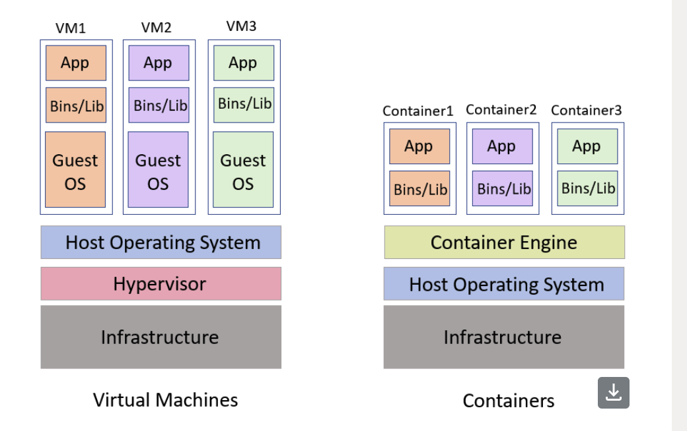

## VIRTUALIZATION VS CONTAINERS
Virtualization and containers are both technologies that enable the creation of isolated environments for running applications, but they differ in several fundamental ways. Here's a comparison between the two:
1. Architecture:
- Virtualization:
- Virtual Machines (VMs): Virtualization involves creating virtual machines (VMs) on a physical server using a hypervisor. 
    - Each VM runs its own operating system (OS) and has its own set of virtualized hardware (CPU, memory, storage).
- Hypervisor: The hypervisor is a layer of software that sits between the hardware and the VMs. It manages the VMs, allocates resources, and allows multiple VMs to run on a single physical server.
- Operating System: Since each VM includes a full OS, it is more resource-intensive as it requires significant amounts of memory and processing power.
### Containers:
- Containers: Containers package applications and their dependencies into a single unit. Unlike VMs, containers share the host operating system's kernel and are isolated from each other.
- Container Engine: Containers are managed by a container engine (e.g., Docker), which runs on the host OS. The engine uses features like namespaces and cgroups to isolate containers and manage resource allocation.
Operating System: Containers are more lightweight compared to VMs because they do not require a full OS. Instead, they share the host OS's kernel and only contain the application and its dependencies.

### Resource Efficiency:
#### Virtualization:
- Overhead: VMs have higher overhead because each VM runs a full OS, leading to greater resource consumption (CPU, memory, storage).
Resource Allocation: Resources are allocated per VM, which may result in inefficiencies if VMs are not fully utilizing the allocated resources.
- Containers: Overhead: Containers are lightweight and have lower overhead because they share the host OS and do not require a full OS for each instance.
Resource Allocation: Containers use fewer resources, making them more efficient and faster to start up. They can be packed more densely on the same hardware compared to VMs.
#### Isolation:
- Virtualization: Strong Isolation: VMs provide strong isolation because each VM runs a separate OS and operates independently of other VMs on the same host. This isolation is at the hardware level.
Security: VMs are generally considered more secure because of the stronger isolation between the guest OS and the host OS.
Containers:
Weaker Isolation: Containers provide process-level isolation, which is less strict than VMs. Since containers share the host OS kernel, they are less isolated from one another.
Security: Containers are more vulnerable to security issues that affect the shared OS kernel. However, with proper configuration and tools like Kubernetes, container security can be enhanced.
#### Portability:
- Virtualization:VM Portability: VMs can be moved between different environments (e.g., from one physical server to another) as long as the underlying hypervisor supports the VM format.
- OS Dependency: Moving VMs across different OS environments can be challenging because each VM includes a specific OS.
- Containers:Container Portability: Containers are highly portable across different environments (development, testing, production) as long as the container engine (e.g., Docker) is available. Containers can run consistently on any system that supports the container runtime.
- OS Independence: Containers are less dependent on the underlying OS, which makes them easier to move between different environments.
Use Cases:
- Virtualization: Legacy Applications: VMs are ideal for running legacy applications that require a specific OS version or configuration.
Multi-OS Environments: VMs are used when multiple different OS environments need to run on the same physical hardware.
- Containers: Microservices: Containers are ideal for modern, microservices-based applications where each service can be containerized and managed independently.
- DevOps and CI/CD: Containers are widely used in DevOps practices, particularly in continuous integration and continuous deployment (CI/CD) pipelines, due to their portability and efficiency.

