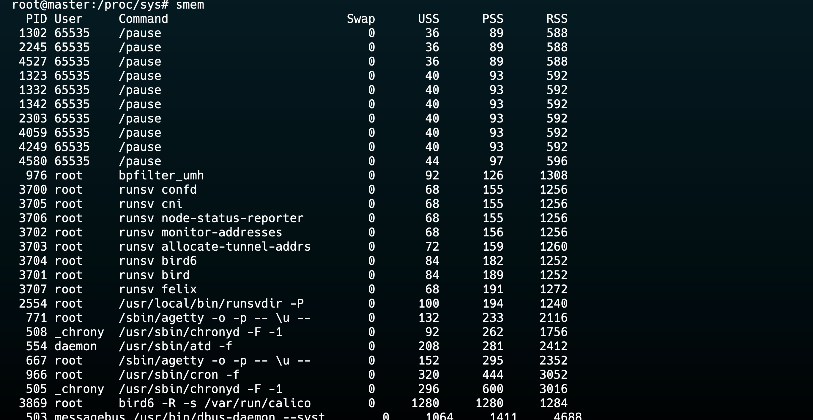
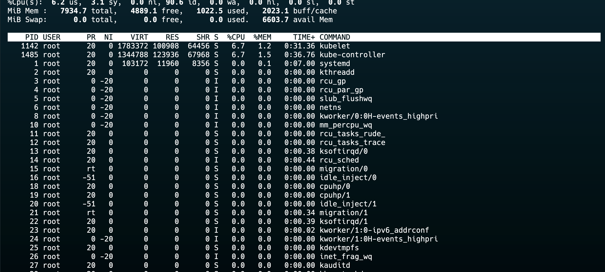

## VIRTUAL MEMORY 
- Memory management technique where the computer uses disk space as extension of RAM.
## Key Concepts of Virtual Memory
- **Illusion of Large Memory**: 
- **Swapping Mechanism**: When the system runs low on RAM, (OS) temporarily transfers inactive data from RAM to a `designated space on the hard drive known as the swap space`. 

- **Memory Management Unit (MMU)**: 
    - MMU is the unit responsible for correct address management of the `disk used as virtual memory`.

## Benefits of Virtual Memory
1. **Multitasking**:
2. **Cost-Effectiveness**:

## Limitations of Virtual Memory
1. **Performance Overhead**: Accessing data in virtual memory is slower.
2. **Thrashing**: Excessive `swapping can lead to thrashing`, where the system spends more time swapping pages than executing processes.
4. **Complexity**: 

```
free -h
```
## RESIDENT SET SIZE AND VIRTUAL SET SIZE

### Resident Set Size (RSS)
- Represents the `total ram occupied by the process`.
- Does `not include the swap space or any virtual memory` or shared libraries.
- RSS can be obtained using commands like `ps`, `top`, `pidstat`.

### Virtual Set Size (VSZ) 
- Represents the total virtual memory occupied by the process.
- Includes `RSS,SWAP SPACE , Allocated Space but still unused, shared libraries`.
- VSZ will always be greater than or equal to RSS.
- RSS only counts `memory in RAM`, while VSZ includes all allocated virtual memory.
- VSZ includes memory `from shared libraries even if not currently in use`, while RSS only counts shared libraries if the pages are currently in memory.

- To get a more accurate picture of memory usage, tools like `smem`.


### Identifying Top Memory-Consuming Processes

```bash
ps -eo pid,vsz,comm=,rss,stat| sort -n -k 2 -r | head 10
```

### Finding RAM Usage of a Specific Process

```bash
ps -o %mem,rss,vsize,cmd -C nginx
```
## THRASHING
- Insufficient RAM 
- High Process Load
- Memory Leaks: Some applications might be consuming more memory over time, leading to exhaustion of RAM.
- Improper System Configuration: Misconfigured swap space or system settings 

## Symptoms of Thrashing
- Slow system performance
- High CPU usage
- Low system responsiveness
- Constant swapping in and out of data between RAM and disk