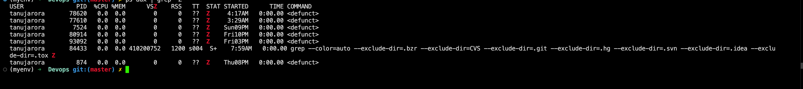

A zombie process is a process that has completed execution but still has an entry in the process table. 
- This entry remains because the process's parent has not yet read its exit status.

### How a Zombie Process is Created

1. **Process Termination:**
   - When a child process finishes execution, it exits and sends a `SIGCHLD` signal to its parent process and with this signal it' sends it's exit status.
   - Child is using the `wait` call for the process termination but the parent is not reading the status for the child process, so it keeps on waiting for the process termination.

2. **Parent Process Responsibilities:**
   - This reading of the exit status is known as `"reaping" the child `process. 

3. **Zombie State:**
   - If the parent process does not call `wait()` to read the child's exit status, the child remains in the process table as a zombie.
   - This means the process has released its resources but retains an entry in the process table to hold its exit status and PID for the parent to read.

- **Orphaned Child Processes:** When a parent process terminates, its children become orphans without reaping it.
    - These orphaned processes are adopted by the `init` process, which automatically reaps them.
    - Hence, orphaned processes typically do not remain zombies for long.

### Identifying Zombie Processes

You can identify zombie processes using commands like `ps` or `top`:

- **Using `ps`:**
  ```sh
  ps aux | grep 'Z'
  ```

- **Using `top`:**
  ```sh
  top
  ```
### Handling Zombie Processes

1. **Parent Process Modification:**
   - Ensure the parent process correctly handles the `SIGCHLD` signal and calls `wait()` to reap child processes.
2. **Manual Reaping:**
3. **Terminating the Parent Process:**
   - If modifying the parent process is not possible, terminating the parent process can sometimes resolve zombie processes, as the `init` process will adopt and reap them.
   ```sh
   kill -SIGTERM <parent_process_pid>
   ```
   ## WAIT SYSTEM CALL
   The `wait()` system call is used to read a child process's exit status because of how process management works in Unix/Linux. 

### 1. **Parent-Child Relationship**:
   - When a parent process creates a child process (using `fork()`), the operating system keeps track of the child and its exit status.
   - The parent is `responsible for handling the cleanup of the child process` after it terminates. This is where the exit status comes in.

### 2. **Exit Status Communication**:
   - When a child process terminates (either normally or due to an error), it returns an **exit status** (a small integer) to the operating system.
   - This exit status contains important information, such as whether the child terminated successfully or due to a signal (e.g., segmentation fault).

### 3. **Why `wait()` is Needed**:
   - The **exit status is held in the process table** until the parent collects it. 
   - The `wait()` (or `waitpid()`) system call allows the parent process to:
     1. **Retrieve the exit status** of the child process.
     2. **Clean up the process resources** by removing the child process entry from the process table.
   - If the parent doesn't call `wait()`, the child process remains as a **zombie**. 

### 4. **Prevents Resource Leaks**:
   - The operating system needs to retain the child's exit status and process information until the parent collects it. 
   - Without `wait()`, this information would remain indefinitely, leading to a buildup of zombie processes, which could exhaust system resources if not handled.

### Function of Wait Call
### 1. **Purpose of `wait()`**:
   - The primary function of `wait()` is to make the **parent process "wait"** until one of its child processes terminates. 
   - This is because `wait()` doesn’t just collect the exit status; `it also suspends the parent’s execution until a child process finishes`, if one hasn’t already.
   - When a parent calls `wait()`, it either waits for a currently running child process to terminate or, if a child has already terminated, it immediately returns the exit status.

### 2. **Why the Name "wait"?**
   - The name refers to the fact that the parent process may need to **"wait"** for the child process to finish. In scenarios where the child process is still running, `wait()` will block (pause) the parent process and **wait** until the child process terminates.
   - Even though one of its key functions is collecting the exit status of the child, the act of waiting is an essential part of its functionality. This is why the name `wait()` makes sense—it implies that the parent may have to **pause and wait** for the child to finish, not just retrieve the exit status.

### 3. **When `wait()` Doesn’t "Wait"**:
   - If the child has already finished by the time `wait()` is called, the parent doesn’t have to actually wait, and the exit status is immediately retrieved. However, the function still performs the cleanup process (reaping the zombie), so the name **`wait()`** reflects the general case where a process waits for its child to finish.

### 4. **More Accurate Behavior with `waitpid()`**:
   - The more flexible `waitpid()` call allows the parent process to specify exactly which child process to wait for and can be configured not to block at all. 
   - It gives finer control but still retains the same general idea: "waiting" for a child process to finish.
