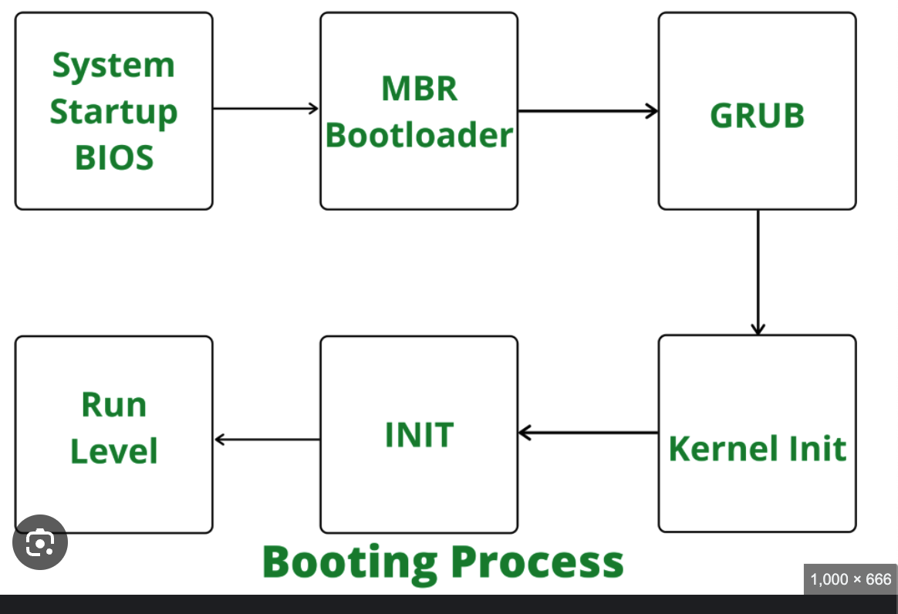

## Stages of the Linux Boot Process

### 1. **System Startup**
- Bios perform a hardware test called POST Test for RAM, CPU
- Bios Loads the OS from the bootable device.

### 2. **Bootloader Stage**
- Bootloader is the main process which loads the Operating system kernel which will be the middleman to talk to the operating system loaded in the system startup process.
- GRUB OR LILO are examples of bootloaders.
- Kernel is sotred as a compressed image file eg: vmlinuz
- Kernel is loaded into memory by bootloader and then it decompress itself in memory from a compressed image
- Menu is provided and once selected then kernel loaded into the memory.
- **BIOS Systems**: The bootloader is located in the Master Boot Record (MBR) of the bootable disk.
- **UEFI Systems**: The bootloader is located in a specific EFI system partition.

### 3. **Kernel Stage**
#### Initial Hardware Setup:
- The kernel performs basic hardware initialization.
- Mounting the Root Filesystem: This can be the final root system or the temporary root file system which is called Initial Ram DISK or initrd.
- Fires the init process. 

### 4. **System Services and Daemons**
- Init Process now runs the daemons and various processes that are required for the initialization process
### 6. **User Interaction**
Finally, once all services are running, the system presents a login prompt or graphical user interface.
The Master Boot Record (MBR) is a critical component of the boot process for traditional BIOS-based systems. It resides in the first 512 bytes of a storage device, such as a hard disk or SSD. The MBR is crucial for both the system startup process and disk partitioning. Here's a detailed breakdown of the MBR:

### Structure of the MBR

1. **Bootloader (446 bytes):**
   - The first part of the MBR contains the bootloader code. This is a small program that is executed by the BIOS to boot the operating system. The bootloader's job is to find and load the operating system's kernel.
   - If a more complex bootloader like GRUB is used, the MBR will typically load a secondary stage bootloader that resides elsewhere on the disk.

2. **Partition Table (64 bytes):**
   - The partition table follows the bootloader code and is 64 bytes in size. It contains four entries, each 16 bytes long, describing the partitions on the disk.
   - Each partition entry includes:
     - **Partition Status (1 byte):** Indicates if the partition is bootable. A value of 0x80 marks it as active, while 0x00 indicates it is inactive.
     - **Starting CHS (3 bytes):** The cylinder-head-sector (CHS) address of the first sector in the partition.
     - **Partition Type (1 byte):** Identifies the filesystem type or indicates special partition types (e.g., 0x83 for Linux, 0x07 for NTFS).
     - **Ending CHS (3 bytes):** The CHS address of the last sector in the partition.
     - **Starting LBA (4 bytes):** The logical block addressing (LBA) of the first sector in the partition. LBA is a more modern addressing method compared to CHS.
     - **Partition Size (4 bytes):** The size of the partition in sectors.

3. **Boot Signature (2 bytes):**
   - The last two bytes of the MBR contain the boot signature (also known as the magic number), which is 0x55AA. This signature indicates the presence of a valid MBR. If the BIOS does not find this signature, it will assume the disk is not bootable.

### Functions of the MBR

1. **Boot Process:**
   - When a computer is powered on, the BIOS performs the Power-On Self Test (POST) and initializes hardware components.
   - The BIOS then reads the first sector of the first bootable disk into memory and looks for the MBR.
   - The BIOS checks the boot signature (0x55AA). If valid, it transfers control to the bootloader code in the MBR.
   - The bootloader code in the MBR then executes, which typically involves loading the operating system's kernel or a more complex bootloader (e.g., GRUB).

2. **Partition Management:**
   - The partition table in the MBR provides information about the primary partitions on the disk.
   - An MBR disk can have up to four primary partitions, or three primary partitions and one extended partition.
   - The extended partition can contain multiple logical partitions, allowing for more than four partitions on a single disk.

### Limitations of MBR

1. **Partition Limit:**
   - MBR supports a maximum of four primary partitions. This can be circumvented by creating an extended partition, which can hold multiple logical partitions.

2. **Disk Size Limit:**
   - MBR uses 32-bit values for partition sizes and starting locations, limiting the maximum addressable storage to 2TB (2^32 sectors of 512 bytes each).

3. **Bootloader Size:**
   - The size of the bootloader code in the MBR is limited to 446 bytes, which is relatively small. More complex bootloaders require multiple stages.

### Comparison with GPT (GUID Partition Table)

- **Capacity:**
  - GPT supports disks larger than 2TB, addressing up to 9.4 ZB (zettabytes).
- **Partition Limit:**
  - GPT allows for a much larger number of partitions. The standard allows up to 128 partitions, but it can be extended.
- **Redundancy:**
  - GPT stores multiple copies of the partition table for redundancy and includes CRC32 checksums for integrity verification.
- **Compatibility:**
  - GPT is required for booting from disks larger than 2TB on UEFI-based systems. MBR can be used on both BIOS and UEFI systems, but with the aforementioned limitations.
