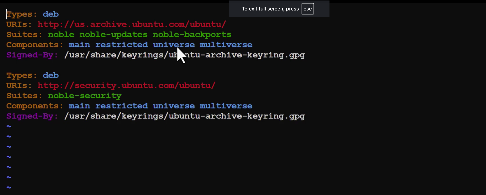
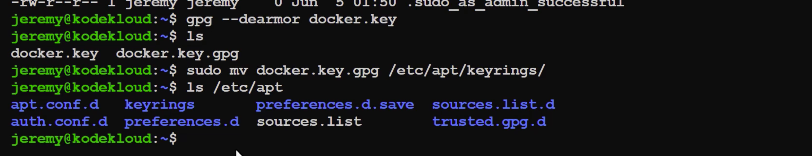
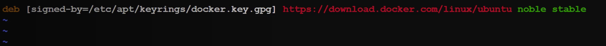

## LIST THE FILES OF PACKAGE
```bash
dpkg --listfiles nginx
dpkg --listfiles nginx
/.
/usr
/usr/sbin
/usr/sbin/nginx
/usr/share
/usr/share/doc
/usr/share/doc/nginx
/usr/share/doc/nginx/changelog.Debian.gz
/usr/share/doc/nginx/copyright
/usr/share/man
/usr/share/man/man8
/usr/share/man/man8/nginx.8.gz
```

## Search a file is associated with the package
```bash
dpkg --search /usr/sbin/nginx
bob@ubuntu-host ~ ➜  dpkg --search /bin/ls
# coreutils: /bin/ls

```
## Check the Package for Files and Dependencies
```bash
apt show nginx
apt search nginx module image
```

### 1. **Types: deb**
   - **deb**: This specifies the type of package repository. `deb` indicates that the repository contains precompiled binary packages

### 2. **URIs:**
   - **http://us.archive.ubuntu.com/ubuntu/**: This is the base URL for the main Ubuntu repository. It points to a mirror server where the packages are hosted.
   - **http://security.ubuntu.com/ubuntu/**: This is the base URL for the Ubuntu security updates repository, where security-related updates are provided.

### 3. **Suites:**
   - **noble**: This represents the codename for the Ubuntu release you’re using. In this context, "noble" is an example codename, which corresponds to a specific version of Ubuntu.
   - **noble-updates**: This refers to updates for the "noble" release. 
   - **noble-backports**: This refers to backports for the "noble" release. 
   - **noble-security**: This suite is specifically for security updates for the "noble" release.

### 4. **Components:**
   - **main**: This is the main component of the repository, containing free and open-source software that is officially supported by the Ubuntu team.
   - **restricted**: This component contains proprietary drivers or software with legal restrictions, which are supported by `Ubuntu but not open source`.
   - **universe**: This contains community-maintained open-source software that is `freely available but not officially supported by Ubuntu`.
   - **multiverse**: This includes software that `is not free or may have legal restrictions`. It is maintained by the community but is not supported by Ubuntu.

### 5. **Signed-By:**
   - **/usr/share/keyrings/ubuntu-archive-keyring.gpg**: This specifies the location of the GPG key used to verify the authenticity of the packages downloaded from the repository. 
    - This is public key signed by their own private key

## Adding New Repositories
```bash
sudo apt mv docker.key.gp /etc/apt/keyrings
```


```bash
sudo apt update -y
sudo apt-add-repository 
```
```bash

bob@ubuntu-host ~ ✖ sudo apt-add-repository deb http://us.archive.ubuntu.com/ubuntu/ focal main
Repository: 'deb http://us.archive.ubuntu.com/ubuntu/ focal main'
Description:
Archive for codename: focal components: main
More info: http://us.archive.ubuntu.com/ubuntu/
Adding repository.
Press [ENTER] to continue or Ctrl-c to cancel.
Adding deb entry to /etc/apt/sources.list.d/archive_uri-http_us_archive_ubuntu_com_ubuntu_-jammy.list
Adding disabled deb-src entry to /etc/apt/sources
```

