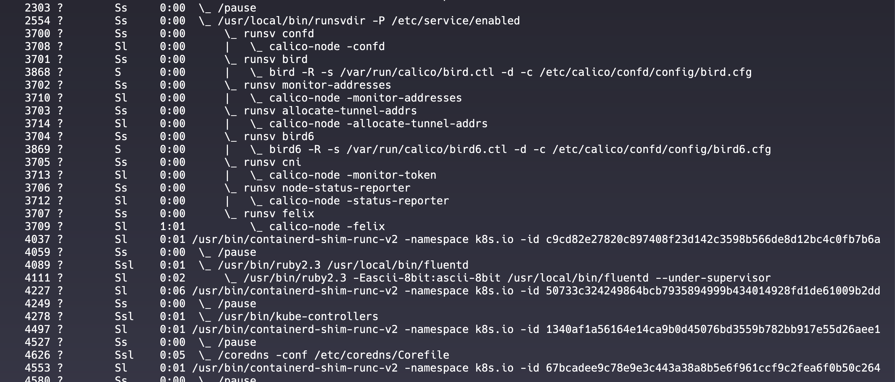
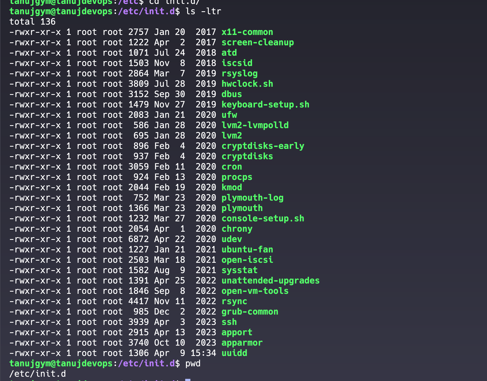

Processes in a system can be broadly categorized into two types:
* **Shell Job**: 
  - Interactive from user end and interacts with different processes.

* **Daemon**: 
  - need elevated privileges
  - Background process.
  - PID less than 1000

  

## Process life cycle


```
                        +---------+
                        |         |
                        | Created |
                        |         |
                        +----+----+
                             |
                             | Schedule
                             v
                        +----+----+
                        |         |
                        | Running |
               -------- |         | ----------
             /          +----+----+            \
           /  Error           |        Complete  \ 
          v                   |                   v
  +-------+-----+     +-------+-------+     +---------+
  |             |     |               |     |         |
  | Terminated  |<----| Interrupted   |<----|  Exit   |
  |             |     |               |     |         |
  +-------------+     +---------------+     +---------+
```

- `Created`: The process enters the system. It's allocated with necessary resources but is not yet running.
- `Running`: The process is actively executing on the CPU.
- `Interrupted`: The process is temporarily stopped, either to let other processes run or because it is waiting for an input or an event.
- `Exit`: The process has completed execution and is ready to be removed from the system.
- `Terminated`: An error or an explicit kill command leads to the process being forcefully stopped.

### Init Process

* The first process that initiates when a system boots up is assigned Process ID (PID) 1. This is called the `systemd process or init process`
- Acts as parent for all the other process.
- Manage the process based on the configuration file stored at `/etc/inittab`


### Terminating Processes by PID
```bash
kill 12345
```

### Terminating Processes by Name 

```bash
pkill java
```

### Specifying Termination Signals

```bash
kill -SIGINT 12345
```

-` SIGTERM (15): Graceful termination of a process.`

| Signal | Value | Description |
| --- | --- | --- |
| `SIGHUP` | (1) | Hangup detected on controlling terminal or death of controlling process |
| `SIGINT` | (2) | Interrupt from keyboard; typically, caused by `Ctrl+C` |
| `SIGKILL` | (9) | Forces immediate process termination; it cannot be ignored, blocked, or caught |
| `SIGSTOP` | (19) | Pauses the process; cannot be ignored |
| `SIGCONT` | (18) | Resumes paused process |


### Special PID Values in `kill`
- **`-1`**: 
  - kill -1 pid will kill all the `process except the init process itself`.
  - init process is also not killed by -1 but all other process which user has the permission to signal will be killed.
- **`0`**: 
  - This `PID will be in such a group`
  - By Zero send we can send the signal to `all processes in the same process group`.

- **Negative values less than -1**
  - any other negative value less than 1 will be considered as a process group id and this signal will be send to all processes in the that particular process group.

```bash
# Sending SIGTERM to all processes the user can signal except init process.
kill -1 -SIGTERM

# Sending SIGTERM to all processes in the same process group as the current process
kill 0 -SIGTERM

# Sending SIGTERM to all processes in the process group with PGID 2
kill -2 -SIGTERM
```


## Foreground and Background Jobs

- **Foreground Process**: 
- **Background Process**: 

```
+------------------------+
|                        |
| Start Job in Foreground|
|                        |
+-----------+------------+
            |
            | Ctrl+Z or bg
            v
+-----------+------------+
|                        |
|   Job Running in       |
|   Background           |
|                        |
+-----------+------------+
            |
            | fg or job completes
            v
+-----------+------------+
|                        |
|   Job Completes        |
|   or Returns to        |
|   Foreground           |
|                        |
+------------------------+
```

### Controlling Job Execution

You can direct a program to run in the background right from its initiation by appending an ampersand `&` operator after the command. 

```bash
sleep 1000 &
```
### Job and Process Management Commands

If you wish to bring a background job to the foreground, utilize the fg command followed by the job number. For instance, to bring job number 3 to the foreground, you would use:

```bash
fg 3
```

To convert a foreground process to a background process, you can use Ctrl+Z. 
- **This operation pauses the process and allows you to resume it in the background using the bg command followed by the job number.** 

```bash
bg 1
```