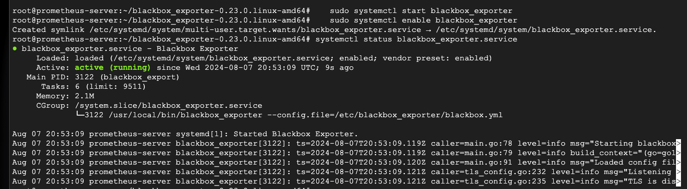

### Key Features of Blackbox Exporter
1. **Multiple Probe Types**:
   - **HTTP/HTTPS**: Monitor web services by performing HTTP(S) requests.
   - **TCP**: Check the availability of TCP services.
   - **ICMP**: Perform ping tests to check the reachability of network hosts.
   - **DNS**: Query DNS servers to ensure domain resolution.

2. **Flexible Configuration**:
   - Allows defining different modules for different types of probes with customizable parameters.

3. **Detailed Metrics**:
   - Provides metrics on response time, DNS resolution time, TCP connection time, HTTP status codes, and more.

### Installation and Configuration

#### Step 1: Install Blackbox Exporter

1. **Download Blackbox Exporter**:

   ```bash
   wget https://github.com/prometheus/blackbox_exporter/releases/download/v0.23.0/blackbox_exporter-0.23.0.linux-amd64.tar.gz
   ```

2. **Extract and move to the appropriate directory**:

   ```bash
   tar xvf blackbox_exporter-*.tar.gz
   cd blackbox_exporter-*
   sudo mv blackbox_exporter /usr/local/bin/
   sudo mkdir -p /etc/blackbox_exporter
   sudo mv blackbox.yml /etc/blackbox_exporter/
   ```

3. **Create a Blackbox Exporter systemd service**:

   ```bash
   sudo nano /etc/systemd/system/blackbox_exporter.service
   ```

   Add the following content:

   ```ini
   [Unit]
   Description=Blackbox Exporter
   After=network.target

   [Service]
   Type=simple
   ExecStart=/usr/local/bin/blackbox_exporter --config.file=/etc/blackbox_exporter/blackbox.yml
   Restart=always

   [Install]
   WantedBy=multi-user.target
   ```

4. **Start and enable Blackbox Exporter**:

   ```bash
   sudo systemctl daemon-reload
   sudo systemctl start blackbox_exporter
   sudo systemctl enable blackbox_exporter
   ```

#### Step 2: Configure Blackbox Exporter

1. **Edit the `blackbox.yml` configuration file**:

   ```bash
   sudo nano /etc/blackbox_exporter/blackbox.yml
   ```

   Example configuration:

   ```yaml
   modules:
     http_2xx:
       prober: http
       timeout: 5s
       http:
         valid_http_versions: [ "HTTP/1.1", "HTTP/2" ]
         valid_status_codes: []  # Defaults to 2xx
         method: GET
         fail_if_ssl: false
         fail_if_not_ssl: false

     tcp_connect:
       prober: tcp
       timeout: 5s
       tcp:
         preferred_ip_protocol: "ip4"

     icmp:
       prober: icmp
       timeout: 5s
   ```

2. **Restart Blackbox Exporter to apply the configuration**:

   ```bash
   sudo systemctl restart blackbox_exporter
   ```

#### Step 3: Configure Prometheus to Scrape Blackbox Exporter

1. **Edit the Prometheus configuration file (`/etc/prometheus/prometheus.yml`)**:

   ```bash
   sudo nano /etc/prometheus/prometheus.yml
   ```

2. **Add a new job for Blackbox Exporter**:

   ```yaml
   scrape_configs:
     - job_name: 'blackbox'
       metrics_path: /probe
       params:
         module: [http_2xx]  # Look for a HTTP 200 response
       static_configs:
         - targets:
           - http://example.com  # Target to probe
       relabel_configs:
         - source_labels: [__address__]
           target_label: __param_target
         - source_labels: [__param_target]
           target_label: instance
         - target_label: __address__
           replacement: localhost:9115  # Blackbox Exporter's address
   ```

3. **Restart Prometheus** to apply the changes:

   ```bash
   sudo systemctl restart prometheus
   ```

### Step-by-Step Process

1. **Blackbox Exporter Configuration**:
   - You configure the Blackbox Exporter with modules defining different types of probes (e.g., HTTP, TCP, ICMP) in the `blackbox.yml` file.

2. **Prometheus Configuration**:
   - You configure Prometheus to scrape the Blackbox Exporter by adding a new scrape job in the `prometheus.yml` file.
   - This scrape job includes the `metrics_path` set to `/probe`, and parameters defining which module to use and the target endpoint to probe.

3. **Scraping Process**:
   - Prometheus periodically sends HTTP requests to the Blackbox Exporter’s `/probe` endpoint.
   - The request includes parameters specifying the target and the probe module to use.

4. **Probe Execution**:
   - Upon receiving a request, the Blackbox Exporter performs the specified probe (e.g., HTTP request, TCP connection, ping).
   - It collects metrics about the probe, such as response time, success status, and detailed results.

5. **Metrics Exposure**:
   - The Blackbox Exporter exposes these metrics on the HTTP response, formatted for Prometheus.
   - Prometheus scrapes this data and stores it in its time-series database.
