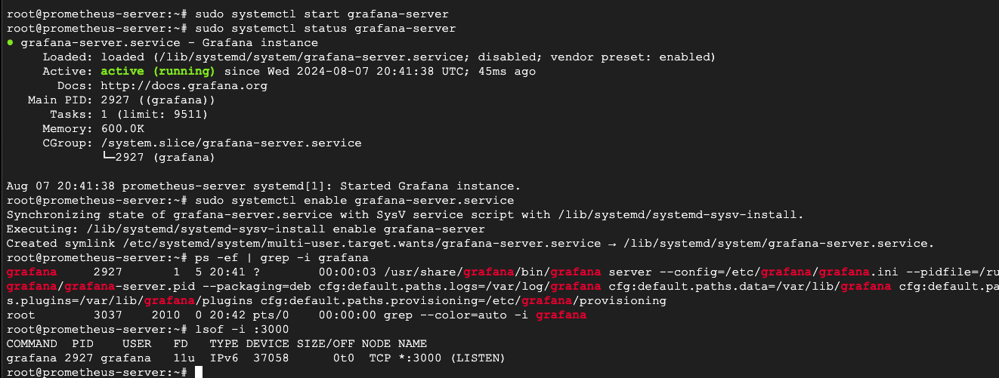

Complete the following steps to install Grafana from the APT repository:

Install the prerequisite packages:
```bash
sudo apt-get install -y apt-transport-https software-properties-common wget
```
Import the GPG key:

```bash
sudo mkdir -p /etc/apt/keyrings/
wget -q -O - https://apt.grafana.com/gpg.key | gpg --dearmor | sudo tee /etc/apt/keyrings/grafana.gpg > /dev/null
```
To add a repository for stable releases, run the following command:


echo "deb [signed-by=/etc/apt/keyrings/grafana.gpg] https://apt.grafana.com stable main" | sudo tee -a /etc/apt/sources.list.d/grafana.list
To add a repository for beta releases, run the following command:


echo "deb [signed-by=/etc/apt/keyrings/grafana.gpg] https://apt.grafana.com beta main" | sudo tee -a /etc/apt/sources.list.d/grafana.list
Run the following command to update the list of available packages:


# Updates the list of available packages
sudo apt-get update
To install Grafana OSS, run the following command:

# Installs the latest OSS release:
sudo apt-get install grafana
To install Grafana Enterprise, run the following command:


# Installs the latest Enterprise release:
sudo apt-get install grafana-enterprise
# START THE SERVER
```bash
sudo systemctl daemon-reload
sudo systemctl start grafana-server
sudo systemctl status grafana-server
sudo systemctl enable grafana-server.service
```
