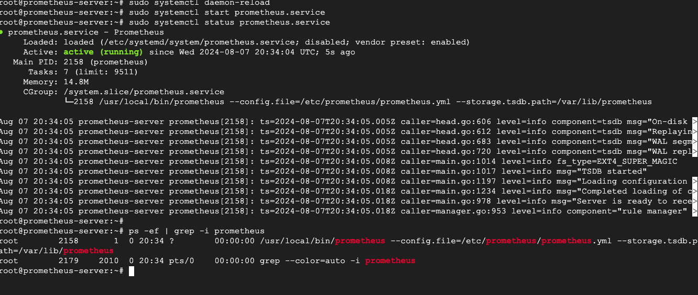

### Step 1: Install Prometheus
1. **Download Prometheus**:

   ```bash
   wget https://github.com/prometheus/prometheus/releases/download/v2.40.1/prometheus-2.40.1.linux-amd64.tar.gz
   ```

2. **Extract and move to the appropriate directory**:

   ```bash
   tar xvf prometheus-*.tar.gz
   cd prometheus-*
   sudo mv prometheus /usr/local/bin/
   sudo mv promtool /usr/local/bin/
   sudo mkdir -p /etc/prometheus
   sudo mv prometheus.yml /etc/prometheus/
   ```

3. **Create a Prometheus systemd service**:

   ```bash
   sudo nano /etc/systemd/system/prometheus.service
   ```

   Add the following content:

   ```ini
   [Unit]
   Description=Prometheus
   After=network.target

   [Service]
   Type=simple
   ExecStart=/usr/local/bin/prometheus --config.file=/etc/prometheus/prometheus.yml --storage.tsdb.path=/var/lib/prometheus
   Restart=always

   [Install]
   WantedBy=multi-user.target
   ```

4. **Start and enable Prometheus**:

   ```bash
   sudo systemctl daemon-reload
   sudo systemctl start prometheus
   sudo systemctl enable prometheus
   ```
    
### Step 2: Install Node Exporter

1. **Download Node Exporter**:

   ```bash
   wget https://github.com/prometheus/node_exporter/releases/download/v1.4.0/node_exporter-1.4.0.linux-amd64.tar.gz
   ```

2. **Extract and move to the appropriate directory**:

   ```bash
   tar xvf node_exporter-*.tar.gz
   cd node_exporter-*
   sudo mv node_exporter /usr/local/bin/
   ```

3. **Create a Node Exporter systemd service**:

   ```bash
   sudo nano /etc/systemd/system/node_exporter.service
   ```

   Add the following content:

   ```ini
   [Unit]
   Description=Node Exporter
   After=network.target

   [Service]
   Type=simple
   ExecStart=/usr/local/bin/node_exporter
   Restart=always

   [Install]
   WantedBy=multi-user.target
   ```

4. **Start and enable Node Exporter**:

   ```bash
   sudo systemctl daemon-reload
   sudo systemctl start node_exporter
   sudo systemctl enable node_exporter
   ```

### Step 3: Configure Prometheus to scrape Node Exporter

1. **Edit Prometheus configuration**:

   ```bash
   sudo nano /etc/prometheus/prometheus.yml
   ```

   Add the following under the `scrape_configs` section:

   ```yaml
   - job_name: 'node_exporter'
     static_configs:
       - targets: ['localhost:9100']
   ```

2. **Restart Prometheus**:

   ```bash
   sudo systemctl restart prometheus
   ```

### Step 4: Install Grafana

1. **Download Grafana**:

   ```bash
   wget https://dl.grafana.com/oss/release/grafana-10.1.5-1.x86_64.rpm
   ```

2. **Install Grafana**:

   ```bash
   sudo apt install grafana-10.1.5-1.x86_64.rpm
   ```

3. **Start and enable Grafana**:

   ```bash
   sudo systemctl start grafana-server
   sudo systemctl enable grafana-server
   ```

### Step 5: Configure Grafana

1. **Access Grafana**: Open your web browser and go to `http://<your-server-ip>:3000`. The default login is `admin` for both username and password.

2. **Add Prometheus as a data source**:
   - Navigate to Configuration > Data Sources.
   - Click on "Add data source" and select "Prometheus".
   - Set the URL to `http://<your-server-ip>:9090`.
   - Click "Save & Test" to ensure it connects successfully.

3. **Create a dashboard**:
   - Navigate to Dashboards > + New Dashboard.
   - Add panels and choose the appropriate metrics from Prometheus.

### Security Note
- Ensure that Prometheus and Node Exporter are not exposed to the internet without proper security measures (e.g., firewalls, VPNs).
- Change default passwords and enable authentication for Grafana.

The `localhost:9100` in the Prometheus configuration refers to the Node Exporter running on the same machine as Prometheus. Node Exporter is a Prometheus exporter for hardware and OS metrics. By default, it runs on port 9100.

To monitor multiple servers, you'll need to install Node Exporter on each server you want to monitor and then configure Prometheus to scrape metrics from these additional servers.

Here’s how to do it step by step:

### Step 1: Install Node Exporter on Additional Servers

Repeat the installation steps for Node Exporter on each additional server:

1. **Download Node Exporter** on the additional server:

   ```bash
   wget https://github.com/prometheus/node_exporter/releases/download/v1.5.0/node_exporter-1.5.0.linux-amd64.tar.gz
   ```

2. **Extract and move to the appropriate directory**:

   ```bash
   tar xvf node_exporter-*.tar.gz
   cd node_exporter-*
   sudo mv node_exporter /usr/local/bin/
   ```

3. **Create a Node Exporter systemd service**:

   ```bash
   sudo nano /etc/systemd/system/node_exporter.service
   ```

   Add the following content:

   ```ini
   [Unit]
   Description=Node Exporter
   After=network.target

   [Service]
   Type=simple
   ExecStart=/usr/local/bin/node_exporter
   Restart=always

   [Install]
   WantedBy=multi-user.target
   ```

4. **Start and enable Node Exporter**:

   ```bash
   sudo systemctl daemon-reload
   sudo systemctl start node_exporter
   sudo systemctl enable node_exporter
   ```

### Step 2: Configure Prometheus to Scrape Metrics from Multiple Servers

1. **Edit the Prometheus configuration file (`/etc/prometheus/prometheus.yml`)**:
https://www.stackhero.io/en/services/Prometheus/documentations/Using-Node-Exporter/Add-TLS-encryption-to-Prometheus-Node-Exporter
   ```bash
   sudo nano /etc/prometheus/prometheus.yml
   ```

2. **Add the additional server targets to the `scrape_configs` section**. For example:

   ```yaml
   scrape_configs:
     - job_name: 'node_exporter'
       static_configs:
         - targets: ['localhost:9100', 'server1:9100', 'server2:9100']
   ```

   Replace `server1` and `server2` with the actual hostnames or IP addresses of your additional servers.

3. **Restart Prometheus** to apply the changes:

   ```bash
   sudo systemctl restart prometheus
   ```

### Step 3: Verify the Configuration

1. **Access Prometheus**: Open your web browser and go to `http://<your-prometheus-server-ip>:9090/targets`.
   
   You should see all your configured targets listed, and their status should be "UP".

### Step 4: Update Grafana Dashboard

1. **Access Grafana**: Open your web browser and go to `http://<your-grafana-server-ip>:3000`.

2. **Add Prometheus as a Data Source (if not already added)**:
   - Navigate to Configuration > Data Sources.
   - Click on "Add data source" and select "Prometheus".
   - Set the URL to `http://<your-prometheus-server-ip>:9090`.
   - Click "Save & Test" to ensure it connects successfully.

3. **Create or Update Dashboard**:
   - Navigate to Dashboards > + New Dashboard.
   - Add panels and choose the appropriate metrics from Prometheus.
   - You can use the hostname labels to filter metrics for different servers.

### Example Prometheus Configuration (`prometheus.yml`)

Here's a complete example of the Prometheus configuration with multiple servers:

```yaml
global:
  scrape_interval: 15s # Default scrape interval

scrape_configs:
  - job_name: 'node_exporter'
    static_configs:
      - targets: ['localhost:9100', '192.168.1.2:9100', '192.168.1.3:9100']
```

## TLS CERTIFICATES

### 1. **Generate TLS Certificates**
#### Using OpenSSL:

```bash
# Generate a private key
openssl genrsa -out prometheus.key 2048

# Generate a certificate signing request (CSR)
openssl req -new -key prometheus.key -out prometheus.csr

# Generate a self-signed certificate
openssl x509 -req -days 365 -in prometheus.csr -signkey prometheus.key -out prometheus.crt
```

### 2. **Configure Prometheus to Use TLS**

After generating the certificates, configure Prometheus to use them. You need to update the Prometheus configuration file (typically named `prometheus.yml`) and the command-line arguments used to start Prometheus.

#### Update the Prometheus Configuration:

Edit your `prometheus.yml` configuration file to include the TLS settings. Under the `scrape_configs` section, configure each job to use TLS:

```yaml
scrape_configs:
  - job_name: 'node_exporter'
    scheme: https
    tls_config:
      ca_file: /path/to/ca.crt
      cert_file: /path/to/prometheus.crt
      key_file: /path/to/prometheus.key
    static_configs:
      - targets: ['localhost:9100']
```

#### Update the Prometheus Command-Line Arguments:

When starting Prometheus, specify the paths to the certificate and key:

```bash
./prometheus --web.config.file=/path/to/web-config.yml
```

### 3. **Create a Web Configuration File**

Prometheus uses a web configuration file to enable TLS. Create a `web-config.yml` file with the following content:

```yaml
tls_server_config:
  cert_file: /path/to/prometheus.crt
  key_file: /path/to/prometheus.key
```

Make sure this file is referenced by the `--web.config.file` flag when starting Prometheus.

### 4. **Restart Prometheus**

After making these changes, restart the Prometheus service:

```bash
sudo systemctl restart prometheus
```

Or if running manually:

```bash
./prometheus --config.file=prometheus.yml --web.config.file=/path/to/web-config.yml
```

### 5. **Configure Clients to Use TLS**

Ensure all Prometheus clients, like node exporters or other exporters, are configured to use TLS and have the appropriate certificates. Update their configurations to use the HTTPS scheme and point them to the CA certificate used by Prometheus.

### 6. **Verify Encryption**

To confirm that encryption is working:

1. Access Prometheus using HTTPS in a web browser (`https://<prometheus-server>:9090`).
2. Check the connection details to verify that a secure connection is established.
3. Ensure no unencrypted HTTP traffic is allowed.

### 7. **Monitoring and Maintenance**

- **Renew Certificates:** Keep track of certificate expiration dates and renew them as needed.
- **Security Audits:** Regularly audit and review your Prometheus and client configurations to ensure they meet your security requirements.

### Conclusion

Using TLS to encrypt communications between Prometheus and its clients adds a vital layer of security, especially in environments where sensitive data is monitored. Following these steps will help you set up and maintain secure communication for Prometheus.