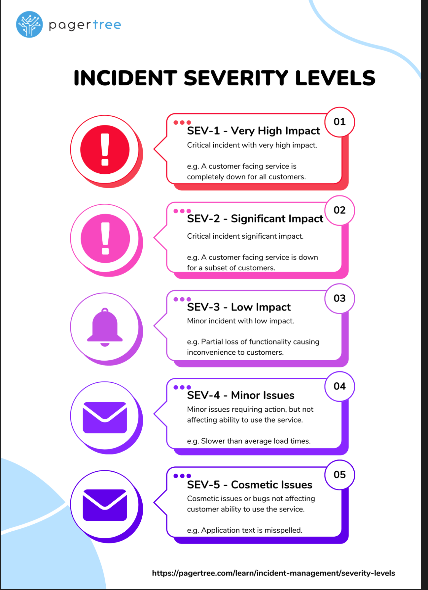

## How do you prioritize which alerts to respond to first during an incident?
The first step to prioritizing alerts is to understand the severity level of the incident, who it affects, and what kind of impact it will have on your customers or systems. 
- After determining the severity level, you can prioritize alerts starting from a SEV-1 level (highest, greatest impact) down to a SEV-5 (lowest, smallest impact).

## What is Chaos Engineering?
Chaos Engineering is a methodical approach to discovering failures before they lead to outages. 
- By proactively testing how a system responds to stress, you can pinpoint and resolve failures before they become problems that affect your customers and systems. 
- Chaos Monkey is a popular tool used in Chaos Engineering.

## How do you handle capacity planning and scaling for high-traffic applications?
- Use load balancing - Distribute requests across multiple servers, optimizing resource utilization.
- Cache frequently accessed data 
- Automate testing - Stress test your system to identify bottlenecks in performance. Use continuous integration tools (like GitHub Actions) to automatically test code changes.
- Monitor systems - Utilize APM tools to provide real-time insight 
- Design your system to scale - Scale your system up or down to meet the needs of traffic to maintain performance.

## What is toil reduction, and how is it achieved?
- Toil is a term used to describe manual, repetitive, and tedious tasks that engineers perform in production environments. 
- Toil reduction is the process of reducing the amount of time spent on tasks that are considered toil. This can be achieved through process automation.

## What is white-box monitoring?
- White-box monitoring is a method of monitoring the internal metrics of applications that run on a server when you can access its source code.

## What is black-box monitoring?
- Black box monitoring is a type of application monitoring that focuses on an application's external behavior without needing access to its source code.